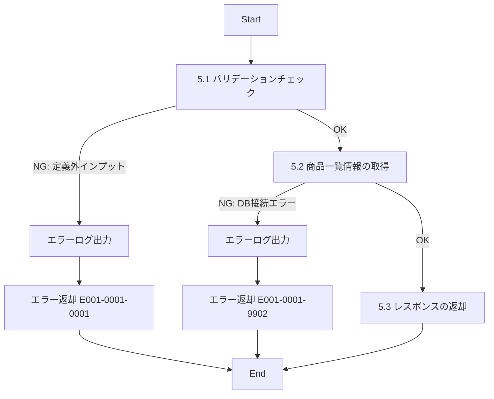

# ID001001_商品一覧情報取得_仕様書

## 1.目次

- [ID001001\_商品一覧情報取得\_仕様書](#id001001_商品一覧情報取得_仕様書)
  - [1.目次](#1目次)
  - [2.概要](#2概要)
  - [3.パラメータ](#3パラメータ)
    - [3.1.URI](#31uri)
    - [3.2.インプット](#32インプット)
    - [3.3.アウトプット](#33アウトプット)
  - [4.処理フロー](#4処理フロー)
  - [5.処理詳細](#5処理詳細)
    - [5.1 バリデーションチェック](#51-バリデーションチェック)
    - [5.2 商品一覧情報の取得](#52-商品一覧情報の取得)
    - [5.3 レスポンスの返却](#53-レスポンスの返却)
  - [6.CRUD](#6crud)
  - [7.エラーメッセージ](#7エラーメッセージ)
  - [8.SQL](#8sql)
    - [8.1.商品一覧情報取得](#81商品一覧情報取得)
  - [9.備考](#9備考)

## 2.概要

ECサイトの商品一覧画面で表示する商品情報を取得するAPI。
カテゴリや生産者による絞り込み、ページネーションに対応する。

## 3.パラメータ

### 3.1.URI

`/products/list/get`

[API一覧 2. API一覧 参照](./API一覧.md)

### 3.2.インプット

```json
{
  "categoryId": "cat001",
  "producerId": "pd00000001",
  "limit": 20,
  "offset": 0
}
```

| パラメータ名 | 型 | 必須 | 説明 |
|------------|-----|------|------|
| categoryId | string | 任意 | カテゴリID。指定した場合、該当カテゴリの商品のみ取得 |
| producerId | string | 任意 | 生産者ID。指定した場合、該当生産者の商品のみ取得 |
| limit | number | 任意 | 取得件数（デフォルト：20、最大：100） |
| offset | number | 任意 | 取得開始位置（デフォルト：0） |

### 3.3.アウトプット

```json
{
  "products": [
    {
      "productId": "p00000000001",
      "productName": "【岡山県産】巨峰",
      "description": "岡山県産の巨峰です",
      "price": 3000,
      "stockQuantity": 5,
      "categoryId": "cat001",
      "categoryName": "ぶどう",
      "producerId": "pd00000001",
      "producerName": "桑田果樹園",
      "images": [
        {
          "imagePath": "https://www.hoge.co.jp/aaa.png",
          "viewOrder": 1
        }
      ]
    }
  ],
  "total": 100
}
```

| パラメータ名 | 型 | 説明 |
|------------|-----|------|
| products | array | 商品情報の配列 |
| products[].productId | string | 商品ID |
| products[].productName | string | 商品名 |
| products[].description | string | 商品説明 |
| products[].price | number | 価格 |
| products[].stockQuantity | number | 在庫数 |
| products[].categoryId | string | カテゴリID |
| products[].categoryName | string | カテゴリ名 |
| products[].producerId | string | 生産者ID |
| products[].producerName | string | 生産者名 |
| products[].images | array | 商品画像の配列 |
| products[].images[].imagePath | string | 画像パス |
| products[].images[].viewOrder | number | 表示順 |
| total | number | 全商品件数 |

## 4.処理フロー



## 5.処理詳細

### 5.1 バリデーションチェック
1. インプットの定義通りかバリデーションチェックを行う。
   1. categoryIdが指定されている場合、文字列型であることを確認する。
   2. producerIdが指定されている場合、文字列型であることを確認する。
   3. limitが指定されている場合、数値型で1〜100の範囲内であることを確認する。
   4. offsetが指定されている場合、数値型で0以上であることを確認する。
   5. **定義通りでないインプットがあった場合、処理を中断する**
      1. エラーログ(E001-0001-0001)を出力する。
      2. エラー(E001-0001-0001)を返却する。

### 5.2 商品一覧情報の取得
1. 「商品一覧情報」を取得する。[8.1.商品一覧情報取得](#81商品一覧情報取得)
   1. **エラーが発生した場合、処理を中断する**
      1. エラーログ(E001-0001-9902)を出力する。
      2. エラー(E001-0001-9902)を返却する。
2. 取得した「商品一覧情報」を「商品リスト」に格納する。
3. 全商品件数を「全件数」に格納する。

### 5.3 レスポンスの返却
1. 以下のレスポンスパラメータを設定し、返却する。

| レスポンスパラメータ | 設定値 |
|-------------------|--------|
| products | 「商品リスト」 |
| total | 「全件数」 |

## 6.CRUD

|テーブル名|C|R|U|D|備考|
|--------|--|--|--|--|--|
|PRODUCT||○||||
|PRODUCT_IMAGE||○||||
|CATEGORY||○||||
|PRODUCER||○||||

## 7.エラーメッセージ

|コード|内容|返却メッセージ|備考|
|--------|--|--|--|
|E001-0001-0001|バリデーションエラー|バリデーションエラー|インプットパラメータが不正|
|E001-0001-9902|DBエラー|DBエラー|DB接続時のエラー|

## 8.SQL

### 8.1.商品一覧情報取得

```sql
-- 商品一覧情報取得
SELECT
  p.product_id,
  p.description as product_name,
  p.description,
  p.price,
  p.stock_quantity,
  p.category_id,
  c.name as category_name,
  p.producer_id,
  pr.name as producer_name,
  pi.image_path,
  pi.view_order
FROM PRODUCT p
LEFT JOIN CATEGORY c ON p.category_id = c.category_id
LEFT JOIN PRODUCER pr ON p.producer_id = pr.producer_id
LEFT JOIN PRODUCT_IMAGE pi ON p.product_id = pi.product_id
WHERE p.disabled = 0 -- 有効な商品のみ
  AND (c.disabled = 0 OR c.disabled IS NULL) -- 有効なカテゴリのみ
  AND (pr.disabled = 0 OR pr.disabled IS NULL) -- 有効な生産者のみ
  AND (pi.disabled = 0 OR pi.disabled IS NULL) -- 有効な画像のみ
  AND (:categoryId IS NULL OR p.category_id = :categoryId) -- カテゴリ絞り込み
  AND (:producerId IS NULL OR p.producer_id = :producerId) -- 生産者絞り込み
ORDER BY p.created_at DESC, pi.view_order ASC
LIMIT :limit OFFSET :offset;

-- 全件数取得
SELECT COUNT(DISTINCT p.product_id) as total
FROM PRODUCT p
LEFT JOIN CATEGORY c ON p.category_id = c.category_id
LEFT JOIN PRODUCER pr ON p.producer_id = pr.producer_id
WHERE p.disabled = 0 -- 有効な商品のみ
  AND (c.disabled = 0 OR c.disabled IS NULL) -- 有効なカテゴリのみ
  AND (pr.disabled = 0 OR pr.disabled IS NULL) -- 有効な生産者のみ
  AND (:categoryId IS NULL OR p.category_id = :categoryId) -- カテゴリ絞り込み
  AND (:producerId IS NULL OR p.producer_id = :producerId); -- 生産者絞り込み
```

## 9.備考

- 商品画像は複数登録されている可能性があるため、view_orderでソートして取得する
- limitのデフォルト値は20、最大値は100とする
- 削除フラグ(disabled)が1の商品は取得対象外とする
- 商品の並び順は作成日時の降順（新しい順）とする
