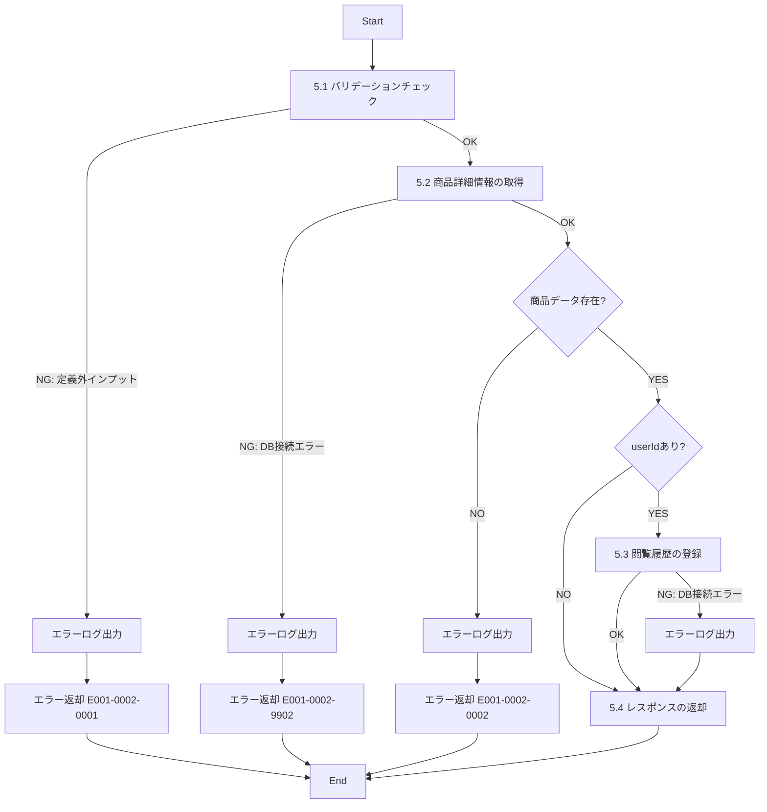

# ID001002_商品詳細情報取得_仕様書

## 1.目次

- [ID001002\_商品詳細情報取得\_仕様書](#id001002_商品詳細情報取得_仕様書)
  - [1.目次](#1目次)
  - [2.概要](#2概要)
  - [3.パラメータ](#3パラメータ)
    - [3.1.URI](#31uri)
    - [3.2.インプット](#32インプット)
    - [3.3.アウトプット](#33アウトプット)
  - [4.処理フロー](#4処理フロー)
  - [5.処理詳細](#5処理詳細)
    - [5.1 バリデーションチェック](#51-バリデーションチェック)
    - [5.2 商品詳細情報の取得](#52-商品詳細情報の取得)
    - [5.3 閲覧履歴の登録](#53-閲覧履歴の登録)
    - [5.4 レスポンスの返却](#54-レスポンスの返却)
  - [6.CRUD](#6crud)
  - [7.エラーメッセージ](#7エラーメッセージ)
  - [8.SQL](#8sql)
    - [8.1.商品詳細情報取得](#81商品詳細情報取得)
    - [8.2.閲覧履歴登録](#82閲覧履歴登録)
  - [9.備考](#9備考)

## 2.概要

ECサイトの商品詳細画面で表示する商品の詳細情報を取得するAPI。
商品の基本情報、画像、カテゴリ、生産者情報を取得し、同時にユーザーの閲覧履歴を記録する。

## 3.パラメータ

### 3.1.URI

`/products/detail/get`

[API一覧 2. API一覧 参照](./API一覧.md)

### 3.2.インプット

```json
{
  "productId": "p00000000001",
  "userId": "user001"
}
```

| パラメータ名 | 型 | 必須 | 説明 |
|------------|-----|------|------|
| productId | string | 必須 | 商品ID |
| userId | string | 任意 | ユーザーID。ログイン中の場合、閲覧履歴を登録するために使用 |

### 3.3.アウトプット

```json
{
  "productId": "p00000000001",
  "productName": "【岡山県産】巨峰",
  "description": "岡山県産の巨峰です。甘みが強く、粒が大きいのが特徴です。",
  "price": 3000,
  "stockQuantity": 5,
  "category": {
    "categoryId": "cat001",
    "categoryName": "ぶどう"
  },
  "producer": {
    "producerId": "pd00000001",
    "producerName": "桑田果樹園",
    "farmName": "桑田果樹園",
    "description": "岡山県でぶどうを生産する農家です。",
    "imagePath": "https://www.hoge.co.jp/producer001.png"
  },
  "images": [
    {
      "imagePath": "https://www.hoge.co.jp/aaa.png",
      "viewOrder": 1
    },
    {
      "imagePath": "https://www.hoge.co.jp/bbb.png",
      "viewOrder": 2
    }
  ]
}
```

| パラメータ名 | 型 | 説明 |
|------------|-----|------|
| productId | string | 商品ID |
| productName | string | 商品名 |
| description | string | 商品説明 |
| price | number | 価格 |
| stockQuantity | number | 在庫数 |
| category | object | カテゴリ情報 |
| category.categoryId | string | カテゴリID |
| category.categoryName | string | カテゴリ名 |
| producer | object | 生産者情報 |
| producer.producerId | string | 生産者ID |
| producer.producerName | string | 生産者名 |
| producer.farmName | string | 農園名 |
| producer.description | string | 農園説明 |
| producer.imagePath | string | 生産者画像パス |
| images | array | 商品画像の配列 |
| images[].imagePath | string | 画像パス |
| images[].viewOrder | number | 表示順 |

## 4.処理フロー



## 5.処理詳細

### 5.1 バリデーションチェック
1. インプットの定義通りかバリデーションチェックを行う。
   1. productIdが文字列型であることを確認する。
   2. productIdが空文字でないことを確認する。
   3. userIdが指定されている場合、文字列型であることを確認する。
   4. **定義通りでないインプットがあった場合、処理を中断する**
      1. エラーログ(E001-0002-0001)を出力する。
      2. エラー(E001-0002-0001)を返却する。

### 5.2 商品詳細情報の取得
1. 「商品詳細情報」を取得する。[8.1.商品詳細情報取得](#81商品詳細情報取得)
   1. **エラーが発生した場合、処理を中断する**
      1. エラーログ(E001-0002-9902)を出力する。
      2. エラー(E001-0002-9902)を返却する。
2. 取得した「商品詳細情報」が0件の場合、**処理を中断する**
   1. エラーログ(E001-0002-0002)を出力する。
   2. エラー(E001-0002-0002)を返却する。
3. 取得した「商品詳細情報」を「商品情報」に格納する。

### 5.3 閲覧履歴の登録
1. **userIdが指定されている場合のみ実行する**
2. 「閲覧履歴」を登録する。[8.2.閲覧履歴登録](#82閲覧履歴登録)
   1. **エラーが発生した場合**
      1. エラーログ(E001-0002-9903)を出力する。
      2. 処理を継続する（閲覧履歴の登録失敗は致命的エラーとしない）

### 5.4 レスポンスの返却
1. 以下のレスポンスパラメータを設定し、返却する。

| レスポンスパラメータ | 設定値 |
|-------------------|--------|
| productId | 「商品情報」のproduct_id |
| productName | 「商品情報」のdescription |
| description | 「商品情報」のdescription |
| price | 「商品情報」のprice |
| stockQuantity | 「商品情報」のstock_quantity |
| category | 「商品情報」のカテゴリ情報 |
| producer | 「商品情報」の生産者情報 |
| images | 「商品情報」の画像情報配列 |

## 6.CRUD

|テーブル名|C|R|U|D|備考|
|--------|--|--|--|--|--|
|PRODUCT||○||||
|PRODUCT_IMAGE||○||||
|CATEGORY||○||||
|PRODUCER||○||||
|VIEW_HISTORY|○||||ユーザーIDが指定されている場合のみ|

## 7.エラーメッセージ

|コード|内容|返却メッセージ|備考|
|--------|--|--|--|
|E001-0002-0001|バリデーションエラー|バリデーションエラー|インプットパラメータが不正|
|E001-0002-0002|商品が存在しない|指定された商品が見つかりません|該当商品が存在しないか、削除済み|
|E001-0002-9902|DBエラー|DBエラー|商品情報取得時のDB接続エラー|
|E001-0002-9903|DBエラー|DBエラー|閲覧履歴登録時のDB接続エラー（警告レベル）|

## 8.SQL

### 8.1.商品詳細情報取得

```sql
-- 商品詳細情報取得
SELECT
  p.product_id,
  p.description as product_name,
  p.description,
  p.price,
  p.stock_quantity,
  c.category_id,
  c.name as category_name,
  pr.producer_id,
  pr.name as producer_name,
  pr.farm_name,
  pr.description as producer_description,
  pr.image_path as producer_image_path,
  pi.image_path,
  pi.view_order
FROM PRODUCT p
LEFT JOIN CATEGORY c ON p.category_id = c.category_id AND c.disabled = 0
LEFT JOIN PRODUCER pr ON p.producer_id = pr.producer_id AND pr.disabled = 0
LEFT JOIN PRODUCT_IMAGE pi ON p.product_id = pi.product_id AND pi.disabled = 0
WHERE p.product_id = :productId
  AND p.disabled = 0 -- 有効な商品のみ
ORDER BY pi.view_order ASC;
```

### 8.2.閲覧履歴登録

```sql
-- 閲覧履歴登録（すでに存在する場合はviewed_atを更新）
INSERT INTO VIEW_HISTORY (
  user_id,
  product_id,
  viewed_at,
  disabled,
  created_at,
  updated_at
)
VALUES (
  :userId,
  :productId,
  CURRENT_TIMESTAMP,
  0,
  CURRENT_TIMESTAMP,
  CURRENT_TIMESTAMP
)
ON DUPLICATE KEY UPDATE
  viewed_at = CURRENT_TIMESTAMP,
  updated_at = CURRENT_TIMESTAMP;
```

## 9.備考

- 商品画像は複数登録されている可能性があるため、view_orderでソートして取得する
- 削除フラグ(disabled)が1の商品は取得対象外とする
- 指定された商品IDが存在しない場合、または削除済みの場合はエラーを返却する
- ユーザーIDが指定されている場合のみ閲覧履歴を登録する（ログイン不要での閲覧も可能）
- 閲覧履歴の登録に失敗した場合でも、商品詳細情報の取得は正常終了とする
- 同じユーザーが同じ商品を複数回閲覧した場合、viewed_atを最新の日時に更新する
