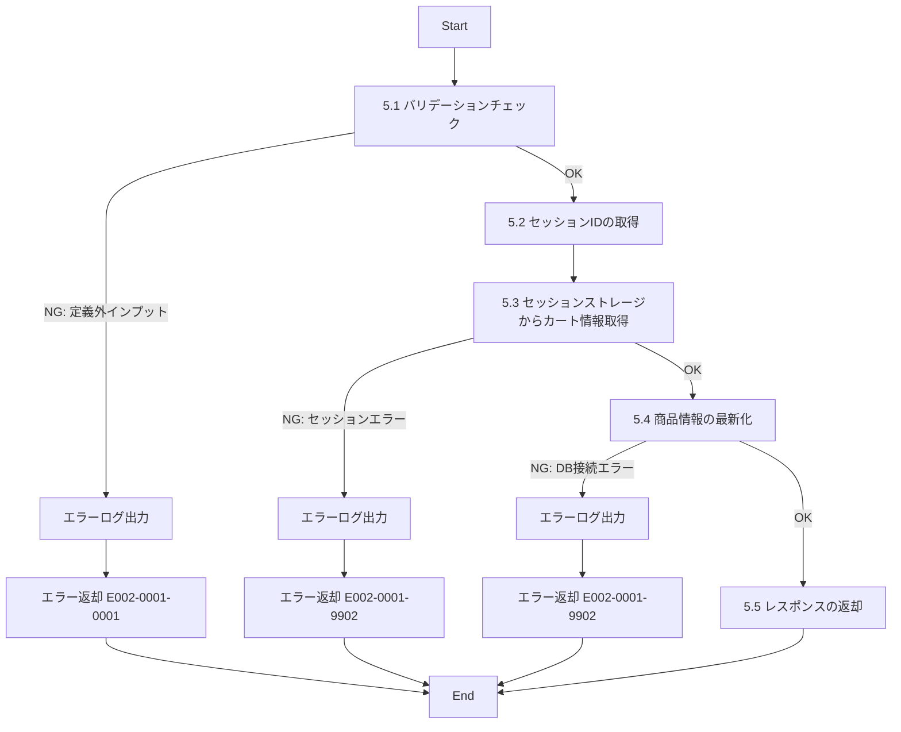

# ID002001_カート情報取得_仕様書

## 1.目次

- [ID002001\_カート情報取得\_仕様書](#id002001_カート情報取得_仕様書)
  - [1.目次](#1目次)
  - [2.概要](#2概要)
  - [3.パラメータ](#3パラメータ)
    - [3.1.URI](#31uri)
    - [3.2.インプット](#32インプット)
    - [3.3.アウトプット](#33アウトプット)
  - [4.処理フロー](#4処理フロー)
  - [5.処理詳細](#5処理詳細)
    - [5.1 バリデーションチェック](#51-バリデーションチェック)
    - [5.2 セッションIDの取得](#52-セッションidの取得)
    - [5.3 セッションストレージからカート情報取得](#53-セッションストレージからカート情報取得)
    - [5.4 商品情報の最新化](#54-商品情報の最新化)
    - [5.5 レスポンスの返却](#55-レスポンスの返却)
  - [6.CRUD](#6crud)
  - [7.エラーメッセージ](#7エラーメッセージ)
  - [8.SQL](#8sql)
    - [8.1.カート情報取得（将来実装予定）](#81カート情報取得将来実装予定)
  - [9.備考](#9備考)

## 2.概要

ECサイトのカート画面で表示するユーザーのカート情報を取得するAPI。
**セッションベースのカート実装**を採用し、セッションストレージ（Redis等）にカート情報を保存する。
ログイン不要でもカート機能を使用でき、ログイン後はセッションカートをユーザーに紐付けることが可能。

## 3.パラメータ

### 3.1.URI

`/user/cart/get`

[API一覧 2. API一覧 参照](./API一覧.md)

### 3.2.インプット

```json
{
  "sessionId": "sess_1234567890abcdef"
}
```

| パラメータ名 | 型 | 必須 | 説明 |
|------------|-----|------|------|
| sessionId | string | 任意 | セッションID。指定がない場合はリクエストヘッダー（Cookie）から取得 |

**注意:**
- sessionIdは通常、HTTPリクエストのCookieヘッダーから自動取得される
- クライアント側で明示的に指定する場合のみ、リクエストボディに含める

### 3.3.アウトプット

```json
{
  "sessionId": "sess_1234567890abcdef",
  "items": [
    {
      "cartItemId": "ci001",
      "product": {
        "productId": "p00000000001",
        "productName": "【岡山県産】巨峰",
        "description": "岡山県産の巨峰です",
        "price": 3000,
        "stockQuantity": 5,
        "imagePath": "https://www.hoge.co.jp/aaa.png"
      },
      "quantity": 2,
      "subtotal": 6000
    },
    {
      "cartItemId": "ci002",
      "product": {
        "productId": "p00000000002",
        "productName": "【青森県産】りんご",
        "description": "青森県産のりんごです",
        "price": 2000,
        "stockQuantity": 10,
        "imagePath": "https://www.hoge.co.jp/bbb.png"
      },
      "quantity": 1,
      "subtotal": 2000
    }
  ],
  "totalAmount": 8000,
  "totalItems": 2
}
```

| パラメータ名 | 型 | 説明 |
|------------|-----|------|
| sessionId | string | セッションID |
| items | array | カート内商品の配列 |
| items[].cartItemId | string | カートアイテムID |
| items[].product | object | 商品情報 |
| items[].product.productId | string | 商品ID |
| items[].product.productName | string | 商品名 |
| items[].product.description | string | 商品説明 |
| items[].product.price | number | 商品単価 |
| items[].product.stockQuantity | number | 在庫数 |
| items[].product.imagePath | string | 商品画像パス（メイン画像） |
| items[].quantity | number | 数量 |
| items[].subtotal | number | 小計（単価 × 数量） |
| totalAmount | number | カート合計金額 |
| totalItems | number | カート内商品種類数 |

## 4.処理フロー



## 5.処理詳細

### 5.1 バリデーションチェック
1. インプットの定義通りかバリデーションチェックを行う。
   1. sessionIdが指定されている場合、文字列型であることを確認する。
   2. **定義通りでないインプットがあった場合、処理を中断する**
      1. エラーログ(E002-0001-0001)を出力する。
      2. エラー(E002-0001-0001)を返却する。

### 5.2 セッションIDの取得
1. sessionIdを取得する。
   1. リクエストボディにsessionIdが含まれている場合、それを使用する。
   2. リクエストボディにsessionIdがない場合、CookieヘッダーからセッションIDを取得する。
   3. セッションIDが存在しない場合、新しいセッションIDを生成する。
2. 取得/生成したセッションIDを「セッションID」に格納する。

### 5.3 セッションストレージからカート情報取得
1. セッションストレージ（Redis等）から「セッションID」に対応するカート情報を取得する。
   1. **エラーが発生した場合、処理を中断する**
      1. エラーログ(E002-0001-9902)を出力する。
      2. エラー(E002-0001-9902)を返却する。
2. カート情報が存在しない場合、空のカート情報を初期化する。
3. 取得したカート情報を「カートデータ」に格納する。
   - カートデータ構造例: `{ items: [{ productId: "p00000000001", quantity: 2 }] }`

### 5.4 商品情報の最新化
1. 「カートデータ」に含まれる各商品IDについて、PRODUCTテーブルから最新の商品情報を取得する。[8.1.商品情報取得](#81商品情報取得)
   1. **エラーが発生した場合、処理を中断する**
      1. エラーログ(E002-0001-9902)を出力する。
      2. エラー(E002-0001-9902)を返却する。
2. 商品が削除されている（disabled = 1）場合、カートから除外する。
3. 各カートアイテムについて以下を計算する。
   1. 小計 = 最新の商品単価 × 数量
   2. 在庫数が数量より少ない場合、警告フラグを設定する（将来拡張）
4. カート合計金額を計算する。
   - 合計金額 = 各カートアイテムの小計の合計
5. カート内商品種類数をカウントする。
6. 最新化されたカート情報を「カート情報」に格納する。

### 5.5 レスポンスの返却
1. 以下のレスポンスパラメータを設定し、返却する。

| レスポンスパラメータ | 設定値 |
|-------------------|--------|
| sessionId | 「セッションID」 |
| items | 「カート情報」のカートアイテム配列 |
| totalAmount | 「カート情報」の合計金額 |
| totalItems | 「カート情報」の商品種類数 |

## 6.CRUD

|テーブル名|C|R|U|D|備考|
|--------|--|--|--|--|--|
|PRODUCT||○|||商品情報取得用|
|PRODUCT_IMAGE||○|||商品画像取得用|
|（セッションストレージ）|○|○|○||Redis等のセッションストレージ|

## 7.エラーメッセージ

|コード|内容|返却メッセージ|備考|
|--------|--|--|--|
|E002-0001-0001|バリデーションエラー|バリデーションエラー|インプットパラメータが不正|
|E002-0001-9902|セッションエラー/DBエラー|セッションストレージまたはDBへのアクセスエラー|Redis接続エラーまたはDB接続エラー|

## 8.SQL

### 8.1.商品情報取得

```sql
-- 商品情報取得（カート内の商品の最新情報を取得）
SELECT
  p.product_id,
  p.description as product_name,
  p.description,
  p.price,
  p.stock_quantity,
  pi.image_path
FROM PRODUCT p
LEFT JOIN PRODUCT_IMAGE pi ON p.product_id = pi.product_id
  AND pi.view_order = 1
  AND pi.disabled = 0
WHERE p.product_id IN (:productIds)
  AND p.disabled = 0; -- 有効な商品のみ
```

## 9.備考

### セッションベースのカート実装

- **CART/CART_ITEMテーブルを作成せず、セッションストレージ（Redis等）でカート情報を管理**
- セッションストレージにはカートの商品ID配列と数量のみを保存し、商品の詳細情報は都度PRODUCTテーブルから取得
- この方式のメリット:
  1. テーブル設計が不要で実装が簡素化される
  2. ログイン不要でもカート機能が使える
  3. 価格や在庫数などの商品情報が常に最新
  4. データベースへの負荷が少ない

### セッション管理

- セッションIDはクライアント側でCookieに保存される
- セッションの有効期限は30日間を想定
- セッションストレージの実装例: Redis（キー: `cart:{sessionId}`、値: JSON形式のカートデータ）
- セッションデータ例:
  ```json
  {
    "items": [
      { "productId": "p00000000001", "quantity": 2, "addedAt": "2025-11-15T10:30:00Z" },
      { "productId": "p00000000002", "quantity": 1, "addedAt": "2025-11-15T11:00:00Z" }
    ]
  }
  ```

### ログイン時のカート統合

- ログイン時に、セッションカートをユーザーアカウントに紐付けることが可能
- セッションIDとuserIdのマッピングをセッションストレージに保存
- ログアウト時もセッションカートは維持される

### その他

- 商品が削除されている場合（disabled = 1）、自動的にカートから除外される
- 商品画像は各商品のメイン画像（view_order = 1）を取得する
- カート内商品の並び順は、カートに追加した日時の昇順（古い順）とする
- 在庫切れ商品のチェック機能は将来拡張予定
- カートアイテムの追加/更新/削除は別APIで実装される
