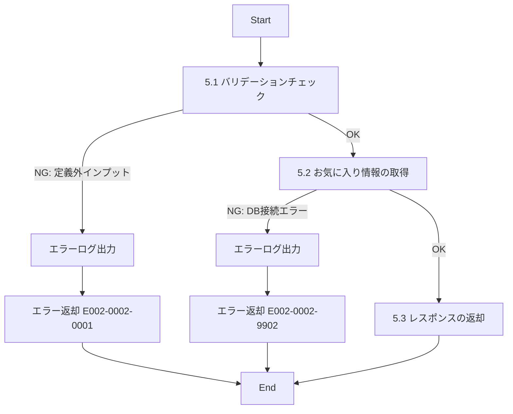

# ID002002_お気に入り情報取得_仕様書

## 1.目次

- [ID002002\_お気に入り情報取得\_仕様書](#id002002_お気に入り情報取得_仕様書)
  - [1.目次](#1目次)
  - [2.概要](#2概要)
  - [3.パラメータ](#3パラメータ)
    - [3.1.URI](#31uri)
    - [3.2.インプット](#32インプット)
    - [3.3.アウトプット](#33アウトプット)
  - [4.処理フロー](#4処理フロー)
  - [5.処理詳細](#5処理詳細)
    - [5.1 バリデーションチェック](#51-バリデーションチェック)
    - [5.2 お気に入り情報の取得](#52-お気に入り情報の取得)
    - [5.3 レスポンスの返却](#53-レスポンスの返却)
  - [6.CRUD](#6crud)
  - [7.エラーメッセージ](#7エラーメッセージ)
  - [8.SQL](#8sql)
    - [8.1.お気に入り商品情報取得](#81お気に入り商品情報取得)
  - [9.備考](#9備考)

## 2.概要

ECサイトのお気に入り画面で表示するユーザーのお気に入り商品情報を取得するAPI。
ユーザーがお気に入り登録した商品の一覧を、登録日時の降順（新しい順）で返却する。

## 3.パラメータ

### 3.1.URI

`/user/favorite/get`

[API一覧 2. API一覧 参照](./API一覧.md)

### 3.2.インプット

```json
{
  "userId": "user001",
  "limit": 20,
  "offset": 0
}
```

| パラメータ名 | 型 | 必須 | 説明 |
|------------|-----|------|------|
| userId | string | 必須 | ユーザーID |
| limit | number | 任意 | 取得件数（デフォルト：20、最大：100） |
| offset | number | 任意 | 取得開始位置（デフォルト：0） |

### 3.3.アウトプット

```json
{
  "favorites": [
    {
      "productId": "p00000000001",
      "productName": "【岡山県産】巨峰",
      "description": "岡山県産の巨峰です",
      "price": 3000,
      "stockQuantity": 5,
      "categoryId": "cat001",
      "categoryName": "ぶどう",
      "producerId": "pd00000001",
      "producerName": "桑田果樹園",
      "imagePath": "https://www.hoge.co.jp/aaa.png",
      "favoritedAt": "2025-11-10T10:30:00Z"
    },
    {
      "productId": "p00000000002",
      "productName": "【青森県産】りんご",
      "description": "青森県産のりんごです",
      "price": 2000,
      "stockQuantity": 10,
      "categoryId": "cat002",
      "categoryName": "りんご",
      "producerId": "pd00000002",
      "producerName": "青森果樹園",
      "imagePath": "https://www.hoge.co.jp/bbb.png",
      "favoritedAt": "2025-11-09T15:20:00Z"
    }
  ],
  "total": 15
}
```

| パラメータ名 | 型 | 説明 |
|------------|-----|------|
| favorites | array | お気に入り商品の配列 |
| favorites[].productId | string | 商品ID |
| favorites[].productName | string | 商品名 |
| favorites[].description | string | 商品説明 |
| favorites[].price | number | 価格 |
| favorites[].stockQuantity | number | 在庫数 |
| favorites[].categoryId | string | カテゴリID |
| favorites[].categoryName | string | カテゴリ名 |
| favorites[].producerId | string | 生産者ID |
| favorites[].producerName | string | 生産者名 |
| favorites[].imagePath | string | 商品画像パス（メイン画像） |
| favorites[].favoritedAt | string | お気に入り登録日時（ISO 8601形式） |
| total | number | お気に入り商品の総件数 |

## 4.処理フロー



## 5.処理詳細

### 5.1 バリデーションチェック
1. インプットの定義通りかバリデーションチェックを行う。
   1. userIdが文字列型であることを確認する。
   2. userIdが空文字でないことを確認する。
   3. limitが指定されている場合、数値型で1〜100の範囲内であることを確認する。
   4. offsetが指定されている場合、数値型で0以上であることを確認する。
   5. **定義通りでないインプットがあった場合、処理を中断する**
      1. エラーログ(E002-0002-0001)を出力する。
      2. エラー(E002-0002-0001)を返却する。

### 5.2 お気に入り情報の取得
1. 「お気に入り商品情報」を取得する。[8.1.お気に入り商品情報取得](#81お気に入り商品情報取得)
   1. **エラーが発生した場合、処理を中断する**
      1. エラーログ(E002-0002-9902)を出力する。
      2. エラー(E002-0002-9902)を返却する。
2. 取得した「お気に入り商品情報」を「お気に入りリスト」に格納する。
3. お気に入り商品の総件数を「総件数」に格納する。

### 5.3 レスポンスの返却
1. 以下のレスポンスパラメータを設定し、返却する。

| レスポンスパラメータ | 設定値 |
|-------------------|--------|
| favorites | 「お気に入りリスト」 |
| total | 「総件数」 |

## 6.CRUD

|テーブル名|C|R|U|D|備考|
|--------|--|--|--|--|--|
|FAVORITE||○|||将来実装予定|
|PRODUCT||○||||
|PRODUCT_IMAGE||○||||
|CATEGORY||○||||
|PRODUCER||○||||

## 7.エラーメッセージ

|コード|内容|返却メッセージ|備考|
|--------|--|--|--|
|E002-0002-0001|バリデーションエラー|バリデーションエラー|インプットパラメータが不正|
|E002-0002-9902|DBエラー|DBエラー|DB接続時のエラー|

## 8.SQL

### 8.1.お気に入り商品情報取得

```sql
-- お気に入り商品情報取得
-- 想定テーブル構造:
-- FAVORITE (user_id, product_id, created_at, updated_at, disabled)

SELECT
  p.product_id,
  p.description as product_name,
  p.description,
  p.price,
  p.stock_quantity,
  c.category_id,
  c.name as category_name,
  pr.producer_id,
  pr.name as producer_name,
  pi.image_path,
  f.created_at as favorited_at
FROM FAVORITE f
INNER JOIN PRODUCT p ON f.product_id = p.product_id AND p.disabled = 0
LEFT JOIN CATEGORY c ON p.category_id = c.category_id AND c.disabled = 0
LEFT JOIN PRODUCER pr ON p.producer_id = pr.producer_id AND pr.disabled = 0
LEFT JOIN PRODUCT_IMAGE pi ON p.product_id = pi.product_id
  AND pi.view_order = 1
  AND pi.disabled = 0
WHERE f.user_id = :userId
  AND f.disabled = 0 -- 有効なお気に入りのみ
ORDER BY f.created_at DESC
LIMIT :limit OFFSET :offset;

-- お気に入り商品総件数取得
SELECT COUNT(*) as total
FROM FAVORITE f
INNER JOIN PRODUCT p ON f.product_id = p.product_id AND p.disabled = 0
WHERE f.user_id = :userId
  AND f.disabled = 0;
```

## 9.備考

- **FAVORITEテーブルは将来実装予定のテーブルであり、現時点では未定義**
- FAVORITEテーブルの想定構造:
  ```
  FAVORITE (
    user_id PK,
    product_id PK,
    created_at,
    updated_at,
    disabled
  )
  ```
- お気に入り商品は登録日時の降順（新しい順）で返却する
- 商品画像はメイン画像（view_order = 1）のみを返却する
- limitのデフォルト値は20、最大値は100とする
- 削除済み商品（disabled = 1）はお気に入りリストから除外される
- お気に入り登録が削除された場合（FAVORITE.disabled = 1）も除外される
- 商品が削除されてもFAVORITEレコードは残る設計（論理削除）
- お気に入り登録日時はISO 8601形式（例: 2025-11-10T10:30:00Z）で返却する
