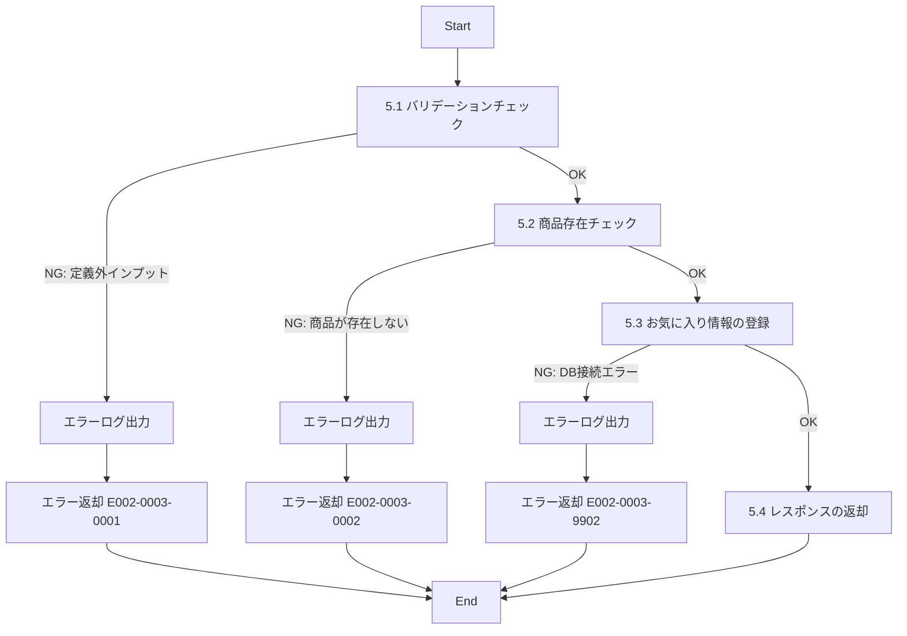

# ID002003_お気に入り情報登録_仕様書

## 1.目次

- [ID002003\_お気に入り情報登録\_仕様書](#id002003_お気に入り情報登録_仕様書)
  - [1.目次](#1目次)
  - [2.概要](#2概要)
  - [3.パラメータ](#3パラメータ)
    - [3.1.URI](#31uri)
    - [3.2.インプット](#32インプット)
    - [3.3.アウトプット](#33アウトプット)
  - [4.処理フロー](#4処理フロー)
  - [5.処理詳細](#5処理詳細)
    - [5.1 バリデーションチェック](#51-バリデーションチェック)
    - [5.2 商品存在チェック](#52-商品存在チェック)
    - [5.3 お気に入り情報の登録](#53-お気に入り情報の登録)
    - [5.4 レスポンスの返却](#54-レスポンスの返却)
  - [6.CRUD](#6crud)
  - [7.エラーメッセージ](#7エラーメッセージ)
  - [8.SQL](#8sql)
    - [8.1.商品存在チェック](#81商品存在チェック)
    - [8.2.お気に入り情報登録](#82お気に入り情報登録)
  - [9.備考](#9備考)

## 2.概要

ECサイトでユーザーが商品をお気に入りに追加するAPI。
既にお気に入り登録済みの場合は、再登録（更新日時の更新）を行う。
お気に入りの削除（disabled = 1に設定）されていた場合は、再度有効化（disabled = 0）する。

## 3.パラメータ

### 3.1.URI

`/user/favorite/reg`

[API一覧 2. API一覧 参照](./API一覧.md)

### 3.2.インプット

```json
{
  "userId": "user001",
  "productId": "p00000000001"
}
```

| パラメータ名 | 型 | 必須 | 説明 |
|------------|-----|------|------|
| userId | string | 必須 | ユーザーID |
| productId | string | 必須 | 商品ID |

### 3.3.アウトプット

```json
{
  "success": true,
  "message": "お気に入りに追加しました",
  "favorite": {
    "userId": "user001",
    "productId": "p00000000001",
    "favoritedAt": "2025-11-15T10:30:00Z"
  }
}
```

| パラメータ名 | 型 | 説明 |
|------------|-----|------|
| success | boolean | 登録成功フラグ |
| message | string | 処理結果メッセージ |
| favorite | object | お気に入り情報 |
| favorite.userId | string | ユーザーID |
| favorite.productId | string | 商品ID |
| favorite.favoritedAt | string | お気に入り登録/更新日時（ISO 8601形式） |

## 4.処理フロー



## 5.処理詳細

### 5.1 バリデーションチェック
1. インプットの定義通りかバリデーションチェックを行う。
   1. userIdが文字列型であることを確認する。
   2. userIdが空文字でないことを確認する。
   3. productIdが文字列型であることを確認する。
   4. productIdが空文字でないことを確認する。
   5. **定義通りでないインプットがあった場合、処理を中断する**
      1. エラーログ(E002-0003-0001)を出力する。
      2. エラー(E002-0003-0001)を返却する。

### 5.2 商品存在チェック
1. 指定された商品が存在するかチェックする。[8.1.商品存在チェック](#81商品存在チェック)
   1. **商品が存在しない場合、処理を中断する**
      1. エラーログ(E002-0003-0002)を出力する。
      2. エラー(E002-0003-0002)を返却する。

### 5.3 お気に入り情報の登録
1. お気に入り情報を登録する。[8.2.お気に入り情報登録](#82お気に入り情報登録)
   1. **エラーが発生した場合、処理を中断する**
      1. エラーログ(E002-0003-9902)を出力する。
      2. エラー(E002-0003-9902)を返却する。
2. 登録/更新日時を「登録日時」に格納する。

### 5.4 レスポンスの返却
1. 以下のレスポンスパラメータを設定し、返却する。

| レスポンスパラメータ | 設定値 |
|-------------------|--------|
| success | true |
| message | "お気に入りに追加しました" |
| favorite.userId | インプットのuserId |
| favorite.productId | インプットのproductId |
| favorite.favoritedAt | 「登録日時」 |

## 6.CRUD

|テーブル名|C|R|U|D|備考|
|--------|--|--|--|--|--|
|FAVORITE|○||○||UPSERT処理。将来実装予定|
|PRODUCT||○|||商品存在チェック用|

## 7.エラーメッセージ

|コード|内容|返却メッセージ|備考|
|--------|--|--|--|
|E002-0003-0001|バリデーションエラー|バリデーションエラー|インプットパラメータが不正|
|E002-0003-0002|商品が存在しない|指定された商品が見つかりません|該当商品が存在しないか、削除済み|
|E002-0003-9902|DBエラー|DBエラー|DB接続時のエラー|

## 8.SQL

### 8.1.商品存在チェック

```sql
-- 商品存在チェック
SELECT COUNT(*) as count
FROM PRODUCT
WHERE product_id = :productId
  AND disabled = 0; -- 有効な商品のみ
```

### 8.2.お気に入り情報登録

```sql
-- お気に入り情報登録（UPSERT）
-- 想定テーブル構造:
-- FAVORITE (user_id, product_id, created_at, updated_at, disabled)

INSERT INTO FAVORITE (
  user_id,
  product_id,
  created_at,
  updated_at,
  disabled
)
VALUES (
  :userId,
  :productId,
  CURRENT_TIMESTAMP,
  CURRENT_TIMESTAMP,
  0
)
ON DUPLICATE KEY UPDATE
  updated_at = CURRENT_TIMESTAMP,
  disabled = 0; -- 削除済みの場合は再度有効化
```

## 9.備考

- **FAVORITEテーブルは将来実装予定のテーブルであり、現時点では未定義**
- FAVORITEテーブルの想定構造:
  ```
  FAVORITE (
    user_id PK,
    product_id PK,
    created_at,
    updated_at,
    disabled
  )
  ```
- 既にお気に入り登録済みの商品を再度登録した場合、updated_atのみ更新される
- お気に入りを削除（disabled = 1）した商品を再登録した場合、disabled = 0に戻される
- 削除済み商品（PRODUCT.disabled = 1）はお気に入り登録できない
- トランザクション処理により、商品存在チェックとお気に入り登録は原子性を保つ
- お気に入り登録日時はISO 8601形式（例: 2025-11-15T10:30:00Z）で返却する
- ユーザーがログインしていない場合はこのAPIを呼び出せない（認証チェックが前提）
