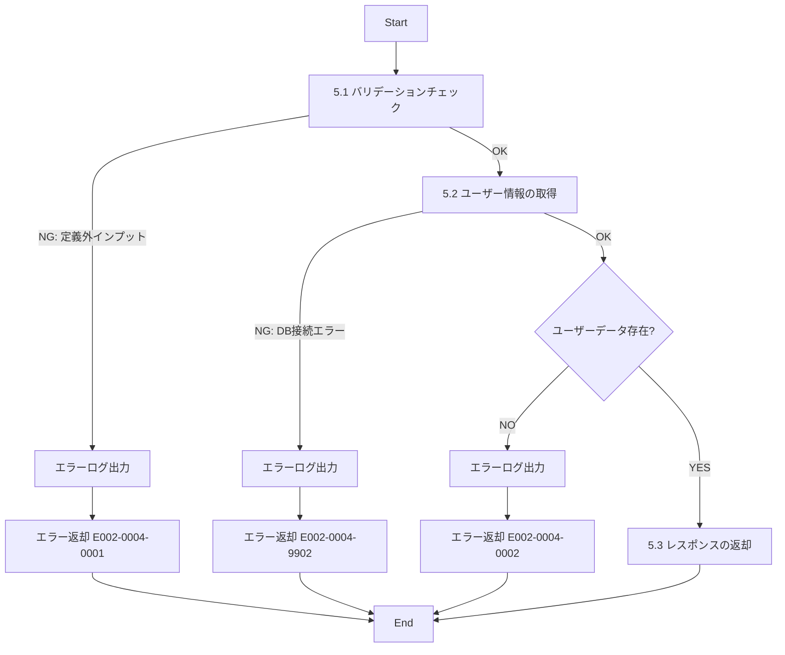

# ID002004_ユーザー情報取得_仕様書

## 1.目次

- [ID002004\_ユーザー情報取得\_仕様書](#id002004_ユーザー情報取得_仕様書)
  - [1.目次](#1目次)
  - [2.概要](#2概要)
  - [3.パラメータ](#3パラメータ)
    - [3.1.URI](#31uri)
    - [3.2.インプット](#32インプット)
    - [3.3.アウトプット](#33アウトプット)
  - [4.処理フロー](#4処理フロー)
  - [5.処理詳細](#5処理詳細)
    - [5.1 バリデーションチェック](#51-バリデーションチェック)
    - [5.2 ユーザー情報の取得](#52-ユーザー情報の取得)
    - [5.3 レスポンスの返却](#53-レスポンスの返却)
  - [6.CRUD](#6crud)
  - [7.エラーメッセージ](#7エラーメッセージ)
  - [8.SQL](#8sql)
    - [8.1.ユーザー基本情報取得](#81ユーザー基本情報取得)
    - [8.2.ユーザーメールアドレス取得](#82ユーザーメールアドレス取得)
    - [8.3.ユーザー住所取得](#83ユーザー住所取得)
    - [8.4.ユーザー電話番号取得](#84ユーザー電話番号取得)
  - [9.備考](#9備考)

## 2.概要

ECサイトでユーザーのプロフィール情報を取得するAPI。
ユーザーの基本情報、メールアドレス、住所、電話番号を含む詳細情報を返却する。

## 3.パラメータ

### 3.1.URI

`/user/detail/get`

[API一覧 2. API一覧 参照](./API一覧.md)

### 3.2.インプット

```json
{
  "userId": "user001"
}
```

| パラメータ名 | 型 | 必須 | 説明 |
|------------|-----|------|------|
| userId | string | 必須 | ユーザーID |

### 3.3.アウトプット

```json
{
  "userId": "user001",
  "userRole": 1,
  "permissions": "user",
  "displayName": "山田太郎",
  "lastName": "山田",
  "firstName": "太郎",
  "lastNameKana": "ヤマダ",
  "firstNameKana": "タロウ",
  "emails": [
    {
      "seqNo": 1,
      "email": "taro.yamada@example.com",
      "isPrimary": true
    },
    {
      "seqNo": 2,
      "email": "yamada.sub@example.com",
      "isPrimary": false
    }
  ],
  "addresses": [
    {
      "seqNo": 1,
      "address": "東京都渋谷区1-2-3",
      "prefectureCode": "13",
      "prefectureName": "東京都",
      "isPrimary": true
    }
  ],
  "phoneNumbers": [
    {
      "seqNo": 1,
      "phoneNumber": "090-1234-5678",
      "type": "携帯",
      "isPrimary": true
    },
    {
      "seqNo": 2,
      "phoneNumber": "03-1234-5678",
      "type": "自宅",
      "isPrimary": false
    }
  ]
}
```

| パラメータ名 | 型 | 説明 |
|------------|-----|------|
| userId | string | ユーザーID |
| userRole | number | 役職 |
| permissions | string | 権限 |
| displayName | string | 表示名（ニックネーム等） |
| lastName | string | 氏名（姓） |
| firstName | string | 氏名（名） |
| lastNameKana | string | 氏名かな（姓） |
| firstNameKana | string | 氏名かな（名） |
| emails | array | メールアドレスの配列 |
| emails[].seqNo | number | 連番 |
| emails[].email | string | メールアドレス |
| emails[].isPrimary | boolean | メインアドレスかどうか |
| addresses | array | 住所の配列 |
| addresses[].seqNo | number | 連番 |
| addresses[].address | string | 住所 |
| addresses[].prefectureCode | string | 都道府県コード |
| addresses[].prefectureName | string | 都道府県名 |
| addresses[].isPrimary | boolean | メイン住所かどうか |
| phoneNumbers | array | 電話番号の配列 |
| phoneNumbers[].seqNo | number | 連番 |
| phoneNumbers[].phoneNumber | string | 電話番号 |
| phoneNumbers[].type | string | 自宅・携帯など |
| phoneNumbers[].isPrimary | boolean | メイン電話番号かどうか |

## 4.処理フロー



## 5.処理詳細

### 5.1 バリデーションチェック
1. インプットの定義通りかバリデーションチェックを行う。
   1. userIdが文字列型であることを確認する。
   2. userIdが空文字でないことを確認する。
   3. **定義通りでないインプットがあった場合、処理を中断する**
      1. エラーログ(E002-0004-0001)を出力する。
      2. エラー(E002-0004-0001)を返却する。

### 5.2 ユーザー情報の取得
1. 「ユーザー基本情報」を取得する。[8.1.ユーザー基本情報取得](#81ユーザー基本情報取得)
   1. **エラーが発生した場合、処理を中断する**
      1. エラーログ(E002-0004-9902)を出力する。
      2. エラー(E002-0004-9902)を返却する。
2. 取得した「ユーザー基本情報」が0件の場合、**処理を中断する**
   1. エラーログ(E002-0004-0002)を出力する。
   2. エラー(E002-0004-0002)を返却する。
3. 「ユーザーメールアドレス」を取得する。[8.2.ユーザーメールアドレス取得](#82ユーザーメールアドレス取得)
   1. **エラーが発生した場合、処理を中断する**
      1. エラーログ(E002-0004-9902)を出力する。
      2. エラー(E002-0004-9902)を返却する。
4. 「ユーザー住所」を取得する。[8.3.ユーザー住所取得](#83ユーザー住所取得)
   1. **エラーが発生した場合、処理を中断する**
      1. エラーログ(E002-0004-9902)を出力する。
      2. エラー(E002-0004-9902)を返却する。
5. 「ユーザー電話番号」を取得する。[8.4.ユーザー電話番号取得](#84ユーザー電話番号取得)
   1. **エラーが発生した場合、処理を中断する**
      1. エラーログ(E002-0004-9902)を出力する。
      2. エラー(E002-0004-9902)を返却する。
6. 取得した情報を「ユーザー情報」に格納する。

### 5.3 レスポンスの返却
1. 以下のレスポンスパラメータを設定し、返却する。

| レスポンスパラメータ | 設定値 |
|-------------------|--------|
| userId | 「ユーザー情報」のuser_id |
| userRole | 「ユーザー情報」のuser_role |
| permissions | 「ユーザー情報」のpermissions |
| displayName | 「ユーザー情報」のdisplay_name |
| lastName | 「ユーザー情報」のlast_name |
| firstName | 「ユーザー情報」のfirst_name |
| lastNameKana | 「ユーザー情報」のlast_name_kana |
| firstNameKana | 「ユーザー情報」のfirst_name_kana |
| emails | 「ユーザー情報」のメールアドレス配列 |
| addresses | 「ユーザー情報」の住所配列 |
| phoneNumbers | 「ユーザー情報」の電話番号配列 |

## 6.CRUD

|テーブル名|C|R|U|D|備考|
|--------|--|--|--|--|--|
|USER||○||||
|USER_DETAIL||○||||
|USER_EMAIL||○||||
|USER_ADDRESS||○||||
|USER_PHONE_NUMBER||○||||
|PREFECTURE||○|||住所の都道府県名取得用|

## 7.エラーメッセージ

|コード|内容|返却メッセージ|備考|
|--------|--|--|--|
|E002-0004-0001|バリデーションエラー|バリデーションエラー|インプットパラメータが不正|
|E002-0004-0002|ユーザーが存在しない|指定されたユーザーが見つかりません|該当ユーザーが存在しないか、削除済み|
|E002-0004-9902|DBエラー|DBエラー|DB接続時のエラー|

## 8.SQL

### 8.1.ユーザー基本情報取得

```sql
-- ユーザー基本情報取得
SELECT
  u.user_id,
  u.user_role,
  u.permissions,
  ud.display_name,
  ud.last_name,
  ud.first_name,
  ud.last_name_kana,
  ud.first_name_kana
FROM USER u
LEFT JOIN USER_DETAIL ud ON u.user_id = ud.user_id AND ud.disabled = 0
WHERE u.user_id = :userId
  AND u.disabled = 0; -- 有効なユーザーのみ
```

### 8.2.ユーザーメールアドレス取得

```sql
-- ユーザーメールアドレス取得
SELECT
  seq_no,
  email,
  is_primary
FROM USER_EMAIL
WHERE user_id = :userId
  AND disabled = 0 -- 有効なメールアドレスのみ
ORDER BY is_primary DESC, seq_no ASC; -- メインアドレスを先頭に
```

### 8.3.ユーザー住所取得

```sql
-- ユーザー住所取得
SELECT
  ua.seq_no,
  ua.address,
  ua.prefecture_code,
  p.name as prefecture_name,
  ua.is_primary
FROM USER_ADDRESS ua
LEFT JOIN PREFECTURE p ON ua.prefecture_code = p.prefecture_code AND p.disabled = 0
WHERE ua.user_id = :userId
  AND ua.disabled = 0 -- 有効な住所のみ
ORDER BY ua.is_primary DESC, ua.seq_no ASC; -- メイン住所を先頭に
```

### 8.4.ユーザー電話番号取得

```sql
-- ユーザー電話番号取得
SELECT
  seq_no,
  phone_number,
  type,
  is_primary
FROM USER_PHONE_NUMBER
WHERE user_id = :userId
  AND disabled = 0 -- 有効な電話番号のみ
ORDER BY is_primary DESC, seq_no ASC; -- メイン電話番号を先頭に
```

## 9.備考

- パスワード情報はセキュリティ上、このAPIでは返却しない
- 削除フラグ(disabled = 1)が設定されたユーザーは取得対象外とする
- メールアドレス、住所、電話番号は複数登録可能であり、配列で返却する
- is_primaryがtrueのものがメインの連絡先となる
- メイン連絡先（is_primary = true）を配列の先頭に配置する
- ユーザーが存在しない場合、または削除済みの場合はエラーを返却する
- 個人情報を含むため、本人確認（認証）が必須のAPI
- USER_DETAIL、USER_EMAIL、USER_ADDRESS、USER_PHONE_NUMBERがない場合でも、USERレコードが存在すればエラーとせず、該当フィールドは空配列またはnullで返却する
