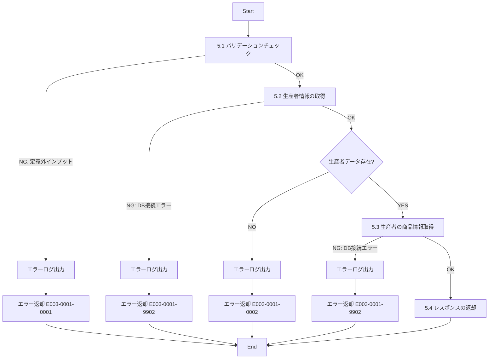

# ID003001_生産者情報取得_仕様書

## 1.目次

- [ID003001\_生産者情報取得\_仕様書](#id003001_生産者情報取得_仕様書)
  - [1.目次](#1目次)
  - [2.概要](#2概要)
  - [3.パラメータ](#3パラメータ)
    - [3.1.URI](#31uri)
    - [3.2.インプット](#32インプット)
    - [3.3.アウトプット](#33アウトプット)
  - [4.処理フロー](#4処理フロー)
  - [5.処理詳細](#5処理詳細)
    - [5.1 バリデーションチェック](#51-バリデーションチェック)
    - [5.2 生産者情報の取得](#52-生産者情報の取得)
    - [5.3 生産者の商品情報取得](#53-生産者の商品情報取得)
    - [5.4 レスポンスの返却](#54-レスポンスの返却)
  - [6.CRUD](#6crud)
  - [7.エラーメッセージ](#7エラーメッセージ)
  - [8.SQL](#8sql)
    - [8.1.生産者基本情報取得](#81生産者基本情報取得)
    - [8.2.生産者の商品情報取得](#82生産者の商品情報取得)
  - [9.備考](#9備考)

## 2.概要

ECサイトの生産者詳細画面で表示する生産者の情報を取得するAPI。
生産者の基本情報、住所、農園説明、その他の商品情報を返却する。

## 3.パラメータ

### 3.1.URI

`/producer/detail/get`

[API一覧 2. API一覧 参照](./API一覧.md)

### 3.2.インプット

```json
{
  "producerId": "pd00000001",
  "userId": "user001"
}
```

| パラメータ名 | 型 | 必須 | 説明 |
|------------|-----|------|------|
| producerId | string | 必須 | 生産者ID |
| userId | string | 任意 | ユーザーID。フォロー状態の取得に使用 |

### 3.3.アウトプット

```json
{
  "producerId": "pd00000001",
  "name": "桑田果樹園",
  "farmName": "桑田果樹園",
  "description": "岡山県でぶどうを生産する農家です。品質にこだわり、丁寧な栽培を心がけています。",
  "imagePath": "https://www.hoge.co.jp/producer001.png",
  "area": "岡山県",
  "address": "岡山県岡山市北区1-2-3",
  "follow": false,
  "products": [
    {
      "productId": "p00000000001",
      "productName": "【岡山県産】巨峰",
      "price": 3000,
      "stockQuantity": 5,
      "imagePath": "https://www.hoge.co.jp/aaa.png"
    },
    {
      "productId": "p00000000003",
      "productName": "【岡山県産】シャインマスカット",
      "price": 5000,
      "stockQuantity": 3,
      "imagePath": "https://www.hoge.co.jp/ccc.png"
    }
  ]
}
```

| パラメータ名 | 型 | 説明 |
|------------|-----|------|
| producerId | string | 生産者ID |
| name | string | 生産者名 |
| farmName | string | 農園名 |
| description | string | 農園説明 |
| imagePath | string | 生産者画像パス |
| area | string | 所在地エリア名 |
| address | string | 所在地住所 |
| follow | boolean | ユーザーがこの生産者をフォローしているか（userIdが指定されていない場合はfalse） |
| products | array | この生産者の商品一覧 |
| products[].productId | string | 商品ID |
| products[].productName | string | 商品名 |
| products[].price | number | 価格 |
| products[].stockQuantity | number | 在庫数 |
| products[].imagePath | string | 商品画像パス（メイン画像） |

## 4.処理フロー



## 5.処理詳細

### 5.1 バリデーションチェック
1. インプットの定義通りかバリデーションチェックを行う。
   1. producerIdが文字列型であることを確認する。
   2. producerIdが空文字でないことを確認する。
   3. userIdが指定されている場合、文字列型であることを確認する。
   4. **定義通りでないインプットがあった場合、処理を中断する**
      1. エラーログ(E003-0001-0001)を出力する。
      2. エラー(E003-0001-0001)を返却する。

### 5.2 生産者情報の取得
1. 「生産者基本情報」を取得する。[8.1.生産者基本情報取得](#81生産者基本情報取得)
   1. **エラーが発生した場合、処理を中断する**
      1. エラーログ(E003-0001-9902)を出力する。
      2. エラー(E003-0001-9902)を返却する。
2. 取得した「生産者基本情報」が0件の場合、**処理を中断する**
   1. エラーログ(E003-0001-0002)を出力する。
   2. エラー(E003-0001-0002)を返却する。
3. 取得した「生産者基本情報」を「生産者情報」に格納する。

### 5.3 生産者の商品情報取得
1. 「生産者の商品情報」を取得する。[8.2.生産者の商品情報取得](#82生産者の商品情報取得)
   1. **エラーが発生した場合、処理を中断する**
      1. エラーログ(E003-0001-9902)を出力する。
      2. エラー(E003-0001-9902)を返却する。
2. 取得した「生産者の商品情報」を「商品リスト」に格納する。

### 5.4 レスポンスの返却
1. 以下のレスポンスパラメータを設定し、返却する。

| レスポンスパラメータ | 設定値 |
|-------------------|--------|
| producerId | 「生産者情報」のproducer_id |
| name | 「生産者情報」のname |
| farmName | 「生産者情報」のfarm_name |
| description | 「生産者情報」のdescription |
| imagePath | 「生産者情報」のimage_path |
| area | 「生産者情報」のarea_name |
| address | 「生産者情報」のaddress |
| follow | false（将来的にはFOLLOWテーブルから取得） |
| products | 「商品リスト」 |

## 6.CRUD

|テーブル名|C|R|U|D|備考|
|--------|--|--|--|--|--|
|PRODUCER||○||||
|PRODUCER_ADDRESS||○||||
|AREA||○|||所在地名取得用|
|PRODUCT||○|||生産者の商品取得用|
|PRODUCT_IMAGE||○|||商品画像取得用|

## 7.エラーメッセージ

|コード|内容|返却メッセージ|備考|
|--------|--|--|--|
|E003-0001-0001|バリデーションエラー|バリデーションエラー|インプットパラメータが不正|
|E003-0001-0002|生産者が存在しない|指定された生産者が見つかりません|該当生産者が存在しないか、削除済み|
|E003-0001-9902|DBエラー|DBエラー|DB接続時のエラー|

## 8.SQL

### 8.1.生産者基本情報取得

```sql
-- 生産者基本情報取得
SELECT
  p.producer_id,
  p.name,
  p.farm_name,
  p.description,
  p.image_path,
  a.name as area_name,
  pa.address
FROM PRODUCER p
LEFT JOIN PRODUCER_ADDRESS pa ON p.producer_id = pa.producer_id AND pa.disabled = 0
LEFT JOIN AREA a ON pa.area_kbn = a.area_kbn AND a.disabled = 0
WHERE p.producer_id = :producerId
  AND p.disabled = 0 -- 有効な生産者のみ
LIMIT 1;
```

### 8.2.生産者の商品情報取得

```sql
-- 生産者の商品情報取得
SELECT
  p.product_id,
  p.description as product_name,
  p.price,
  p.stock_quantity,
  pi.image_path
FROM PRODUCT p
LEFT JOIN PRODUCT_IMAGE pi ON p.product_id = pi.product_id
  AND pi.view_order = 1
  AND pi.disabled = 0
WHERE p.producer_id = :producerId
  AND p.disabled = 0 -- 有効な商品のみ
ORDER BY p.created_at DESC
LIMIT 10; -- 最大10件
```

## 9.備考

- 削除フラグ(disabled = 1)が設定された生産者は取得対象外とする
- 生産者の商品は最大10件まで取得し、作成日時の降順（新しい順）で返却する
- 商品画像はメイン画像（view_order = 1）のみを返却する
- フォロー機能は将来実装予定のため、現時点ではfollowは常にfalseを返却する
  - 将来的にはPRODUCER_FOLLOWテーブル（未定義）からフォロー状態を取得する想定
- 生産者が複数の住所を持つ場合、最初の1件のみ返却される（LIMIT 1）
- 生産者に商品が1件もない場合でも、productsは空配列として返却する（エラーとしない）
- PRODUCER_ADDRESSやAREAテーブルにデータがない場合、areaやaddressはnullとなる
