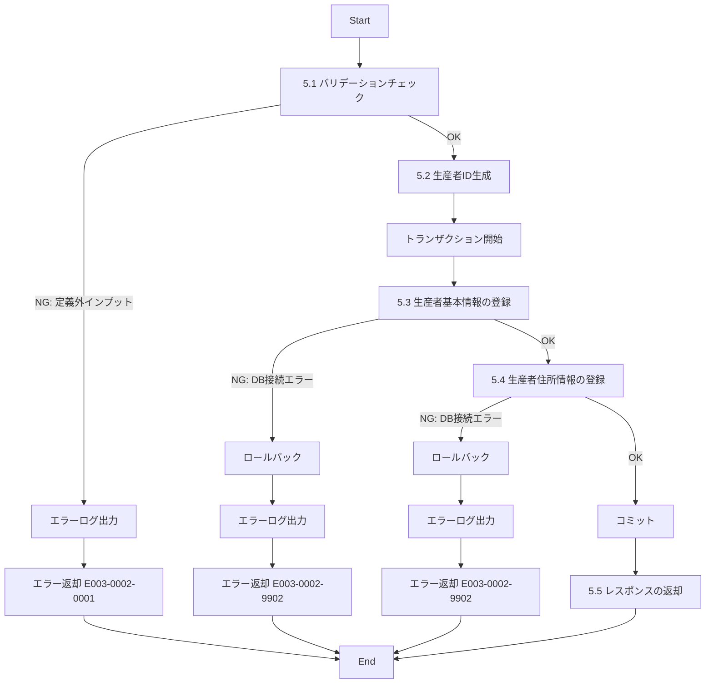

# ID003002_生産者情報登録_仕様書

## 1.目次

- [ID003002\_生産者情報登録\_仕様書](#id003002_生産者情報登録_仕様書)
  - [1.目次](#1目次)
  - [2.概要](#2概要)
  - [3.パラメータ](#3パラメータ)
    - [3.1.URI](#31uri)
    - [3.2.インプット](#32インプット)
    - [3.3.アウトプット](#33アウトプット)
  - [4.処理フロー](#4処理フロー)
  - [5.処理詳細](#5処理詳細)
    - [5.1 バリデーションチェック](#51-バリデーションチェック)
    - [5.2 生産者ID生成](#52-生産者id生成)
    - [5.3 生産者基本情報の登録](#53-生産者基本情報の登録)
    - [5.4 生産者住所情報の登録](#54-生産者住所情報の登録)
    - [5.5 レスポンスの返却](#55-レスポンスの返却)
  - [6.CRUD](#6crud)
  - [7.エラーメッセージ](#7エラーメッセージ)
  - [8.SQL](#8sql)
    - [8.1.生産者基本情報登録](#81生産者基本情報登録)
    - [8.2.生産者住所情報登録](#82生産者住所情報登録)
  - [9.備考](#9備考)

## 2.概要

ECサイトに新しい生産者を登録するAPI。
生産者の基本情報と住所情報をトランザクションで一括登録する。

## 3.パラメータ

### 3.1.URI

`/producer/detail/reg`

[API一覧 2. API一覧 参照](./API一覧.md)

### 3.2.インプット

```json
{
  "name": "桑田果樹園",
  "farmName": "桑田果樹園",
  "description": "岡山県でぶどうを生産する農家です。品質にこだわり、丁寧な栽培を心がけています。",
  "imagePath": "https://www.hoge.co.jp/producer001.png",
  "areaKbn": "area001",
  "address": "岡山県岡山市北区1-2-3",
  "createdBy": "admin001"
}
```

| パラメータ名 | 型 | 必須 | 説明 |
|------------|-----|------|------|
| name | string | 必須 | 生産者名 |
| farmName | string | 必須 | 農園名 |
| description | string | 任意 | 農園説明 |
| imagePath | string | 任意 | 生産者画像パス |
| areaKbn | string | 必須 | 所在地区分（AREAテーブルのarea_kbn） |
| address | string | 必須 | 所在地住所 |
| createdBy | string | 必須 | 作成者のユーザーID |

### 3.3.アウトプット

```json
{
  "success": true,
  "message": "生産者情報を登録しました",
  "producer": {
    "producerId": "pd00000010",
    "name": "桑田果樹園",
    "farmName": "桑田果樹園",
    "description": "岡山県でぶどうを生産する農家です。品質にこだわり、丁寧な栽培を心がけています。",
    "imagePath": "https://www.hoge.co.jp/producer001.png",
    "areaKbn": "area001",
    "address": "岡山県岡山市北区1-2-3",
    "createdAt": "2025-11-15T10:30:00Z"
  }
}
```

| パラメータ名 | 型 | 説明 |
|------------|-----|------|
| success | boolean | 登録成功フラグ |
| message | string | 処理結果メッセージ |
| producer | object | 登録された生産者情報 |
| producer.producerId | string | 生成された生産者ID |
| producer.name | string | 生産者名 |
| producer.farmName | string | 農園名 |
| producer.description | string | 農園説明 |
| producer.imagePath | string | 生産者画像パス |
| producer.areaKbn | string | 所在地区分 |
| producer.address | string | 所在地住所 |
| producer.createdAt | string | 登録日時（ISO 8601形式） |

## 4.処理フロー



## 5.処理詳細

### 5.1 バリデーションチェック
1. インプットの定義通りかバリデーションチェックを行う。
   1. nameが文字列型で空文字でないことを確認する。
   2. farmNameが文字列型で空文字でないことを確認する。
   3. descriptionが指定されている場合、文字列型であることを確認する。
   4. imagePathが指定されている場合、文字列型であることを確認する。
   5. areaKbnが文字列型で空文字でないことを確認する。
   6. addressが文字列型で空文字でないことを確認する。
   7. createdByが文字列型で空文字でないことを確認する。
   8. **定義通りでないインプットがあった場合、処理を中断する**
      1. エラーログ(E003-0002-0001)を出力する。
      2. エラー(E003-0002-0001)を返却する。

### 5.2 生産者ID生成
1. 新しい生産者IDを生成する。
   1. フォーマット: `pd` + 8桁の連番（例: pd00000010）
   2. PRODUCERテーブルの最大IDを取得し、+1した値を使用する。
2. 生成したIDを「生産者ID」に格納する。

### 5.3 生産者基本情報の登録
1. トランザクションを開始する。
2. 生産者基本情報を登録する。[8.1.生産者基本情報登録](#81生産者基本情報登録)
   1. **エラーが発生した場合、処理を中断する**
      1. トランザクションをロールバックする。
      2. エラーログ(E003-0002-9902)を出力する。
      3. エラー(E003-0002-9902)を返却する。

### 5.4 生産者住所情報の登録
1. 生産者住所情報を登録する。[8.2.生産者住所情報登録](#82生産者住所情報登録)
   1. **エラーが発生した場合、処理を中断する**
      1. トランザクションをロールバックする。
      2. エラーログ(E003-0002-9902)を出力する。
      3. エラー(E003-0002-9902)を返却する。
2. トランザクションをコミットする。
3. 登録日時を「登録日時」に格納する。

### 5.5 レスポンスの返却
1. 以下のレスポンスパラメータを設定し、返却する。

| レスポンスパラメータ | 設定値 |
|-------------------|--------|
| success | true |
| message | "生産者情報を登録しました" |
| producer.producerId | 「生産者ID」 |
| producer.name | インプットのname |
| producer.farmName | インプットのfarmName |
| producer.description | インプットのdescription |
| producer.imagePath | インプットのimagePath |
| producer.areaKbn | インプットのareaKbn |
| producer.address | インプットのaddress |
| producer.createdAt | 「登録日時」 |

## 6.CRUD

|テーブル名|C|R|U|D|備考|
|--------|--|--|--|--|--|
|PRODUCER|○||||生産者基本情報登録|
|PRODUCER_ADDRESS|○||||生産者住所情報登録|
|AREA||○|||所在地区分の存在チェック用|

## 7.エラーメッセージ

|コード|内容|返却メッセージ|備考|
|--------|--|--|--|
|E003-0002-0001|バリデーションエラー|バリデーションエラー|インプットパラメータが不正|
|E003-0002-9902|DBエラー|DBエラー|DB接続時のエラー|

## 8.SQL

### 8.1.生産者基本情報登録

```sql
-- 生産者基本情報登録
INSERT INTO PRODUCER (
  producer_id,
  name,
  farm_name,
  description,
  image_path,
  disabled,
  created_by,
  updated_by,
  created_at,
  updated_at
)
VALUES (
  :producerId,
  :name,
  :farmName,
  :description,
  :imagePath,
  0, -- 有効
  :createdBy,
  :createdBy,
  CURRENT_TIMESTAMP,
  CURRENT_TIMESTAMP
);
```

### 8.2.生産者住所情報登録

```sql
-- 生産者住所情報登録
INSERT INTO PRODUCER_ADDRESS (
  producer_id,
  area_kbn,
  address,
  disabled,
  created_by,
  updated_by,
  created_at,
  updated_at
)
VALUES (
  :producerId,
  :areaKbn,
  :address,
  0, -- 有効
  :createdBy,
  :createdBy,
  CURRENT_TIMESTAMP,
  CURRENT_TIMESTAMP
);
```

## 9.備考

- 生産者基本情報と住所情報は同一トランザクション内で登録され、原子性が保証される
- 生産者IDは自動生成され、フォーマットは`pd` + 8桁の連番
- areaKbnはAREAテーブルに存在する値である必要がある（外部キー制約）
- 登録時のdisabledは0（有効）で固定
- created_byとupdated_byには同じユーザーIDが設定される
- 画像ファイルのアップロード処理は別APIで実行され、このAPIでは画像パスのみを登録する
- 登録日時はISO 8601形式（例: 2025-11-15T10:30:00Z）で返却する
- 管理者権限が必要なAPI（createdByで権限チェックを行う想定）
