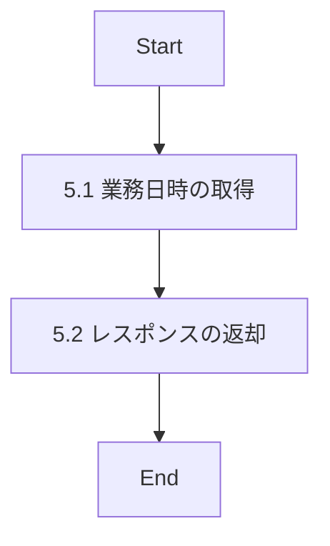

# ID004001_業務日時取得_仕様書

## 1.目次

- [ID004001\_業務日時取得\_仕様書](#id004001_業務日時取得_仕様書)
  - [1.目次](#1目次)
  - [2.概要](#2概要)
  - [3.パラメータ](#3パラメータ)
    - [3.1.URI](#31uri)
    - [3.2.インプット](#32インプット)
    - [3.3.アウトプット](#33アウトプット)
  - [4.処理フロー](#4処理フロー)
  - [5.処理詳細](#5処理詳細)
    - [5.1 業務日時の取得](#51-業務日時の取得)
    - [5.2 レスポンスの返却](#52-レスポンスの返却)
  - [6.CRUD](#6crud)
  - [7.エラーメッセージ](#7エラーメッセージ)
  - [8.SQL](#8sql)
  - [9.備考](#9備考)

## 2.概要

システムの業務日時を取得するAPI。
サーバー側の現在日時を返却する。クライアント側の時刻との同期やタイムスタンプの統一に使用する。

## 3.パラメータ

### 3.1.URI

`/sys/bizdate/get`

[API一覧 2. API一覧 参照](./API一覧.md)

### 3.2.インプット

```json
{}
```

インプットパラメータなし

### 3.3.アウトプット

```json
{
  "businessDateTime": "2025-11-15T10:30:45Z",
  "timestamp": 1731668445000,
  "timezone": "Asia/Tokyo",
  "format": {
    "iso8601": "2025-11-15T10:30:45Z",
    "date": "2025-11-15",
    "time": "10:30:45",
    "dateTimeJp": "2025年11月15日 10時30分45秒"
  }
}
```

| パラメータ名 | 型 | 説明 |
|------------|-----|------|
| businessDateTime | string | 業務日時（ISO 8601形式） |
| timestamp | number | UNIXタイムスタンプ（ミリ秒） |
| timezone | string | タイムゾーン |
| format | object | 各種フォーマットの日時 |
| format.iso8601 | string | ISO 8601形式 |
| format.date | string | 日付部分（YYYY-MM-DD） |
| format.time | string | 時刻部分（HH:mm:ss） |
| format.dateTimeJp | string | 日本語形式 |

## 4.処理フロー



## 5.処理詳細

### 5.1 業務日時の取得
1. サーバーの現在日時を取得する。
2. 取得した日時を「業務日時」に格納する。
3. 「業務日時」を各種フォーマットに変換する。
   1. ISO 8601形式に変換する。
   2. UNIXタイムスタンプ（ミリ秒）に変換する。
   3. 日付部分（YYYY-MM-DD）を抽出する。
   4. 時刻部分（HH:mm:ss）を抽出する。
   5. 日本語形式に変換する。

### 5.2 レスポンスの返却
1. 以下のレスポンスパラメータを設定し、返却する。

| レスポンスパラメータ | 設定値 |
|-------------------|--------|
| businessDateTime | 「業務日時」（ISO 8601形式） |
| timestamp | 「業務日時」（UNIXタイムスタンプ） |
| timezone | タイムゾーン（"Asia/Tokyo"） |
| format.iso8601 | 「業務日時」（ISO 8601形式） |
| format.date | 「業務日時」の日付部分 |
| format.time | 「業務日時」の時刻部分 |
| format.dateTimeJp | 「業務日時」（日本語形式） |

## 6.CRUD

|テーブル名|C|R|U|D|備考|
|--------|--|--|--|--|--|
|（なし）|-|-|-|-|データベースアクセスなし|

## 7.エラーメッセージ

|コード|内容|返却メッセージ|備考|
|--------|--|--|--|
|（エラーなし）|-|-|正常時のみ|

## 8.SQL

SQLは使用しない（データベースアクセスなし）

## 9.備考

- このAPIはインプットパラメータを必要としない
- データベースへのアクセスは行わず、サーバーのシステム時刻を返却する
- タイムゾーンは"Asia/Tokyo"（日本標準時）を使用する
- ISO 8601形式の日時はUTC（協定世界時）で返却する
- クライアント側でタイムゾーン変換が必要な場合は、timezoneを参照する
- 認証不要のパブリックAPIとして提供される想定
- キャッシュは行わず、常に最新の時刻を返却する
- 処理時間は非常に短く、エラーが発生する可能性はほぼない
- システムメンテナンスや時刻調整の際に、このAPIを参照して業務日時を確認できる
