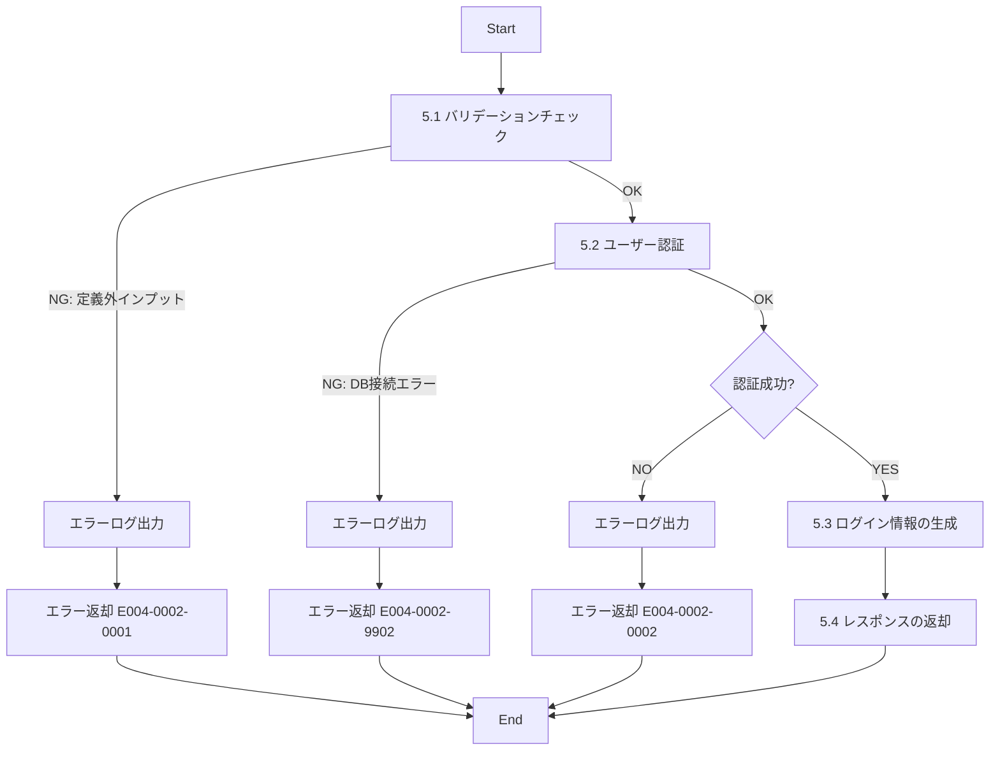

# ID004002_ログイン情報取得_仕様書

## 1.目次

- [ID004002\_ログイン情報取得\_仕様書](#id004002_ログイン情報取得_仕様書)
  - [1.目次](#1目次)
  - [2.概要](#2概要)
  - [3.パラメータ](#3パラメータ)
    - [3.1.URI](#31uri)
    - [3.2.インプット](#32インプット)
    - [3.3.アウトプット](#33アウトプット)
  - [4.処理フロー](#4処理フロー)
  - [5.処理詳細](#5処理詳細)
    - [5.1 バリデーションチェック](#51-バリデーションチェック)
    - [5.2 ユーザー認証](#52-ユーザー認証)
    - [5.3 ログイン情報の生成](#53-ログイン情報の生成)
    - [5.4 レスポンスの返却](#54-レスポンスの返却)
  - [6.CRUD](#6crud)
  - [7.エラーメッセージ](#7エラーメッセージ)
  - [8.SQL](#8sql)
    - [8.1.ユーザー認証情報取得](#81ユーザー認証情報取得)
  - [9.備考](#9備考)

## 2.概要

ユーザーのログイン処理を行い、認証情報を取得するAPI。
ユーザーIDとパスワードで認証を行い、成功時にはトークンや権限情報を返却する。

## 3.パラメータ

### 3.1.URI

`/sys/login/get`

[API一覧 2. API一覧 参照](./API一覧.md)

### 3.2.インプット

```json
{
  "userId": "user001",
  "password": "password123"
}
```

| パラメータ名 | 型 | 必須 | 説明 |
|------------|-----|------|------|
| userId | string | 必須 | ユーザーID |
| password | string | 必須 | パスワード（平文） |

### 3.3.アウトプット

```json
{
  "success": true,
  "message": "ログインに成功しました",
  "user": {
    "userId": "user001",
    "displayName": "山田太郎",
    "userRole": 1,
    "permissions": "user"
  },
  "session": {
    "token": "eyJhbGciOiJIUzI1NiIsInR5cCI6IkpXVCJ9...",
    "expiresAt": "2025-11-16T10:30:00Z",
    "refreshToken": "refresh_token_example"
  }
}
```

| パラメータ名 | 型 | 説明 |
|------------|-----|------|
| success | boolean | ログイン成功フラグ |
| message | string | 処理結果メッセージ |
| user | object | ユーザー情報 |
| user.userId | string | ユーザーID |
| user.displayName | string | 表示名 |
| user.userRole | number | 役職 |
| user.permissions | string | 権限 |
| session | object | セッション情報 |
| session.token | string | アクセストークン（JWT） |
| session.expiresAt | string | トークン有効期限（ISO 8601形式） |
| session.refreshToken | string | リフレッシュトークン |

## 4.処理フロー



## 5.処理詳細

### 5.1 バリデーションチェック
1. インプットの定義通りかバリデーションチェックを行う。
   1. userIdが文字列型であることを確認する。
   2. userIdが空文字でないことを確認する。
   3. passwordが文字列型であることを確認する。
   4. passwordが空文字でないことを確認する。
   5. **定義通りでないインプットがあった場合、処理を中断する**
      1. エラーログ(E004-0002-0001)を出力する。
      2. エラー(E004-0002-0001)を返却する。

### 5.2 ユーザー認証
1. ユーザー認証情報を取得する。[8.1.ユーザー認証情報取得](#81ユーザー認証情報取得)
   1. **エラーが発生した場合、処理を中断する**
      1. エラーログ(E004-0002-9902)を出力する。
      2. エラー(E004-0002-9902)を返却する。
2. 取得したユーザー情報が0件、または無効なユーザーの場合、**処理を中断する**
   1. エラーログ(E004-0002-0002)を出力する。
   2. エラー(E004-0002-0002)を返却する。
3. インプットのpasswordをハッシュ化する。
4. ハッシュ化されたpasswordと、取得したパスワードハッシュを比較する。
5. **パスワードが一致しない場合、処理を中断する**
   1. エラーログ(E004-0002-0002)を出力する。
   2. エラー(E004-0002-0002)を返却する。
6. 認証成功として、ユーザー情報を「ユーザー情報」に格納する。

### 5.3 ログイン情報の生成
1. アクセストークン（JWT）を生成する。
   1. ペイロード: userId, userRole, permissions
   2. 有効期限: 24時間
2. リフレッシュトークンを生成する。
   1. 有効期限: 30日
3. トークン有効期限を算出する。
4. 生成した情報を「セッション情報」に格納する。

### 5.4 レスポンスの返却
1. 以下のレスポンスパラメータを設定し、返却する。

| レスポンスパラメータ | 設定値 |
|-------------------|--------|
| success | true |
| message | "ログインに成功しました" |
| user.userId | 「ユーザー情報」のuser_id |
| user.displayName | 「ユーザー情報」のdisplay_name |
| user.userRole | 「ユーザー情報」のuser_role |
| user.permissions | 「ユーザー情報」のpermissions |
| session.token | 「セッション情報」のアクセストークン |
| session.expiresAt | 「セッション情報」のトークン有効期限 |
| session.refreshToken | 「セッション情報」のリフレッシュトークン |

## 6.CRUD

|テーブル名|C|R|U|D|備考|
|--------|--|--|--|--|--|
|USER||○|||認証情報取得用|
|USER_DETAIL||○|||表示名取得用|

## 7.エラーメッセージ

|コード|内容|返却メッセージ|備考|
|--------|--|--|--|
|E004-0002-0001|バリデーションエラー|バリデーションエラー|インプットパラメータが不正|
|E004-0002-0002|認証失敗|ユーザーIDまたはパスワードが正しくありません|ユーザーが存在しない、またはパスワード不一致|
|E004-0002-9902|DBエラー|DBエラー|DB接続時のエラー|

## 8.SQL

### 8.1.ユーザー認証情報取得

```sql
-- ユーザー認証情報取得
SELECT
  u.user_id,
  u.password,
  u.user_role,
  u.permissions,
  ud.display_name
FROM USER u
LEFT JOIN USER_DETAIL ud ON u.user_id = ud.user_id AND ud.disabled = 0
WHERE u.user_id = :userId
  AND u.disabled = 0; -- 有効なユーザーのみ
```

## 9.備考

- パスワードはハッシュ化されてデータベースに保存されている（bcrypt等を使用）
- インプットのパスワードは平文で受け取り、サーバー側でハッシュ化して比較する
- 認証失敗時は、ユーザーが存在しない場合とパスワードが間違っている場合を区別しない（セキュリティ上の理由）
- アクセストークンはJWT（JSON Web Token）形式で生成する
- トークンの有効期限は24時間、リフレッシュトークンは30日とする
- ログイン成功時のレスポンスにはパスワード情報は含めない
- セキュリティ上、ログイン失敗の詳細（ユーザーが存在しないのか、パスワードが間違っているのか）は返却しない
- ブルートフォース攻撃対策として、ログイン失敗回数の制限を実装することを推奨（仕様書には含まれていないが、実装時に考慮）
- HTTPS通信必須（パスワードを平文で送信するため）
- トークンはHTTP Onlyクッキーまたは LocalStorageに保存することを想定
