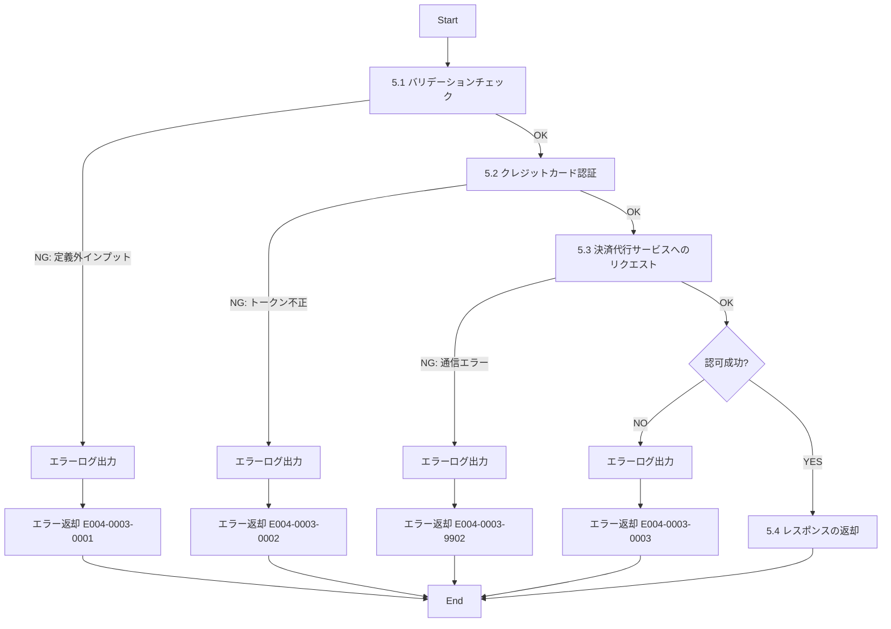

# ID004003_クレジット認可情報取得_仕様書

## 1.目次

- [ID004003\_クレジット認可情報取得\_仕様書](#id004003_クレジット認可情報取得_仕様書)
  - [1.目次](#1目次)
  - [2.概要](#2概要)
  - [3.パラメータ](#3パラメータ)
    - [3.1.URI](#31uri)
    - [3.2.インプット](#32インプット)
    - [3.3.アウトプット](#33アウトプット)
  - [4.処理フロー](#4処理フロー)
  - [5.処理詳細](#5処理詳細)
    - [5.1 バリデーションチェック](#51-バリデーションチェック)
    - [5.2 クレジットカード認証](#52-クレジットカード認証)
    - [5.3 決済代行サービスへのリクエスト](#53-決済代行サービスへのリクエスト)
    - [5.4 レスポンスの返却](#54-レスポンスの返却)
  - [6.CRUD](#6crud)
  - [7.エラーメッセージ](#7エラーメッセージ)
  - [8.SQL](#8sql)
  - [9.備考](#9備考)

## 2.概要

クレジットカード決済の認可情報を取得するAPI。
決済代行サービス（例: Stripe、PAY.JP等）と連携し、クレジットカード情報の認証と認可を行う。

## 3.パラメータ

### 3.1.URI

`/sys/credit/auth/get`

[API一覧 2. API一覧 参照](./API一覧.md)

### 3.2.インプット

```json
{
  "userId": "user001",
  "amount": 5000,
  "currency": "JPY",
  "cardToken": "tok_1234567890abcdef",
  "description": "商品購入"
}
```

| パラメータ名 | 型 | 必須 | 説明 |
|------------|-----|------|------|
| userId | string | 必須 | ユーザーID |
| amount | number | 必須 | 決済金額 |
| currency | string | 必須 | 通貨コード（ISO 4217）デフォルト: JPY |
| cardToken | string | 必須 | カードトークン（決済代行サービスから取得） |
| description | string | 任意 | 決済の説明 |

### 3.3.アウトプット

```json
{
  "success": true,
  "message": "クレジットカード認可に成功しました",
  "authorization": {
    "authorizationId": "auth_1234567890",
    "status": "authorized",
    "amount": 5000,
    "currency": "JPY",
    "cardLast4": "4242",
    "cardBrand": "Visa",
    "authorizedAt": "2025-11-15T10:30:00Z",
    "expiresAt": "2025-11-22T10:30:00Z"
  }
}
```

| パラメータ名 | 型 | 説明 |
|------------|-----|------|
| success | boolean | 認可成功フラグ |
| message | string | 処理結果メッセージ |
| authorization | object | 認可情報 |
| authorization.authorizationId | string | 認可ID |
| authorization.status | string | ステータス（authorized, failed等） |
| authorization.amount | number | 認可金額 |
| authorization.currency | string | 通貨コード |
| authorization.cardLast4 | string | カード番号下4桁 |
| authorization.cardBrand | string | カードブランド（Visa, Mastercard等） |
| authorization.authorizedAt | string | 認可日時（ISO 8601形式） |
| authorization.expiresAt | string | 認可有効期限（ISO 8601形式） |

## 4.処理フロー



## 5.処理詳細

### 5.1 バリデーションチェック
1. インプットの定義通りかバリデーションチェックを行う。
   1. userIdが文字列型で空文字でないことを確認する。
   2. amountが数値型で0より大きいことを確認する。
   3. currencyが文字列型で3文字（ISO 4217形式）であることを確認する。
   4. cardTokenが文字列型で空文字でないことを確認する。
   5. descriptionが指定されている場合、文字列型であることを確認する。
   6. **定義通りでないインプットがあった場合、処理を中断する**
      1. エラーログ(E004-0003-0001)を出力する。
      2. エラー(E004-0003-0001)を返却する。

### 5.2 クレジットカード認証
1. cardTokenの形式を確認する。
2. **cardTokenが不正な形式の場合、処理を中断する**
   1. エラーログ(E004-0003-0002)を出力する。
   2. エラー(E004-0003-0002)を返却する。

### 5.3 決済代行サービスへのリクエスト
1. 決済代行サービスのAPIに認可リクエストを送信する。
   1. エンドポイント: 決済代行サービスのcharge/authorize endpoint
   2. リクエストパラメータ:
      - amount: 決済金額
      - currency: 通貨コード
      - source: cardToken
      - description: 決済の説明
      - capture: false（認可のみ、決済は後で実行）
   3. **通信エラーが発生した場合、処理を中断する**
      1. エラーログ(E004-0003-9902)を出力する。
      2. エラー(E004-0003-9902)を返却する。
2. 決済代行サービスからのレスポンスを取得する。
3. **認可が失敗した場合、処理を中断する**
   1. エラーログ(E004-0003-0003)を出力する。
   2. エラー(E004-0003-0003)を返却する。
4. レスポンスから認可情報を抽出し、「認可情報」に格納する。

### 5.4 レスポンスの返却
1. 以下のレスポンスパラメータを設定し、返却する。

| レスポンスパラメータ | 設定値 |
|-------------------|--------|
| success | true |
| message | "クレジットカード認可に成功しました" |
| authorization.authorizationId | 「認可情報」のID |
| authorization.status | "authorized" |
| authorization.amount | 「認可情報」の金額 |
| authorization.currency | 「認可情報」の通貨 |
| authorization.cardLast4 | 「認可情報」のカード下4桁 |
| authorization.cardBrand | 「認可情報」のカードブランド |
| authorization.authorizedAt | 「認可情報」の認可日時 |
| authorization.expiresAt | 「認可情報」の有効期限 |

## 6.CRUD

|テーブル名|C|R|U|D|備考|
|--------|--|--|--|--|--|
|（将来実装）|○||||認可履歴テーブルへの記録（将来実装予定）|

## 7.エラーメッセージ

|コード|内容|返却メッセージ|備考|
|--------|--|--|--|
|E004-0003-0001|バリデーションエラー|バリデーションエラー|インプットパラメータが不正|
|E004-0003-0002|カードトークンエラー|カードトークンが不正です|cardTokenの形式が不正|
|E004-0003-0003|認可失敗|クレジットカード認可に失敗しました|決済代行サービス側で認可が拒否された|
|E004-0003-9902|通信エラー|決済サービスとの通信に失敗しました|決済代行サービスとの通信エラー|

## 8.SQL

SQLは使用しない（外部決済代行サービスとのAPI連携のみ）

**将来実装時の想定SQL:**

```sql
-- 認可履歴登録（将来実装予定）
-- 想定テーブル構造:
-- CREDIT_AUTHORIZATION (
--   authorization_id,
--   user_id,
--   amount,
--   currency,
--   status,
--   card_last4,
--   card_brand,
--   authorized_at,
--   expires_at,
--   created_at,
--   updated_at,
--   disabled
-- )

INSERT INTO CREDIT_AUTHORIZATION (
  authorization_id,
  user_id,
  amount,
  currency,
  status,
  card_last4,
  card_brand,
  authorized_at,
  expires_at,
  disabled,
  created_at,
  updated_at
)
VALUES (
  :authorizationId,
  :userId,
  :amount,
  :currency,
  'authorized',
  :cardLast4,
  :cardBrand,
  :authorizedAt,
  :expiresAt,
  0,
  CURRENT_TIMESTAMP,
  CURRENT_TIMESTAMP
);
```

## 9.備考

- **このAPIは決済代行サービス（Stripe、PAY.JP等）との連携を前提としている**
- クレジットカード番号は直接扱わず、決済代行サービスが発行するトークン（cardToken）を使用する
- PCI DSS準拠のため、カード情報をサーバー側で保持しない
- cardTokenはクライアント側で決済代行サービスのJavaScript SDKを使用して取得する
- 認可（Authorization）と決済（Capture）は分離されており、このAPIでは認可のみを行う
- 実際の決済は別のAPI（未実装）で実行する想定
- 認可の有効期限は通常7日間（決済代行サービスによって異なる）
- セキュリティ上、HTTPS通信必須
- 認可履歴をデータベースに保存する機能は将来実装予定
- エラーハンドリングでは、決済代行サービスから返却されるエラーコードを適切にマッピングする
- テスト環境では決済代行サービスのテストモードを使用する
- 本番環境では決済代行サービスの本番APIキーを使用する（環境変数で管理）
