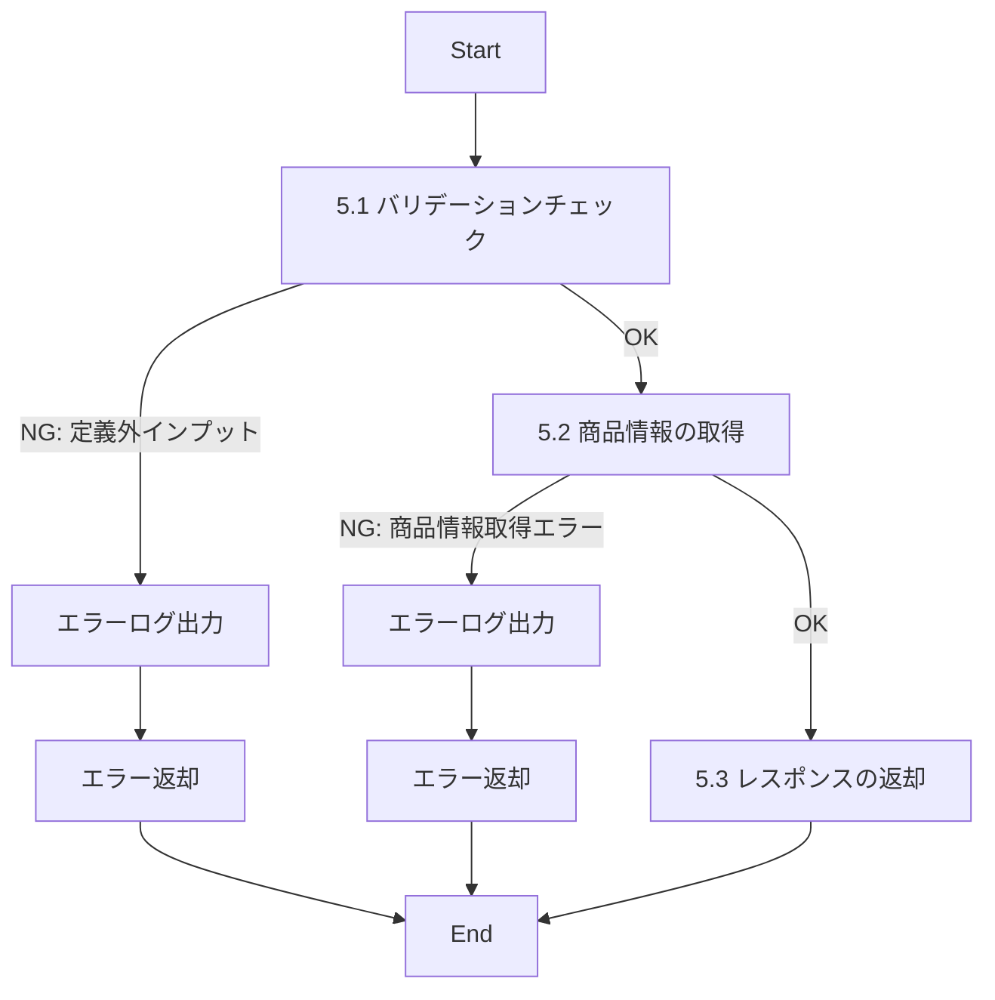

# IDXXXXXXX_API名_仕様書

## 1.目次

- [IDXXXXXXX\_API名\_仕様書](#idxxxxxxx_api名_仕様書)
  - [1.目次](#1目次)
  - [2.概要](#2概要)
  - [3.パラメータ](#3パラメータ)
    - [3.1.URI](#31uri)
    - [3.2.インプット](#32インプット)
    - [3.3.アウトプット](#33アウトプット)
  - [4.処理フロー](#4処理フロー)
  - [5.処理詳細](#5処理詳細)
    - [5.1 バリデーションチェック](#51-バリデーションチェック)
    - [5.2 商品情報の取得](#52-商品情報の取得)
    - [5.3 レスポンスの返却](#53-レスポンスの返却)
  - [6.CRUD](#6crud)
  - [7.エラーメッセージ](#7エラーメッセージ)
  - [8.SQL](#8sql)
    - [8.1.商品情報取得](#81商品情報取得)
  - [9.備考](#9備考)

<!-- 目次はMarkdown All in Oneの拡張機能を入れると自動生成できる -->

## 2.概要

APIの振る舞いや、前提条件を記載する。

## 3.パラメータ

### 3.1.URI

[API一覧 2. API一覧 参照](../../共通/システム要件定義/API一覧.md)

### 3.2.インプット

[API-IF X.X 参照](../../共通/システム要件定義/API-IF仕様書.md)

### 3.3.アウトプット

[API-IF X.X 参照](../../共通/システム要件定義/API-IF仕様書.md)

## 4.処理フロー



<!-- Markdown Preview Mermaid Supportの拡張機能を入れると表示できる。ここはAIに書いてもらうことができる -->

## 5.処理詳細

### 5.1 バリデーションチェック
1. インプットの定義通りかバリデーションチェックを行う。
   1. **定義通りでないインプットがあった場合、処理を中断する**
      1. エラーログ(0001)を出力する。
      1. エラー(0001)を返却する。
<!-- 分岐は強調 -->

### 5.2 商品情報の取得
1. 「商品情報」を取得する。[(商品情報取得)](8.1.商品情報取得)
   1. **エラーが発生した場合、処理を中断する**
      1. エラーログ(9902)を出力する。
      1. エラー(9902)を返却する。

<!-- ローカル変数名は「」で囲む -->

### 5.3 レスポンスの返却
1. 以下のレスポンスパラメータを設定し、返却する。
<!-- ここでどのパラメータに何の値を設定するか表で記載 -->

## 6.CRUD

|テーブル名|C|R|U|D|備考|
|--------|--|--|--|--|--|
|テーブル1||○||||
|テーブル2|○||○|||

## 7.エラーメッセージ
|コード|内容|返却メッセージ|備考|
|--------|--|--|--|
|0001|バリデーションエラー|バリデーションエラー|-|

## 8.SQL

### 8.1.商品情報取得
```sql
select 商品ID
from 商品
where 無効フラグ = '0' --有効
```

## 9.備考