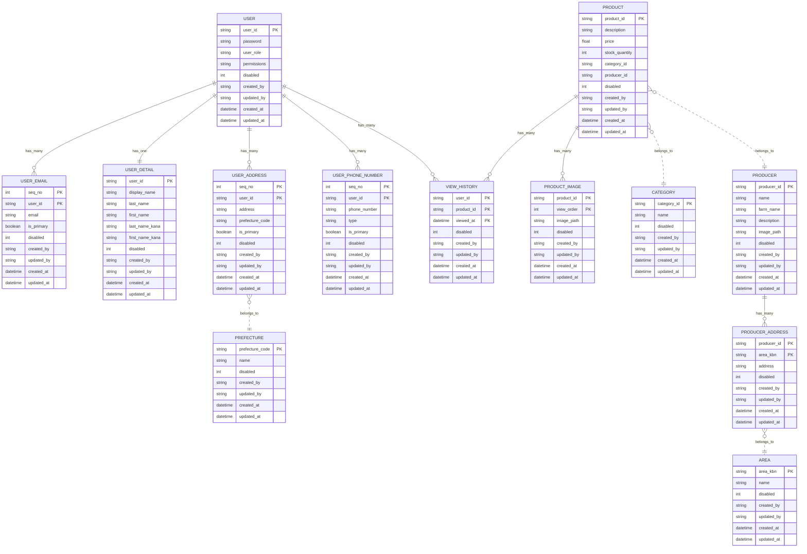

# テーブル定義書

## 概要

### USER（ユーザー）
| カラム名            | 型        | 説明           |
| --------------- | -------- | ------------ |
| user_id         | string      | ユーザーID（主キー）|
| password        | string   | パスワード（ハッシュ）|
| user\_role | int | 役職| 
| permissions | string | 権限|
| disabled    | int   | 使用:0,不使用:1       |
| created\_by     | string | 作成者  User.user_id      |
| updated\_by     | string | 更新者  User.user_id      |
| created\_at     | datetime | 作成日時       |
| updated\_at     | datetime | 更新日時       |

### USER_EMAIL(ユーザメール)
| カラム名              | 型      | 説明               |
| ----------------- | ------ | ---------------- |
| seq_no  | int | 連番 （複合キー）|
| user\_id          | string    | User.user_id （複合キー） |
| email           | string   | メールアドレス   |
| is\_primary | bool     | メイン住所かどうか（任意）  |
| disabled    | int   | 使用:0,不使用:1       |
| created\_by     | string | 作成者  User.user_id      |
| updated\_by     | string | 更新者  User.user_id      |
| created\_at     | datetime | 作成日時       |
| updated\_at     | datetime | 更新日時       |

### USER_DETAIL(ユーザー詳細)
| カラム名              | 型      | 説明               |
| ----------------- | ------ | ---------------- |
| user\_id          | string    | User.user_id （主キー） |
| display\_name     | string | 表示名（ニックネーム等）     |
| last\_name        | string | 氏名（姓）            |
| first\_name       | string | 氏名（名）            |
| last\_name\_kana  | string | 氏名かな（姓）          |
| first\_name\_kana | string | 氏名かな（名）          |
| disabled    | int   | 使用:0,不使用:1       |
| created\_by     | string | 作成者  User.user_id      |
| updated\_by     | string | 更新者  User.user_id      |
| created\_at     | datetime | 作成日時       |
| updated\_at     | datetime | 更新日時       |

### USER_ADDRESS(ユーザー住所)
| カラム名        | 型        | 説明             |
| ----------- | -------- | -------------- |
| seq_no  | int | 連番 （複合キー）|
| user\_id          | string    | User.user_id （複合キー） |
| address     | string   | 郵便番号           |
| prefecture\_code | string | Prefecture.prefecture_code |
| is\_primary | bool     | メイン住所かどうか（任意）  |
| disabled    | int   | 使用:0,不使用:1       |
| created\_by     | string | 作成者  User.user_id      |
| updated\_by     | string | 更新者  User.user_id      |
| created\_at     | datetime | 作成日時       |
| updated\_at     | datetime | 更新日時       |

### USER_PHONE_NUMBER(ユーザー電話番号)
| カラム名          | 型        | 説明              |
| ------------- | -------- | --------------- |
| seq_no  | int | 連番 （複合キー）|
| user\_id          | string    | User.user_id （複合キー） |
| phone\_number | string   | 電話番号            |
| type          | string   | 自宅・携帯など（任意）     |
| is\_primary   | bool     | メイン電話番号かどうか（任意） |
| disabled    | int   | 使用:0,不使用:1       |
| created\_by     | string | 作成者  User.user_id      |
| updated\_by     | string | 更新者  User.user_id      |
| created\_at     | datetime | 作成日時       |
| updated\_at     | datetime | 更新日時       |

### PRODUCT（商品）
| カラム名        | 型        | 説明          |
| ----------- | -------- | ----------- |
| product_id  | string      | 製品ID（主キー）連番 |
| description     | string   | 商品説明         |
| price           | float    | 価格           |
| stock\_quantity | int      | 在庫数          |
| category\_id    | string      | Category.id |
| producer\_id    | string   | Producer.id　|
| disabled    | int   | 使用:0,不使用:1       |
| created\_by     | string | 作成者  User.user_id      |
| updated\_by     | string | 更新者  User.user_id      |
| created\_at | datetime | 作成日時        |
| updated\_at | datetime | 更新日時        |

### PRODUCT_IMAGE（商品画像）
| カラム名        | 型        | 説明          |
| ----------- | -------- | ----------- |
| product_id  | string      | Product.product_id(複合キー) |
| image_path  | string   | 画像パス |
| view_order   | int     | 画像表示順番　product_id + view_orderでの重複不可 (複合キー) |
| disabled    | int   | 使用:0,不使用:1       |
| created\_by     | string | 作成者  User.user_id      |
| updated\_by     | string | 更新者  User.user_id      |
| created\_at | datetime | 作成日時        |
| updated\_at | datetime | 更新日時        |

### CATEGORY（カテゴリ）
| カラム名        | 型        | 説明         |
| ----------- | -------- | ---------- |
| category_id   | string      | カテゴリID（主キー） |
| name        | string   | カテゴリ名       |
| disabled    | int   | 使用:0,不使用:1       |
| created\_by     | string | 作成者  User.user_id      |
| updated\_by     | string | 更新者  User.user_id      |
| created\_at | datetime | 作成日時       |
| updated\_at | datetime | 更新日時       |

### PRODUCER（生産者）
| カラム名        | 型        | 説明               |
| ----------- | -------- | ---------------- |
| producer_id | string    | 生産者ID（主キー）|
| name        | string | 生産者名     |
| farm_name   | string | 農園名     |
| description | string | 農園説明     |
| image_path  | string | 生産者画像     |
| disabled    | int   | 使用:0,不使用:1       |
| created\_by     | string | 作成者  User.user_id      |
| updated\_by     | string | 更新者  User.user_id      |
| created\_at | datetime | 作成日時             |
| updated\_at | datetime | 更新日時             |

### PRODUCER_ADDRESS（生産者住所）
| カラム名        | 型        | 説明               |
| ----------- | -------- | ---------------- |
| producer_id  | string    | Producer.producer_id（複合キー）    |
| area_kbn    | string | 所在地区分 （複合キー）     |
| address    | string | 所在地     |
| disabled    | int   | 使用:0,不使用:1       |
| created\_by     | string | 作成者  User.user_id      |
| updated\_by     | string | 更新者  User.user_id      |
| created\_at | datetime | 作成日時             |
| updated\_at | datetime | 更新日時             |

### VIEW_HISTORY（閲覧履歴）
| カラム名        | 型        | 説明               |
| ----------- | -------- | ---------------- |
| user_id     | string | User.user_id（複合キー）     |
| product_id  | string | Product.product_id（複合キー）   |
| viewed\_at  | datetime | 閲覧した日時 （複合キー）|
| disabled    | int   | 使用:0,不使用:1       |
| created\_at | datetime | 作成日時             |
| updated\_at | datetime | 更新日時             |
| created\_at | datetime | 作成日時 |
| updated\_at | datetime | 更新日時 |

### PREFECTURE（都道府県マスタ）
| カラム名             | 型        | 説明           |
| ---------------- | -------- | ------------ |
| prefecture\_code | string   | 都道府県コード（主キー）|
| name             | string   | 都道府県名|
| disabled    | int   | 使用:0,不使用:1       |
| created\_by     | string | 作成者  User.user_id |
| updated\_by     | string | 更新者  User.user_id |
| created\_at | datetime | 作成日時 |
| updated\_at | datetime | 更新日時 |

### AREA（所在地マスタ）
| カラム名        | 型        | 説明               |
| ----------- | -------- | --------------|
| area\_kbn | string   | 所在地区分（主キー）|
| name             | string   | エリア名|
| disabled    | int   | 使用:0,不使用:1       |
| created\_by     | string | 作成者  User.user_id |
| updated\_by     | string | 更新者  User.user_id |
| created\_at | datetime | 作成日時 |
| updated\_at | datetime | 更新日時 |

## ER図
