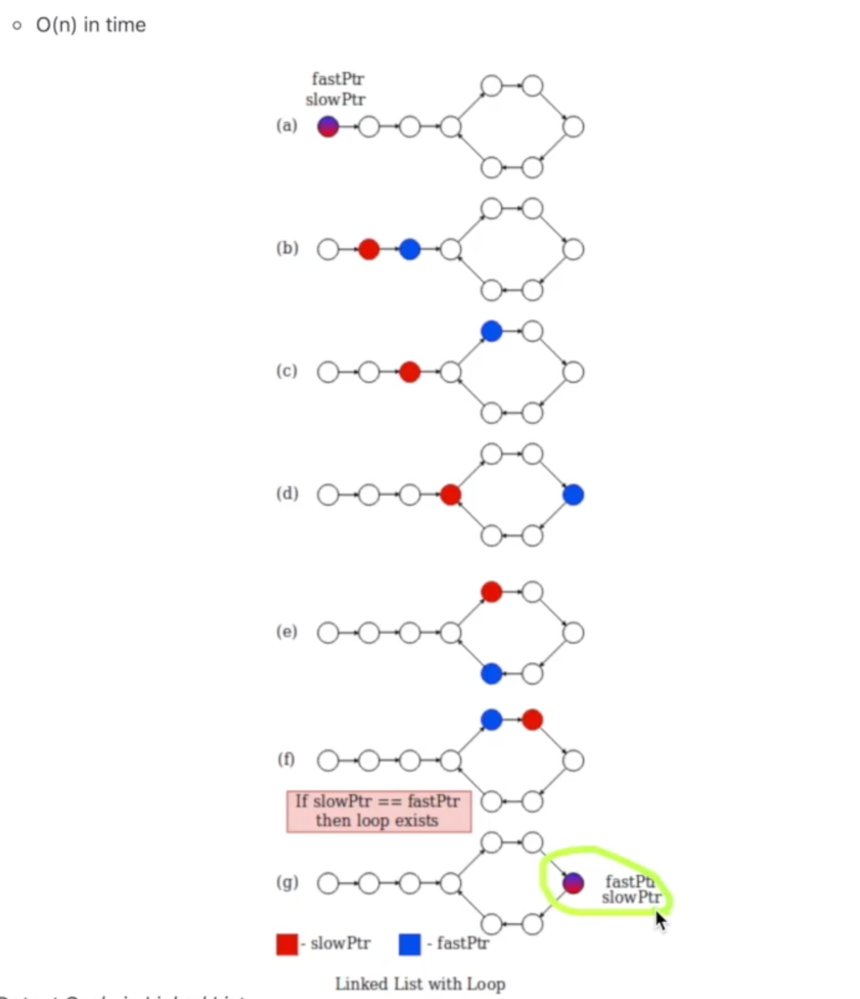

# 学習テーマ
作業日時: 2025-11-12


## 目的・背景 
#### SKILL
```
連結リストのループしている部分を探す。以下のケースの場合は３、４がループ

head -> 1 -> 2 -> 3 -> 4
                  | 　　|
                  ------
```


```java
Node curr = head;
while(curr.next != null){
    curr = curr.next;
}
```
[このときの課題](../20251111_MiddleNodeInLinkedList/memo.md)と同じようにウサギ、かめ戦法を使う。ウサギがやがてカメに追いつくので、追いつけばループしていると判断する。


#### Big-O Runtime and Space Complexity Analysis
runtime: O(n)
space complexity: O(1)

## 実装内容・学んだ技術  


## 課題・問題点  


## 気づき・改善案  


