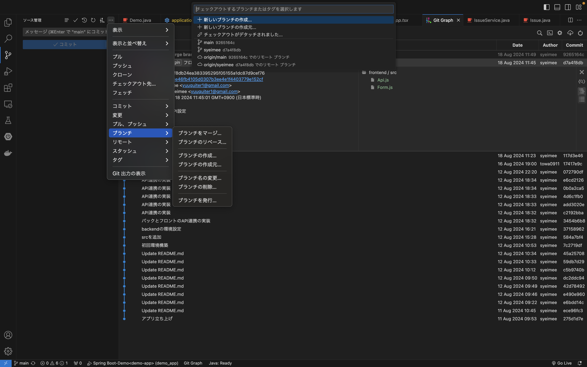
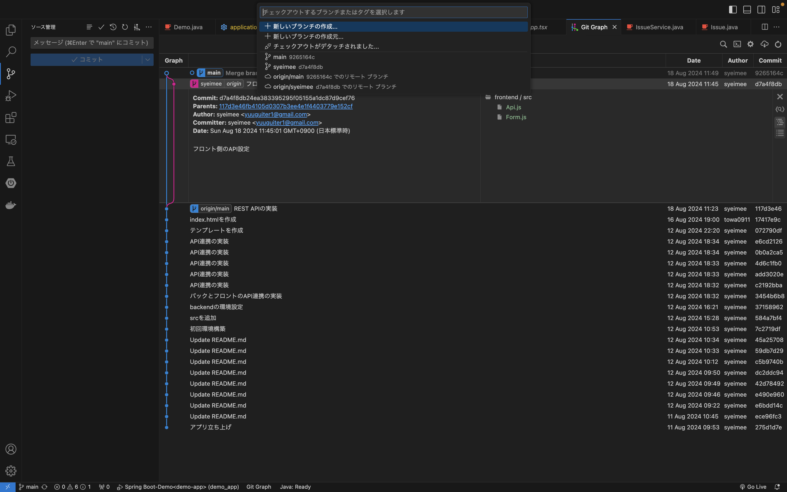
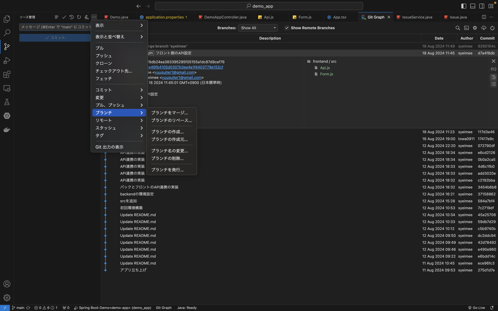

# コミットとプッシュ

### GitHubアカウントを作成
1. [GitHub](https://github.com/)にアクセスしてアカウントを作成

###  新しいリポジトリを作成
1. GitHubのホームページにログイン
2. 画面右上の「+」アイコンをクリックし、「New repository」を選択。
3. リポジトリ名を入力し、必要に応じて説明を追加。
4. パブリックまたはプライベートを選択。
5. 「Create repository」ボタンをクリック。

###  Gitをインストール
1. [Gitの公式サイト](https://git-scm.com/)からインストール。

### ローカルリポジトリの設定
1. ターミナルを開く。
2. プロジェクトのディレクトリに移動します。
```bash
cd /path/to/your/project
```

### Gitの初期化
1. リポジトリを初期化。
```bash
git init
```

### ファイルをステージング
1. ファイルを追加してステージング。
```bash
git add .
```
###  コミットを作成
1. ステージングしたファイルをコミット。
```bash
git commit -m "hogehoge"
```

### リモートリポジトリを追加
1. リモートリポジトリを追加します。<hogehoge>はGitHubのリポジトリURLに置き換えます。
```bash
git remote add origin <hogehoge>
```

### リモートリポジトリにプッシュ
1. コードをGitHubにプッシュします。

```bash
git push -u origin master
```
うまくいかない時はブランチを確認。
```bash
git branch
```
現在のブランチが<code>main</code>だったら
```bash
git push -u origin main
```
<br><br><br>
# プルリクエストとマージ

###  プルリクエストの作成方法

1. 新しいブランチを作成<br>
まず、作業するための新しいブランチを作成する。

```bash
git checkout -b feature-branch
```

2. コードの変更を行う<br>
    新しいブランチで必要な変更を行い、変更をステージングしてコミットする。

```bash
git add .
git commit -m "Add new feature"
```

3. リモートリポジトリにプッシュ<br>
ローカルのブランチをリモートリポジトリにプッシュする。

```bash
コードをコピーする
git push origin feature-branch
```

4. プルリクエストを作成<br>
GitHub上で、リモートリポジトリの「Pull requests」タブをクリックし、「New pull request」ボタンを押す。ベースブランチ（通常はmasterやmain）と比較するブランチ（作成したブランチ）を選択し、プルリクエストを作成する。

### プルリクエストのレビューとマージ
1. プルリクエストのレビュー<br>
プルリクエストが作成されたら、チームメンバーは変更内容をレビューする。レビューはコメントやコードの提案を通じて行う。

2. 必要に応じて変更をリクエスト<br>
レビュワーが修正をリクエストした場合、プルリクエストの作成者はローカルリポジトリで変更を行い、再度プッシュする。

```bash
git add .
git commit -m "hogehoge"
git push origin feature-branch
```

3. プルリクエストの承認<br>
すべてのレビュワーがプルリクエストを承認したら、プルリクエストをマージする準備が整う。

4. プルリクエストのマージ<br>
プルリクエストが承認されたら、GitHub上で「Merge pull request」ボタンをクリックし、「Confirm merge」を押す。

5. ローカルリポジトリの同期<br>
マージが完了したら、ローカルリポジトリを最新の状態に同期する。

```bash
git checkout master
git pull origin master
```

6. 不要なブランチの削除<br>
リモートとローカルの不要なブランチを削除する。

```bash
git branch -d feature-branch
git push origin --delete feature-branch
```


### 注意事項
プルリクエストの説明には、変更内容や理由、影響範囲などを明確に記述する。
コードレビューは品質向上のための重要なプロセスなので、丁寧に行う。
コンフリクトが発生した場合、適切に解消する。

#VSCodeでのマージ手順
### 1.作業はブランチを作成して行う
ブランチの作成を選択して、ブランチ名をつける



### 2.作業終了後は、mainにブランチを切り替えて、作業ブランチをマージする
チェックアウト先を選択し、mainを選ぶ




ブランチをマージを選択し、マージを行う。

