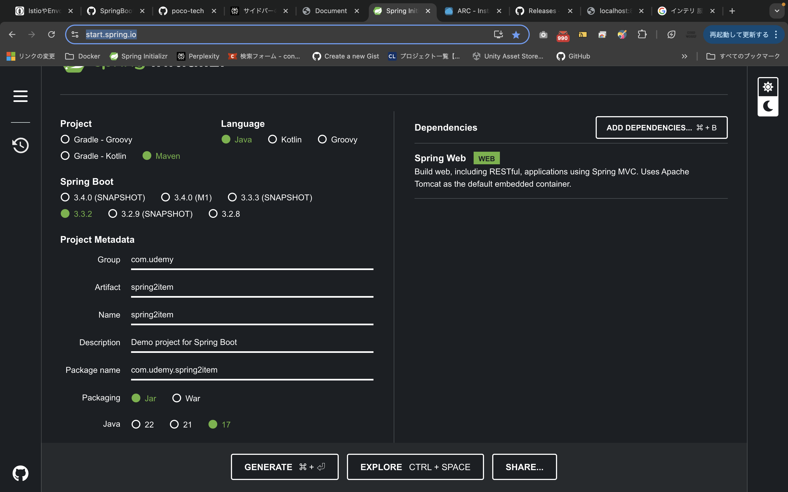
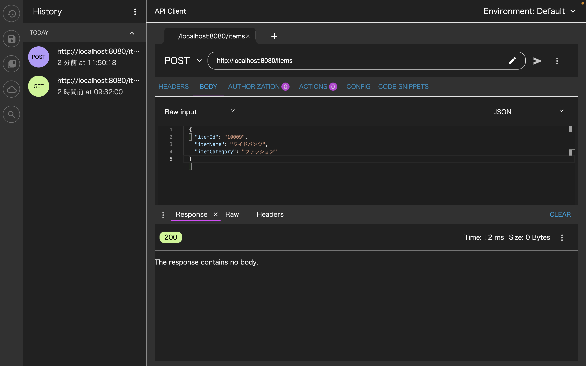

# Spring Initializerを使用してプロジェクトを作成する
URL：https://start.spring.io/


おそらくVS Code側だけでできると思うが、後日調べてみる。

# REST API GETを実装する
### 1  mainメソッド
最上位クラスには`@SpringBootApplication`をつける。`SpringApplication.run(TodoApplication.class, args)`によって、このクラスをメインメソッドとして使用することを宣言する。`args`は引数に渡す。

```java
@SpringBootApplication
public class TodoApplication {

	public static void main(String[] args) {
		SpringApplication.run(TodoApplication.class, args);
	}

}
```
### 2  Controller
アノテーション`@Controller`を使用すると、Controllerの宣言ができる。それぞれのアノテーションの意味は以下の通り。

`@GetMapping`:   HTTP Getリクエスト用のアノテーションで、value属性にURLのパスを指定すると、紐づいているメソッドが実行される。<br>
`@ResponseBody`:   戻り値をそのままレスポンスとしてクライアントに返す処理をする。

```java
package com.udemy.spring1hello1.controller;

import org.springframework.web.bind.annotation.RestController;
import org.springframework.web.bind.annotation.GetMapping;


@RestController
public class HelloController {

    @GetMapping(value = "/")
    public String index() {
        return "アクセス成功です。";
    }
    
    @GetMapping(value = "/hello")
    public String hello() {
        return "Hello World!";
    }

    @GetMapping(value = "/welcome")
    public String welcome() {
        return "SPRING BOOTにようこそ";
    }
}
```
### 3 実行するポートを変更する
Spring Bootはデフォルトで8080ポートで起動する。application.propatiesに設定することで任意のポートに変更することができる。<br><br>
◎localhost:8081に変更する場合
`application.propaties`
```java
server.port = 8081
```
### 4 `application`の起動
Bootダッシュボードを使用して起動する。

### 5 Advanced Rest Clientとは
Advanced Rest Clientとは、作成したAPIの動作テストを行うツール。APIのURLを指定して実行し、簡単にAPIに対してデータ送信、もしくはAPIから受信したデータを確認することができる。これから作成するAPIに対して、実行結果を確認する際に使用する。

install: `https://install.advancedrestclient.com/install`

### 6 `@Service`クラスとは
業務処理の元となる箇所。ロジックは基本的にこちらに実装する。`@Controller`は処理を呼び出す入り口であり、具体的な処理は書かない。

### 7 `@Autowired`とは
`Contoroller`クラスから`Service`クラスを呼ぶときには、`@Autowired`を使用する。SpringBootがサービスクラスのインスタンスを自動で注入してくれる。
### 8 `@PathVariable`とは
特定のidを取得するケースで、動的にURLに値を設定する使用を実装する。例えば`localhost:8080/lists/2`みたいな形。

```java
@RestContorller
ItemControllerクラス

@GetMapping("/items/{id}")
public Item getItem(@PathVariable("id") String id){
  return itemService.getItem(id);
}
```
# REST API POSTを実装する
### 1  `@PostMapping`と`@RequestBody`
情報を登録するにはm、HTTP POSTを利用し、APIに対してBody部にjsonデータを設定してで０たを送信する。`Controller`クラスには、`@PostMapping`でAPIのURを設定します。また、`@RequestBody`でjson形式で受け取ることを指定する。

`ItemController`
```java
@RestController
public class ItemControllor{

    @Autowired
    private ItemService itemServise;

    @GetMapping("/items")
    public List<Item> gettAllItems(){
      return itemService.getAllitems();
    }

    @GetMapping("/items/{id}")
    public Item getItem(@PathVariable("id") String id){
      return itemService.getItem(id);
   }

   @PostMapping("/items")
   public void addItem(@RequestBody Item item)[
     itemService.addItem(item);
   }
}
```
### 2  POSTされたjsonの確認
Advanced Rest Clientにて、POSTでURLを指定する。ステータス　200が返ってくると成功。


# REST API PUTを実装する（データの更新）
### 1  `@PutMapping`
情報を更新するには、HTTP PUTを利用した、更新対象のIDを特定するAPIを作成する。Body部分にjsonデータを設定し、データを送信する。`Controller`クラスには、`@PutMapping`でAPIのURLを設定する。また、`@RequestMapping`でjson形式で受け取り、`@PathVariable`で指定された更新キーを取得する。

`ItemController`
```java
@PutMapping("/items/{itemId}")
public void updateItem(@RequestBody Item item, @PathVariable String itemId){
    itemService.updateItem(itemId, item);
}
```
# REST API DELETEを実装する（データの削除）
### 1  `@DeleteMapping`
情報を削除する場合は、HTTP DELETEを利用した、削除対象のIDを特定するAPIを作成する。`Controller`クラスには、`@DeleteMapping`でAPIのURLを指定する。また、`@PathVariable`で指定された削除キーを取得する。

`ItemController`
```java
@DeleteMapping("/items/{itemId}")
public void deleteItem(@PathVariable String itemId){
    itemService.deleteItem(itemId);
}
```

# REST APIをDBに対応させる（My SQLの場合）
### 1  Spring Data JPAとは
JPAを実装しているHibernateを活用し、データアクセスを簡単に実装することを可能とする。<br>
`@Entity`: Entityクラスと示し、name属性に実際に対応するテーブル名を設定する。
`@Id`: キー値（ID)となる項目に指定する。
`@GeneratedValue`: ID生成方針を定義する。`GenerationType.IDENTITY`はキー値生成をDBの機能で行う。→My SQLでは`auto_increment`に対応する。

```java
@Entity(name="m_item") //実際のテーブル名
public class Item{
 @Id
 @GeneratedValue(strategy = GenerationType.IDENTITY)
 private Long itemId;　//実際のカラム①
 private String itemName;　//実際のカラム②
 private String itemCategory;　//実際のカラム③
}
```
`spring.jpa.hibernate.ddl-auto`: createを指定すると、アプリケーション起動時にEntityに対応するテーブルがあれば削除し、新規作成する。
`spring.jpa.show-sql`: trueを指定すると、実際に流れるSQLを表示する。
`spring.jpa.proparties.hibernate.format_sql`: trueを指定すると、表示されるSQLを見やすく出力する。<br>
`application.properties`
```java
spring.jpa.hibernate.ddl-auto=create
spring.jpa.show-sql=true
spring.jpa.proparties.hibernate.format_sql=true
```
<br>
Spring Data JPAは、インターフェースを定義するだけで、あらかじめ用意されたデータ操作を行うことできる。

`@Repository`:DBアクセスを行うことを示す。
`CrudRepository`:エンティティクラスとIDを指定することで、CRUD機能を提供。
Interfaceだけを定義。実装クラスは不要。
`Repositoryインターフェース`
```java
@Repository
public interface ItemRepository extends CrudRepository<Item, Long>{}
```
<br>

`Service`クラスで`@Autowired`をつけてそのまま利用するだけ。

`Serviceクラス`
```java
@Service
public class ItemService{
    @Autowired
    private ItemRepository itemRepository;

    public List<Item> getAllItems(){
        List<Item> allItems = new ArrayList<>();
        itemRepository.findAll().forEach(allItems: :add);
        return allItems;
}
```

#### ◎CrudRepositoryで使用できるメソッドの一覧
① save : 指定したエンティティを登録・更新する
② findById(id) : キー値を指定すると、指定されたエンティティを検索する
③ findAll : 対応するテーブルの全件を検索する
④ deleteById(id) : 指定されたキー値のデータを削除する

# Controllerで例外を共通処理として対処する
### 1  `@ControllerAdvice`とは
Controllerにて共通に例外処理を行い、HTTPレスポンスとして、クライアントにエラー内容を任意のステータスで返すことができる。

`独自に作成した実行事例外`
```java
public class ItemNotFoundException extends RuntimeException{
    private static final long serialVersionUID = 1L;
    
    public ItemNotFoundException(Long itemId){
        super("商品コード：" + itemId + "は見つかりません。");
}
}
```
<br>

`@ControllerAdvice`: 全てのControllerクラスで発生した例外に対して、共通の設定を行うことできる。
`@ResponseBody`:レスポンスとしてJSONを返却する
`@ExceptionHandler`:指定した例外クラスがControlllerで発生した場合に、当該メソッドでハンドリングする
`@ResponseStatus`:クライアントにはレスポンスを返すステータスコードを指定する。この場合は404エラー

<br>

`エラー処理をコントローラの共通処理とする（ハンドリング）`
```java
@ControllerAdvice
public class ItemNotFoundExceptionControllerAdvice{
    @ResponseBody
    @ExceptionHandler(ItemNotFoundException.class)
    @ResponseStatus(httpStatus.NOT_FOUND)
    public String itemNotFoundHandler(ItemNotFoundException ex){
        return ex.getMessage();
}
}
```
<br>
Controllerであらかじめ設定した例外Throwされると、`@ControllerAdvice`で指定したクラスがハンドリングする
<br>

`コントローラで独自例外をThrow`
```java
@GetMapping("/items/{itemId}")
public Item getItem(@PathVariable("itemId") Long itemId){
    return itemSevice.getItem(itemId).orElseThrow( ()
        -> new ItemNotFoundException(itemId));
}
```
<br>

# キャッシュを使用する
検索系のAPIにて、毎回DBに問い合わせをするのではなく、キャッシュを活用して、効率的にDBに問い合わせをする方法を確認する。また、DBの新規作成・更新・削除を行ったときには、保持しているキャッシュと実データ間で不整合が生じてしまうので、適切にキャッシュクリアを行うことが重要。

### 1  キャッシュを使用する際に必要な依存関係
`Spring cache abstraction`を依存関係に追加する。

### 2 キャッシュを有効にする
`@EnableCaching`でキャッシュの設定をONにし、キャッシュ管理を行う検索系のメソッドに`@Cacheable`を付与する

`@EnableCaching`を`@SpringBootApplication`のクラスに指定する

`@SpringBootApplicationのクラス`
```java
@SpringBootApplication
@EnableCaching
public class Spring3itemApplication
```

`@Cacheable`を取得のメソッドに付与すると結果をキャッシュし、キャッシュされていなければ当該メソッドが処理されず、結果のみを返す。

```java
@Cacheable("getItems")
public List<Item> getAllItems(){
```

商品コード別等のキー値別にキャッシュ管理をする場合には、key属性を指定する。
```java
@Cacheable(value="getItem", key="#p0")
public Optional<Item> getItem(Long itemId){
```
※キー値の指定には、以下のいずれかで指定する必要がある
`#p0`（一般的）
`#a0`
`#itemId`
指定を誤ると`java.IlllegalArgumentException`が発生する

### 3 キャッシュを削除する
`@CacheEvict`でキャッシュを削除する。複数のキャッシュ削除を指定したい場合、`@Cache`を利用し、evict属性にて複数指定する

`@CacheEvict`でキャッシュの値を削除する。以下の例は、新規登録時に、全件検索取得のキャッシュを削除している。
```java
@CacheEvict(value="getItems", allEntries=true)
public void addItem (Item item){
```

複数のキャッシュ削除を指定したい場合、`@Caching`に`evict`属性を用いて`@CacheEvict`を複数指定することができる。以下の指定は、指定したデータの更新時に、対象のキー値で管理されているキャッシュがあれば削除、全件検索取得のキャッシュをそれぞれ削除している。

```java
@Caching(evict = {
        @CacheEvict(value="getItem", key="#p0"),
        @CacheEvict(value="getItem", AllEntries=true)
})
public void updateItem(Long itemId, Item item){
```