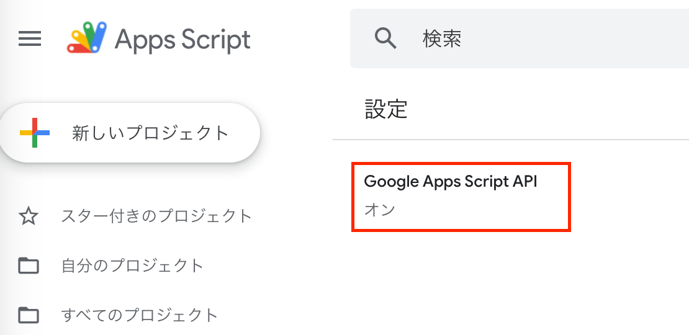

# 学習テーマ
作業日時: 2025-06-20
GASをVSCODEで開発できる環境を作ってみる。

## 目的・背景 
claspを用いた開発環境の構築


## 実装内容・学んだ技術  
### claspとは？
claspは、Googleが提供するNode.jsのパッケージで、開発者がGASをより効率的に実装、バージョン管理、デプロイできるようにする
claspは実装言語にTypeScriptを選択できる。TypeScriptで実装することで、型安全性の保証や、コードの可読性や保守性が期待できるため、直接GASを実装するよりもバグの発生を減少させることが期待できる。

### Google Apps Script APIを有効にする
[GoogleAppScript](https://script.google.com/home/usersettings?pli=1)


### プロジェクトディレクトリの作成とパッケージのインストール
```bash
mkdir myApp
cd _$
npm init -y
npm i -g @google/clasp # claspはグローバルにインストールする
```
### claspでGoogleアカウントにログインする
GASソースコードのアップロード・ダウンロードなどができるようになる
```bash
clasp login
```

### アプリケーションの新規作成と設定
```bash
clasp create --type standalone
```

するとプロジェクトルートに以下のファイルが作成される

- clasp.json claspの設定ファイル
- appsscript.json GASの設定ファイル
※アカウントのGoogle Driveにもアプリケーションが作成される

appsscript.jsonのtimeZoneを日本に変更

```json
//appsscript.json
{
  "timeZone": "Asia/Tokyo", //変更
  "dependencies": {
  },
  "exceptionLogging": "STACKDRIVER",
  "runtimeVersion": "V8"
}
```

### .claspignoreファイルを作成
.gitignoreみたいな感じで、Googleドライブにアップしないようにするためのもの

```bash
**/**
!main.js
!appsscript.json
```

### Googleにアプリケーションをアップロードする
```bash
clasp push
```
成功したっぽい
```bash
Pushed 2 files.
└─ appsscript.json
└─ main.js
```

### TSで書く場合は通常通りコンパイルすればいい

```bash
myApp/
├── src/
│   └── main.ts             ← GASで使いたいコード（TypeScript）
├── dist/
│   └── main.js             ← コンパイル後に出力されるJS
│   └── appsscript.json     ← 必ずセットでpushする
├── tsconfig.json
├── package.json
└── .clasp.json             ← rootDir: "dist"

```

clasp.jsonにはpushするディレクトリを指定する必要がある
```json
//.clasp.json
{
  "scriptId": "1S80-B7KG23hegrpsbykzoeY9uAUB-UHmTFadSI-DM2Hme-UqQjA9p6nu",
  "rootDir": "./dist", //変更
  "scriptExtensions": [
    ".js",
    ".gs"
  ],
  "htmlExtensions": [
    ".html"
  ],
  "jsonExtensions": [
    ".json"
  ],
  "filePushOrder": [],
  "skipSubdirectories": false
}
```

コンパイルコマンド
```bash
npx tsc
```
@types/nodeが競合してエラーが出た場合は、tsconfig.json に "types": ["google-apps-script"] を追加して 明示的に除外
```json
//tsconfig.json
{
  "compilerOptions": {
    "target": "ES5",
    "module": "none",
    "rootDir": "src",
    "outDir": "dist",
    "strict": true,
    "lib": ["es5"],
    "types": ["google-apps-script"]  // これで node の型定義は無視される
  },
  "include": ["src"]
}

```

## 課題・問題点  


## 気づき・改善案  


