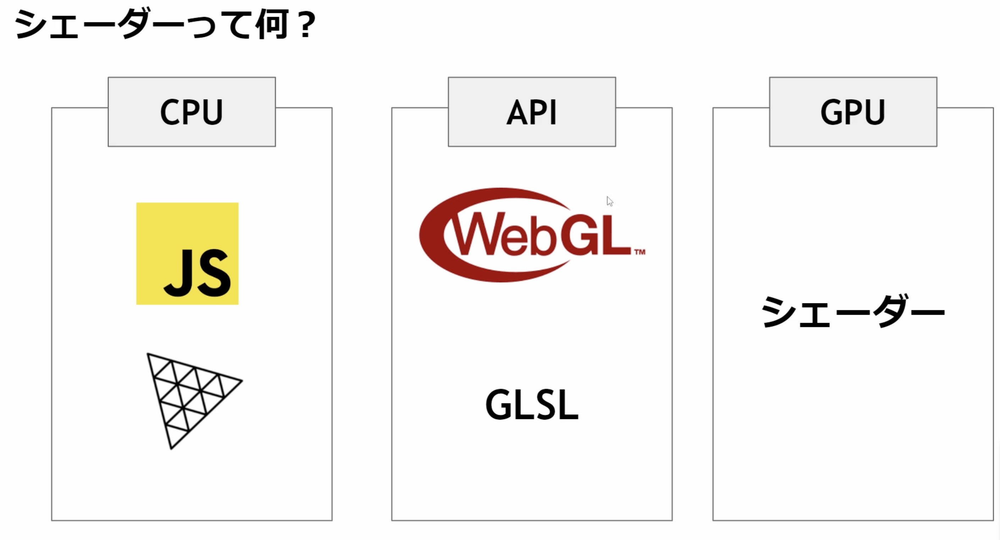
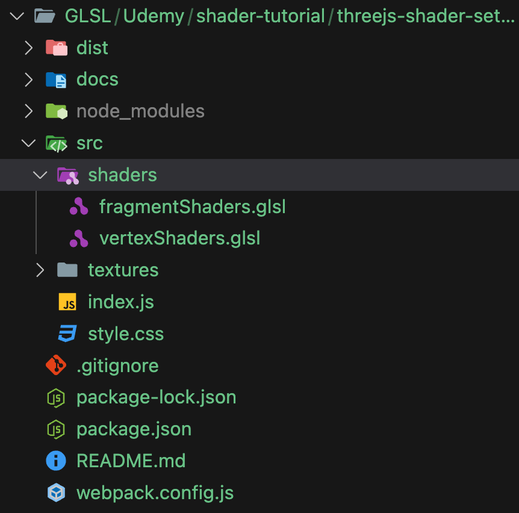
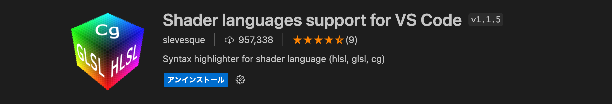

# GLSLについて学ぶ
### Shaderとは

GLSLはシェーダー言語であり、シェーダーをGPUに渡すことで表現を行うことができる

### シェーダーまでの流れ
#### # GLSL
 - VertexShader　頂点を定める
 - FragmentShader 着色を行う
### シェーダーを書くためのファイルを準備
---
- ディレクトリ構造


---
- ファイルのimport

`index.js`

```js
import vertexShader from "./shader/vertexShaders";
import fragmentShader from "./shader/fragmentShaders";
```

---
- ファイルの読み込み

従来はマテリアルとジオメトリをメッシュとして組み合わせて表現をしていた。

```js
// Geometry
const geometry = new THREE.PlaneGeometry(1, 1, 32, 32);

// Material
const material = new THREE.MeshBasicMaterial();

// Mesh
const mesh = new THREE.Mesh(geometry, material);
scene.add(mesh);
```

GLSLを記述する際には、以下のように変更
RawShaderMaterial（生のシェーダーマテリアル）

```js
// Material
const material = new THREE.RawShaderMaterial();
```
さらにプロパティを指定して、
```js
// Material
const material = new THREE.RawShaderMaterial({
    vertexShader: vertexShader, //vertexShaderプロパティ: vertexShader.glsl
    fragmentShader: fragmentShader //fragmentShaderプロパティ: fragmentShader.glsl
});
```
※ 公式Doc: https://threejs.org/docs/#api/en/materials/RawShaderMaterial


### 実際にGLSLを書いてみる

- おすすめの拡張機能
シンタックスとかできる


---
- vertexShader.glsl

頂点情報の記述
```glsl
uniform mat4 projectionMatrix;　//カメラの投影領域を定義(near: 近く　far:遠く)
uniform mat4 viewMatrix;　// カメラの位置・方向
uniform mat4 modelMatrix; //立体の大きさ・位置

attribute vec3 position;　//x, y, z座標を定義

void main(){
    //それぞれの行列を掛け合わせることで座標変換（3Dをブラウザ描画用の2Dに変換）
    gl_Position = projectionMatrix * viewMatrix * modelMatrix * vec4(position, 1.0);
}
```

- fragmentShader.glsl

着色情報の記述

```glsl
precision mediump float;//データをどのくらい精密に扱うかを定義

void main(){
    /*
    * ４次元ベクトルを定義
    * vec4(r,g,b,透明度)
    */

    gl_FragColor = vec4(1.0, 0.0, 0.0, 1.0);
}
```
ただ、これだけだと透明度を変えてもほぼ変化しないので、
`transparent: true`にする必要がある
```js
// Material
const material = new THREE.RawShaderMaterial({
    vertexShader: vertexShader, //vertexShaderプロパティ: vertexShader.glsl
    fragmentShader: fragmentShader, //fragmentShaderプロパティ: fragmentShader.glsl
    transparent: true //透明度を有効
});
```
平面の裏側にも着色を施す場合は、
`side: THREE.DoubleSide`を記述

```js
// Material
const material = new THREE.RawShaderMaterial({
    vertexShader: vertexShader, //vertexShaderプロパティ: vertexShader.glsl
    fragmentShader: fragmentShader, //fragmentShaderプロパティ: fragmentShader.glsl
    transparent: true, //透明度を有効
    side: THREE.DoubleSide //裏側まで着色
});
```
ポリゴンを有効にするには、
`wireframe: true`

```js
// Material
const material = new THREE.RawShaderMaterial({
    vertexShader: vertexShader, //vertexShaderプロパティ: vertexShader.glsl
    fragmentShader: fragmentShader, //fragmentShaderプロパティ: fragmentShader.glsl
    transparent: true, //透明度を有効
    side: THREE.DoubleSide, //裏側まで着色
    wireframe: true //ポリゴン
});
```

### GLSL言語の基本
- 型の指定
```glsl
float a = 1.0; //小数
int a = 1; //整数

vec2 myVec2 = vec2(1.0, 0.5); // 2つの浮動小数点数で初期化
vec3 myVec3 = vec3(1.0, 0.5, 0.3); // 3つの浮動小数点数で初期化
```

- 修飾子
1. attribute: 頂点情報などを入れる
2. uniform: グローバル変数を入れる（共通して使われる変数）
3. varing: VertexShaderからFragmentShaderに変数を渡すときに使う

例
```glsl
uniform mat4 projectionMatrix;　
uniform mat4 viewMatrix;　
uniform mat4 modelMatrix; 

attribute vec3 position;　
```
- 立体を動かす

`vertexShader.glsl`
```glsl
uniform mat4 projectionMatrix;
uniform mat4 viewMatrix;
uniform mat4 modelMatrix;

attribute vec3 position;

void main(){
    vec4 modelPosition = modelMatrix * vec4(position, 1.0);
    modelPosition.z += 0.3; //z座標を動かす
    vec4 viewPosition = viewMatrix * modelPosition;
    vec4 projectionPosition = projectionMatrix * viewPosition;
    gl_Position = projectionPosition;
}
```

## ShaderMaterial
`ShaderMaterial`に変更
```js
// Material
const material = new THREE.ShaderMaterial({
    vertexShader: vertexShader, //vertexShaderプロパティ: vertexShader.glsl
    fragmentShader: fragmentShader, //fragmentShaderプロパティ: fragmentShader.glsl
    transparent: true, //透明度を有効
    side: THREE.DoubleSide //裏側まで着色
});
```

この記述を消さないとエラーになる

```glsl
- uniform mat4 projectionMatrix;　//カメラの投影領域を定義(near: 近く　far:遠く)
- uniform mat4 viewMatrix;　// カメラの位置・方向
- uniform mat4 modelMatrix; //立体の大きさ・位置

- attribute vec3 position;　//x, y, z座標を定義

//以下の記述のみでいい
void main(){
    //それぞれの行列を掛け合わせることで座標変換（3Dをブラウザ描画用の2Dに変換）
    gl_Position = projectionMatrix * viewMatrix * modelMatrix * vec4(position, 1.0);
}
```
```glsl
- precision mediump float;//データをどのくらい精密に扱うかを定義

//以下の記述のみで良い
void main(){
    /*
    * ４次元ベクトルを定義
    * vec4(r,g,b,透明度)
    */

    gl_FragColor = vec4(1.0, 0.0, 0.0, 1.0);
}
```
### Shaderで波を表現してみる

`vertexShader`
```glsl
void main(){
    vec4 modelPosition = modelMatrix * vec4(position, 1.0);
    
    /*
     Tsinθのθの値が大きくなることで、振動数が増える
     Tの値が大きくなることで振幅が大きくなる
    */
    modelPosition.z += sin(modelPosition.x * 10.0) * 0.1;
     
    vec4 viewPosition = viewMatrix * modelPosition;
    vec4 projectionPosition = projectionMatrix * viewPosition;
    gl_Position = projectionPosition;
}
```
---
- パラメータに`uniforms`を指定することで、共通な値(グローバル変数)を用いることができる
```js
// Material
const material = new THREE.ShaderMaterial({
    vertexShader: vertexShader, //vertexShaderプロパティ: vertexShader.glsl
    fragmentShader: fragmentShader, //fragmentShaderプロパティ: fragmentShader.glsl
    transparent: true, //透明度を有効
    side: THREE.DoubleSide //裏側まで着色
    uniforms:{
        uFrequency: {value: 10.0}//グローバル変数には接頭字'u'をつける
    }
});
```
---
- 値の渡し方

`uniform froat uFrequency`を記述する
```glsl
uniform float uFrequency;

void main(){
    vec4 modelPosition = modelMatrix * vec4(position, 1.0);
    
    /*
     Tsinθのθの値が大きくなることで、振動数が増える
     Tの値が大きくなることで振幅が大きくなる
    */
    modelPosition.z += sin(modelPosition.x * uFrequency) * 0.1;
     
    vec4 viewPosition = viewMatrix * modelPosition;
    vec4 projectionPosition = projectionMatrix * viewPosition;
    gl_Position = projectionPosition;
}
```
## 縦波を入れる

y軸方向に波を作る
```glsl
modelPosition.z += sin(modelPosition.y * uFrequency) * 0.1;
```

`Vector2`を用いて二次元ベクトルとして、値を指定する
```js
// Material
const material = new THREE.ShaderMaterial({
  vertexShader: vertexShader, //vertexShaderプロパティ: vertexShader.glsl
  fragmentShader: fragmentShader, //fragmentShaderプロパティ: fragmentShader.glsl
  transparent: true, //透明度を有効
  side: THREE.DoubleSide, //裏側まで着色
  uniforms:{
    uFrequency: {value: new THREE.Vector2(10, 5)} //グローバル変数
  }
});
```
`Vector2`を使用しているので修飾子も合わせて変更する

```glsl
uniform vec2 uFrequency; //vec2に変更

void main(){
    vec4 modelPosition = modelMatrix * vec4(position, 1.0);
    modelPosition.z += sin(modelPosition.x * uFrequency.x) * 0.1; //uFrequency.xと記述
    modelPosition.z += sin(modelPosition.y * uFrequency.y) * 0.1;//uFrequency.yと記述

    vec4 viewPosition = viewMatrix * modelPosition;
    vec4 projectionPosition = projectionMatrix * viewPosition;
    gl_Position = projectionPosition;
}
```

## UIデバッグ

package.jsonに`lil-gui`をインストール
```bash
npm install lil-gui
```

`App.js`
```js
import * as dat from "lil-gui";

const gui = new dat.GUI();

//幅を広げたい場合
const gui = new dat.GUI({width: 300})
```
- デバッグの追加
```js
gui
.add(material.uniforms.uFrequency.value,"x")
.min(0)
.max(20)
.step(0.001)
.name("Frequency.x");

gui
.add(material.uniforms.uFrequency.value,"y")
.min(0)
.max(20)
.step(0.001)
.name("Frequency.y")
```

## 時間経過と共に変化
- グローバル変数の追加と値の更新

```js
const material = new THREE.ShaderMaterial({
  vertexShader: vertexShader, //vertexShaderプロパティ: vertexShader.glsl
  fragmentShader: fragmentShader, //fragmentShaderプロパティ: fragmentShader.glsl
  uniforms:{
    uTime: {value: 0} //経過時間
  }
});

const clock = new THREE.Clock();　//変数を取得

//フレームごとに経過時間を取得する
const animate = () => {
  const elapsedTime = clock.getElapsedTime();　 //経過時間取得
  material.uniforms.uTime.value = elapsedTime; //uTimeの時間を書き換える

  controls.update();

  renderer.render(scene, camera);

  window.requestAnimationFrame(animate);
};

```
- 位相の変更

`vertexShader`
```glsl
uniform float uTime;

modelPosition.z += sin(modelPosition.x * uFrequency.x + uTime) * 0.1; //uFrequency.xと記述
modelPosition.z += sin(modelPosition.y * uFrequency.y + uTime)  * 0.1;//uFrequency.yと記述

```
## 色の変更

グローバル変数の追加
```js
const material = new THREE.ShaderMaterial({
  vertexShader: vertexShader, //vertexShaderプロパティ: vertexShader.glsl
  fragmentShader: fragmentShader, //fragmentShaderプロパティ: fragmentShader.glsl
  uniforms:{
    uColor:{value: new THREE.Color("pink")}
  }
});

```

`uniform vec3 uColor`とすることでRGB属性を取得
```glsl
uniform vec3 uColor;

void main(){
    gl_FragColor = vec4(uColor, 1.0);
}
```

## テクスチャをシェーダーに貼り付ける
- テクスチャのロード

```js
const textureLoader = new THREE.TextureLoader();
const flagTexture = textureLoader.load("./textures/jp-flag.png");//テクスチャの読み込みload関数にはパスを指定する

```
ただこの状態だとビルド時に正しくテクスチャがロードされないので、
importをすることが一般的

```js
import jpFlag from "./textures/jp-flag.png";

const textureLoader = new THREE.TextureLoader();
const flagTexture = textureLoader.load(jpFlag);
```

- テクスチャをグローバル変数に記述

```js
const material = new THREE.ShaderMaterial({
  vertexShader: vertexShader, //vertexShaderプロパティ: vertexShader.glsl
  fragmentShader: fragmentShader, //fragmentShaderプロパティ: fragmentShader.glsl
  uniforms:{
    uTexture: {value: flagTexture}
  }
});
```
---
- `fragmentShader`の記述
```glsl
uniform sampler2D　uTexture;
```
※ テクスチャを読み込む際には、`sampler2D`型を使う


- UV座標を取得してテクスチャとして貼り付ける

※ テクスチャの色情報を定義している座標（UV座標）を取得して、位置付ける必要がある

vertexShaderにはあらかじめuv情報を持っているためグローバル変数に指定する必要はないが、
flagmentShaderにuv情報を渡したいので、アクセス修飾子`varying`を使用する。

`vertexShader`
```glsl
varying vec2 vUV;　//varyingの接頭文字

vUv = uv; //事前に用意されているuv情報をvUvに渡すことでfragmentShaderに渡せる
```

`fragmentShader`
```glsl
varying vec2 vUv; //vUvの読み込み

void main(){
    vec4 textureColor = texture2D(uTexture, vUv); //テクスチャとuv座標を紐づける
    gl_FragColor = textureColor;
}
```

## テクスチャに影をつける

`vartexShader`
```glsl
varying float vElevation;

float elevation = sin(modelPosition.x * uFrequency.x + uTime) * 0.1; 
elevation +=  sin(modelPosition.y * uFrequency.y + uTime)  * 0.1;
modelPosition.z += elevation;

vElevation = elevation;

```

`fragmentShader`
```glsl
varying float vElevation;

void main(){
    textureColor.rgb *= vElevation *2.5 + 0.7; //2.5 0.7は濃淡の調整
}
```

## モデルサイズの調整
1. `modelPosition`を変える方法

```glsl
modelPosition.z *= 0.6;
```
2. index.jsのMeshを変える方法
```js
const mesh = new THREE.Mesh(geometry, material);

mesh.scale.y = 2/3; //scaleを使うとリサイズできる

scene.add(mesh);

```
ちなみに回転させようとすると・・・
```js
const mesh = new THREE.Mesh(geometry, material);

mesh.rotation.x = Math.PI / 2; //90度回転

scene.add(mesh);
```