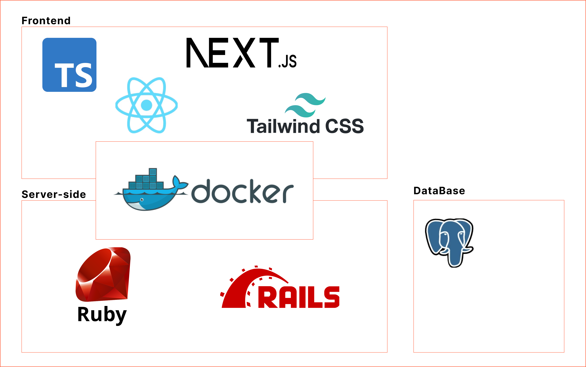

# マークダウン生成ツール
## 1. Overview
URLからHTMLを取得し、Markdownに変換するアプリケーション。

技術ブログの内容をGithubにメモとして保存するのに、０からマークダウンを書くのがめんどくさすぎたので作った。
類似サービスが意外となくて、urlからhtmlを作成するツールやマークダウンからhtmlを作成するツールはあるがURLからHTMLを取得し、Markdownに変換するツールはなさそう。

## 2. Aplication Architecture


### - Server-side
リクエストで受け取ったURLからHTMLを取得し、HTMLに応じたMarkdown記号をHTMLに埋め込む。
それをフロントエンドへレスポンスとして返すAPI。

### - Frontend
URLの入力を受け取り、Server-sideからのレスポンスを画面に表示する。

# ディレクトリ構成

```
root-directory/
│
├── backend/              # サーバーサイド（Rails API）
│   ├── app/              # RailsのMVC構造
│   │   ├── controllers/  # APIコントローラ
│   │   │   └── markdown_controller.rb
│   │   ├── models/       # モデル（今回は使わない）
│   │   └── views/        # ビュー（今回は使わない）
│   ├── config/           # Railsの設定ファイル
│   │   └── routes.rb     # APIルーティング設定
│   ├── db/               # データベース関連ファイル（今回は使わない）
│   ├── Gemfile           # Rubyの依存関係
│   └── Dockerfile        # Dockerの設定ファイル
│
├── frontend/             # フロントエンド（Next.js）
│   ├── node_modules/     # Next.jsの依存パッケージ
│   ├── src/              # ソースファイル
│   │   ├── app/          # App Router
│   │   │   └── page.tsx  
│   │   ├── components/   # コンポーネント
│   │   │　 ├── CopyButton.tsx
│   │   │　 └── MarkdownViewer.tsx
│   │   └── styles/       # CSSやスタイルシート
│   ├── next.config.mjs   # Next.jsの設定ファイル
│   ├── package.json      # Next.jsの依存関係とスクリプト
│   ├── tsconfig.json     # TypeScriptの設定ファイル
│   ├── Dockerfile        # Dockerの設定ファイル
│   └── tailwind.config.ts# tailwindの設定ファイル
│
├── docker-compose.yml    # Docker Composeファイル
└── README.md             # プロジェクト概要
```

# APIエンドポイント

<table>
    <thead>
        <tr>
            <th>Method</th>
            <th>URI</th>
            <th>説明</th>
        </tr>
    </thead>
    <tbody>
        <tr>
            <td>POST</td>
            <td>http://localhost:3000/api/convert</td>
            <td>リクエストからMarkdownを作り、返す</td>
        </tr>
    </tbody>
</table>