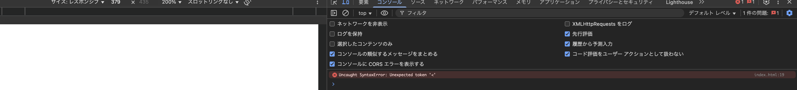
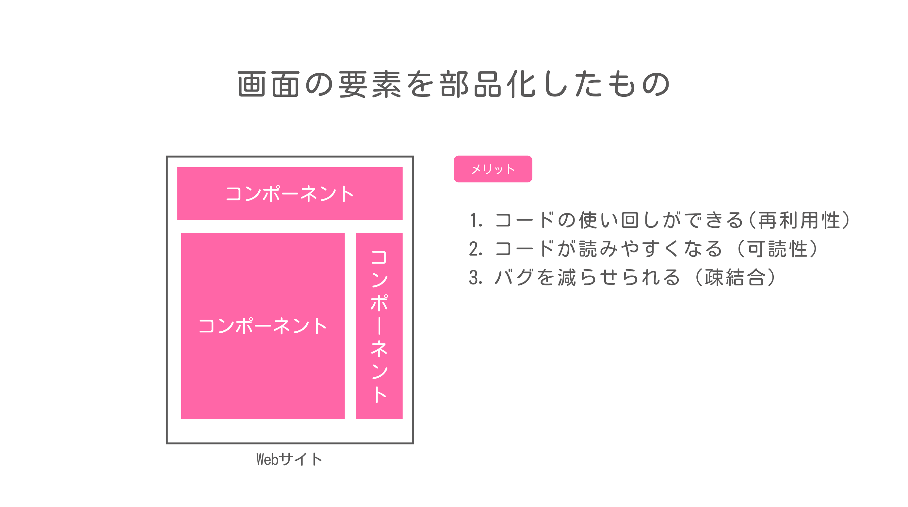
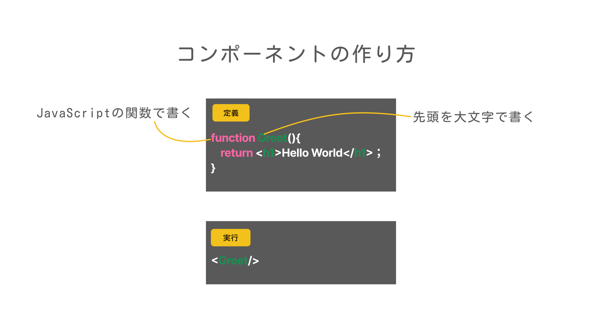
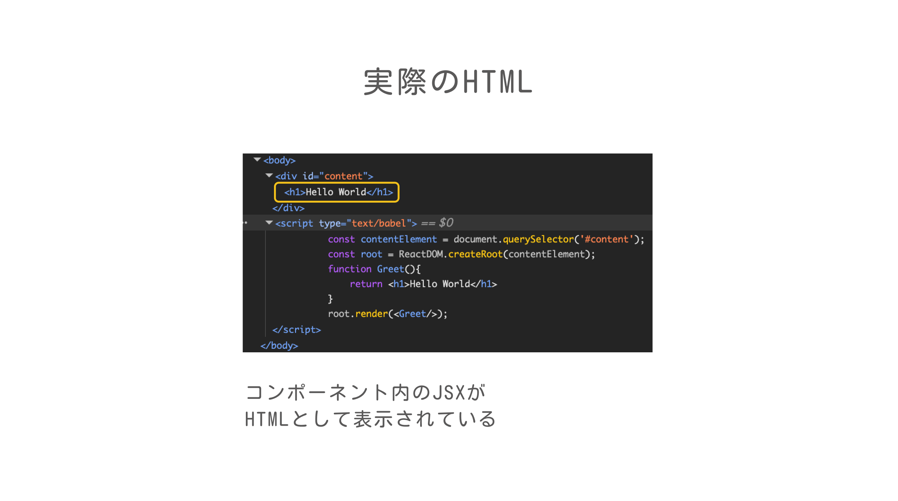
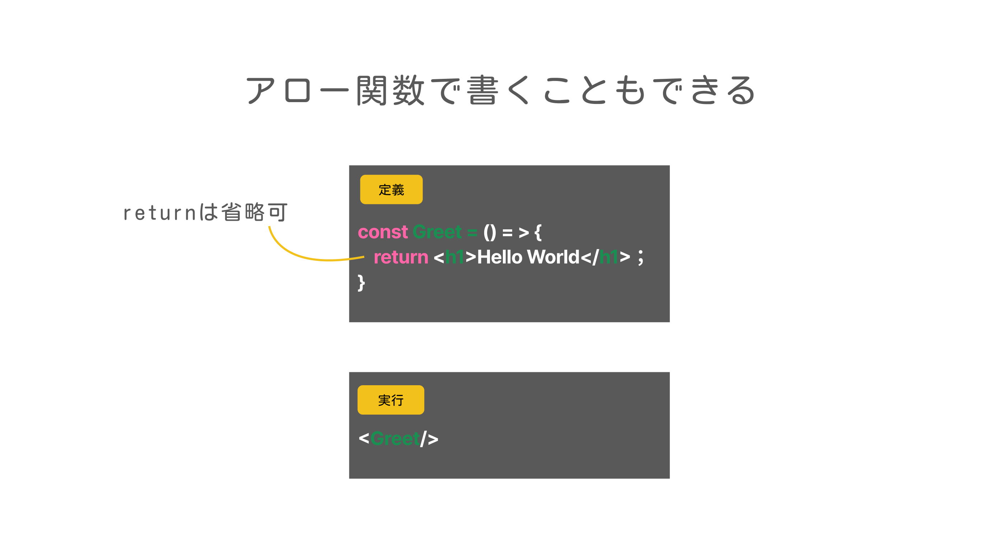

# 学習テーマ
作業日時: 2025-06-27
まずはReactに触れてみよう

## 目的・背景 
Fの社内研修を行うことになったので、Reactの基本に関するドキュメントを作成する。
使用するのはReact18

## 実装内容・学んだ技術  
- [Reactを触ってみる](#Reactを触ってみる)
- [コンポーネントって？](#コンポーネントって？)

### Reactを触ってみる

#### 事前準備
詳しいインストール手順は割愛。以下のものを準備する。
- VSCode
- VSCodeの拡張機能：LiveServer
- 適当なディレクトリにindex.htmlファイルの雛形を作成
今回はこんな感じにしてみた。
```
sampleApp/
└── index.html
```

#### header内に必要なライブラリを読み込んでおく
```html
<!-- React 18 -->
<script src="https://unpkg.com/react@18/umd/react.development.js" crossorigin></script>
<!-- ReactDOM 18 -->
<script src="https://unpkg.com/react-dom@18/umd/react-dom.development.js" crossorigin></script>
<!-- Babel（JSXをブラウザで変換するため） -->
<script src="https://unpkg.com/@babel/standalone/babel.min.js"></script>
```
#### `content`エレメントの内容を書き換えてみる
```html
<!DOCTYPE html>
<html>
    <head>
        <!-- React 18 -->
        <script src="https://unpkg.com/react@18/umd/react.development.js" crossorigin></script>
        <!-- ReactDOM 18 -->
        <script src="https://unpkg.com/react-dom@18/umd/react-dom.development.js" crossorigin></script>
        <!-- Babel（JSXをブラウザで変換するため） -->
        <script src="https://unpkg.com/@babel/standalone/babel.min.js"></script>
    </head>
    <body>
        <div id="content"></div>
        <script type="text/javascript">
            const contentElement = document.querySelector('#content');
            const root = ReactDOM.createRoot(contentElement);
            root.render(<h1>Hello world!</h1>);
        </script>
    </body>
</html>
```
LiveServerを起動して、確認してみる。
何も表示されない・・・？開発者ツールのコンソールを確認してみる。


`Uncaught SyntaxError: Unexpected token '<'`のエラーが出ている。
このエラーは'<'は使えないよって意味。通常のJavaScript内でhtmlを書くことはできない。

じゃあどうするか？
JSX(JS内に書かれたHTML)をJSオブジェクトにBabelを使って変換する(`type="text/babel"`を追記)

```html
    <script type="text/babel">
        const contentElement = document.querySelector('#content');
        const root = ReactDOM.createRoot(contentElement);
        root.render(<h1>Hello world!</h1>);
    </script>
```
正しく表示された！


もう少し、Reactについて理解を深めるために、コンポーネントについて学んでいく。

### コンポーネントって？

#### Reactコンポーネントとは



#### 実際にコンポーネントを作成してみよう
```html
<script type="text/babel">
    const contentElement = document.querySelector('#content');
    const root = ReactDOM.createRoot(contentElement);

    //コンポーネントの定義
    function Greet(){
        return <h1>Hello World</h1>
    }

    //コンポーネントの実行
    root.render(<Greet/>);
</script>

```

開発者ツールを開いて、HTMLの中身を見てみよう。


ちなみに、コンポーネントはアロー関数でも書くことができる。


関数宣言`function`で書くのか、アロー関数で書くのかは好みの問題で、
開発チームのルールに合わせればいいと思います。

今回の学習で使用した最終的なコード
```html
<!DOCTYPE html>
<html>
<head>
    <!-- React 18 -->
    <script src="https://unpkg.com/react@18/umd/react.development.js" crossorigin></script>
    <!-- ReactDOM 18 -->
    <script src="https://unpkg.com/react-dom@18/umd/react-dom.development.js" crossorigin></script>
    <!-- Babel（JSXをブラウザで変換するため） -->
    <script src="https://unpkg.com/@babel/standalone/babel.min.js"></script>
</head>
<body>
    <div id="content"></div>
    <script type="text/babel">
        const contentElement = document.querySelector('#content');
        const root = ReactDOM.createRoot(contentElement);

        //アロー関数の場合
        const Greet = () =>{
            return(
                <div>
                    <h1>Hello</h1>
                    <h1>World</h1>
                </div>
            );
        }
        
        //関数宣言の場合
        // function Greet(){
        //     return(
        //         <div>
        //             <h1>Hello</h1>
        //             <h1>World</h1>
        //         </div>
        //     );
        // }
        root.render(<Greet/>);
    </script>
</body>
</html>
```
第1回目はここまで！
次回は、Reactプロジェクトの作成方法について学んでいきます！

## 課題・問題点  


## 気づき・改善案  


