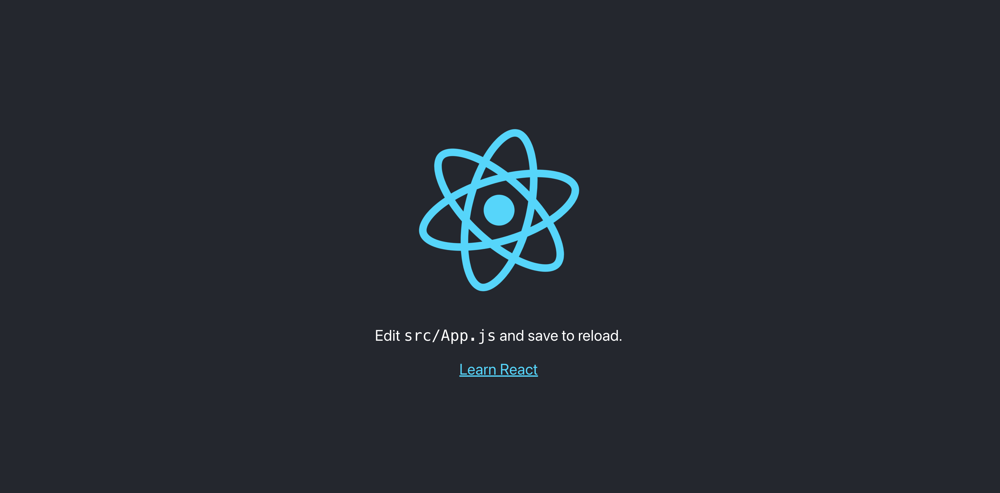
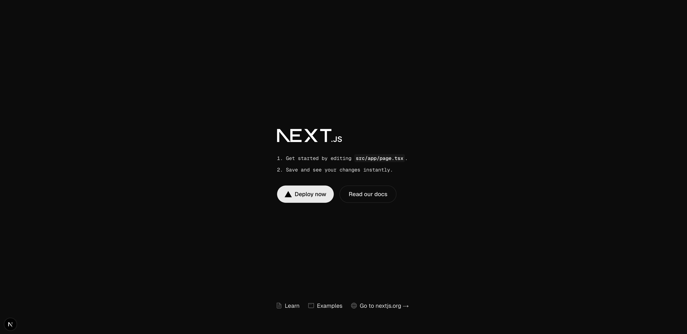

# 学習テーマ
作業日時: 2025-06-29
Reactのプロジェクトの作成方法

## 目的・背景 
Fの社内研修を行うことになったので、Reactの基本に関するドキュメントを作成する。


## 実装内容・学んだ技術  
## プロジェクトの作成方法
```bash
npx create-react-app {プロジェクト名}
```

## Reactのバージョン確認
```
cd {プロジェクト内}
```

※カレントディレクトリ内に`package.json`がないとアプリケーションの起動ができません。
```bash
ls package.json
```
`package.json`が表示されれば問題ない。

今回はReact18で説明をしていくので、React18になっているか確認。
```bash
npm list react
```
ここでReact18でなければ、ダウングレードの必要がある。
`package.json`を確認してもいい
```json
"dependencies": {
  "react": "^18.3.1",
  "react-dom": "^18.3.1",
},
```

React19になっていた場合は、18にダウングレードをする
```bash
npm install react@18 react-dom@18
```

## 起動と停止
以下のコマンドで起動
```bash
npm start
```
`http://localhost:3000`を開いて、この画面が表示されていればOK


ちなみに、起動コマンド等は`package.json`の`scripts`に定義されている。
```json
//package.json
"scripts": {
  "start": "react-scripts start",//開発サーバーを起動
  "build": "react-scripts build",//本番環境でのビルド
  "test": "react-scripts test",//テストスクリプトの実行
  "eject": "react-scripts eject"//隠しファイルの表示（基本的に実行しない）
}
```
アプリケーションの停止は`Ctrl + C`を押す

## フレームワークの使用
通常は、React（ライブラリ）のみで開発を行うことはなく、フレームワークを使用することが一般的。
Reactは“ライブラリ”なので、ルーティングやSSRなどの機能は含まれていない。
そのため、Next.jsのような“フレームワーク”を使うと、ページ遷移やAPI定義などが簡単に実装できる。
今回は、Next.jsを使用して、学習を進めていく。

### ライブラリとフレームワークの違い


```bash
npx create-next-app@latest {プロジェクト名}
```

オプションを選択できるが、基本はデフォルトでOK

```bash
✔ Would you like to use TypeScript? … No / Yes
✔ Would you like to use ESLint? … No / Yes
✔ Would you like to use Tailwind CSS? … No / Yes
✔ Would you like your code inside a `src/` directory? … No / Yes
✔ Would you like to use App Router? (recommended) … No / Yes
✔ Would you like to use Turbopack for `next dev`? … No / Yes
✔ Would you like to customize the import alias (`@/*` by default)? … No / Yes
```

プロジェクトのルートディレクトリに移動。
```bash
cd {プロジェクト名}
```

アプリケーションの起動
```bash
npm run dev
```
`http://localhost:3000`にアクセスすると、以下の画面が表示される。


アプリケーションの停止は`Ctrl + C`

第３回はここまで。
次回は、コンポーネントにCSSを当ててみようと思います！
## 課題・問題点  


## 気づき・改善案  


