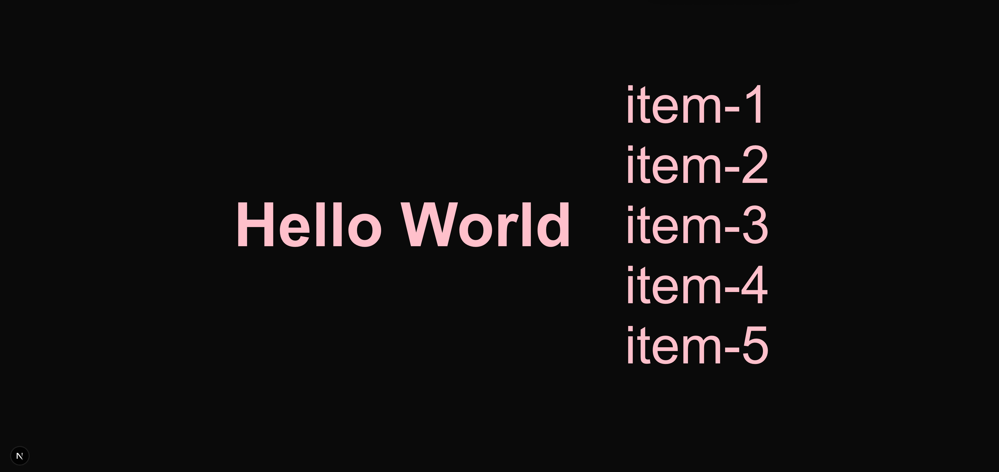
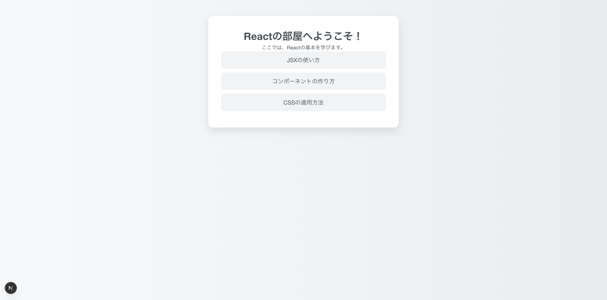

# 学習テーマ
作業日時: 2025-06-30

コンポーネントの分割
## 目的・背景 
Fの社内研修を行うことになったので、Reactの基本に関するドキュメントを作成する。


## 実装内容・学んだ技術  
## 事前準備
前回作成したプロジェクトを使用して、/demo-app/src/app/page.tsxをコンポーネントに分割してみる
前回までで以下の内容のTSXを作成しているはずなので、その続きから行なっていきます。

```ts
import "./Greet.css"
const Greet = ()=> {
  return (
    <div className="component">
      <h3>Hello World</h3>
    </div>
  );
}

export default Greet;
```

`Hello World`の下にリストを作成する。

```ts
import "./Greet.css"
const Greet = ()=> {
  return (
    <div className="component">
      <h3>Hello World</h3>
      <ul className="item-list">
        <li>item-1</li>
        <li>item-2</li>
        <li>item-3</li>
        <li>item-4</li>
        <li>item-5</li>
      </ul>
    </div>
  );
}

export default Greet;
```

`item-list`にもCSSを当てておこう。
```css
.item-list{
    list-style: none;
    padding-left: 100px;
}
```

アプリケーションを起動しよう。
```bash
npm run dev
```

以下の画面が表示されているか確認しよう。


## コンポーネントに分割をしよう
先ほど作成したTSXのリスト部分をコンポーネント化していく。
まずは以下のように`components`ディレクトリを作成し、`List.tsx`を作成しておく。
```bash
demo-app/
└── src/
    ├── app/
    │   └── page.tsx
    └── components/
        └── List.tsx
```

`List.tsx`には先ほど作成したリストを切り取って貼り付けよう。

```ts
//List.tsx
const List = () => {
    return(
        //切り取ったリストを以下に貼り付けた
        <ul className="item-list">
            <li>item-1</li>
            <li>item-2</li>
            <li>item-3</li>
            <li>item-4</li>
            <li>item-5</li>
        </ul>
    );
}

export default List;
```
```tsx
//リスト部分を切り取った後のpage.tsx
import "./Greet.css"
const Greet = ()=> {
  return (
    <div className="component">
      <h3>Hello World</h3>
    </div>
  );
}

export default Greet;
```

## 💡 補足：Reactのコンポーネント名について
- コンポーネント名は必ず**大文字**で始める必要があります。
- 小文字で始めた場合、Reactはそれを通常のHTMLタグと解釈します

## 作成したコンポーネントを読み込む
以下のようにListコンポーネントを読み込もう。
```ts
//page.tsx
import "./Greet.css"
import List from "../components/List" //Listコンポーネントのインポート
const Greet = ()=> {
  return (
    <div className="component">
      <h3>Hello World</h3>
      <List /> {/* コンポーネントの呼び出し */}
    </div>
  );
}

export default Greet;
```

アプリケーションを起動すると、コンポーネント分割前後で
同じ画面になっていることを確認しよう。


ここからさらに、`page.tsx`の中身をGreetコンポーネントとして作成し、
`page.tsx`に読み込ませてみよう。

フォルダ構成は以下の通り。
```bash
demo-app/
└── src/
    ├── app/
    │   └── page.tsx
    └── components/
        ├── List.tsx
        ├── Greet.tsx ← 新規作成
        └── Greet.css ← 以前作成したCSSをここに移動
```

`Greet.tsx`を以下の内容に編集。
```ts
//Greet.tsx
import "./Greet.css"
import List from "./List"
const Greet = ()=> {
  return (
    <div className="component">
      <h3>Hello World</h3>
      <List />
    </div>
  );
}

export default Greet;
```
`page.tsx`でGreetコンポーネントを読み込む。

```ts
//page.tsx
import Greet from "../components/Greet";
const Home = ()=> {
  return (
    <Greet />
  );
}

export default Home;
```
アプリケーションを起動すると、コンポーネント分割前後で
同じ画面になっていることを確認しよう。


大丈夫だった人は、以下の練習問題にチャレンジしてみましょう！

## コンポーネント分割の練習問題

プロジェクトを新規作成して、以下のディレクトリ構成にしてください。
```bash
src/
├── app/
│   ├── page.tsx
│   └── page.css
└── components/
    ├── Title.tsx
    └── TopicList.tsx
```

`page.tsx`と`page.css`は以下の内容を貼り付けてください。
```ts
// app/page.tsx
import "./page.css"

export default function Home() {
  return (
    <div className="container">
      <h1>Reactの部屋へようこそ！</h1>
      <p>ここでは、Reactの基本を学びます。</p>
      <ul className="item-list">
        <li>JSXの使い方</li>
        <li>コンポーネントの作り方</li>
        <li>CSSの適用方法</li>
      </ul>
    </div>
  );
}
```

```css
/* app/page.css */
body {
  margin: 0;
  padding: 0;
  font-family: 'Helvetica Neue', sans-serif;
  background: linear-gradient(to right, #f8f9fa, #e9ecef);
  color: #495057;
}

.container {
  max-width: 600px;
  margin: 60px auto;
  padding: 40px;
  background-color: #ffffff;
  border-radius: 16px;
  box-shadow: 0 10px 30px rgba(0, 0, 0, 0.1);
  text-align: center;
  transition: transform 0.3s ease;
}

.container h3 {
  font-size: 28px;
  color: #212529;
  margin-bottom: 32px;
  font-weight: bold;
  letter-spacing: 0.5px;
}

.item-list {
  list-style: none;
  padding: 0;
  margin: 0;
}

.item-list li {
  background: #f1f3f5;
  margin-bottom: 12px;
  padding: 14px 20px;
  border-radius: 10px;
  color: #495057;
  font-size: 18px;
  transition: background-color 0.3s ease, transform 0.2s ease;
}

.item-list li:hover {
  background-color: #dee2e6;
  transform: scale(1.02);
  cursor: pointer;
}

```
アプリケーション起動後の画面



#### 問題
`page.tsx`を`Title.tsx`と`TopicList.tsx`の２つのコンポーネントに分割してください。
コンポーネント分割前後で同じ画面が表示されればOKです。
（下に模範解答を記載しています）<br>
↓<br>
↓<br>
↓<br>
↓<br>
↓<br>
↓<br>
↓<br>
↓<br>
↓<br>
↓<br>
↓<br>
↓<br>
↓<br>
↓<br>
↓<br>
↓<br>
↓<br>
↓<br>
↓<br>
↓<br>
↓<br>
↓<br>
↓<br>
↓<br>
↓<br>
```ts
// components/Title.tsx
const Title = () => {
  return (
    <>
      <h1>Reactの部屋へようこそ！</h1>
      <p>ここでは、Reactの基本を学びます。</p>
    </>
  );
};

export default Title;
```
```ts
// components/TopicList.tsx
const TopicList = () => {
  return (
    <ul className="item-list">
      <li>JSXの使い方</li>
      <li>コンポーネントの作り方</li>
      <li>CSSの適用方法</li>
    </ul>
  );
};

export default TopicList;
```

```ts
// app/page.tsx
import "./page.css"
import Title from "../components/Title";
import TopicList from "../components/TopicList";
export default function Home() {
  return (
    <div className="container">
      <Title />
      <TopicList />
    </div>
  );
}
```

次回はFragmentについて学習していきます！
## 課題・問題点  


## 気づき・改善案  


