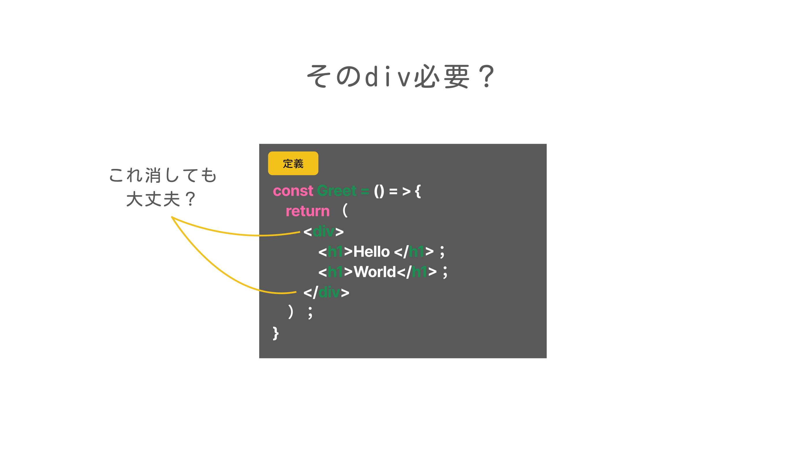
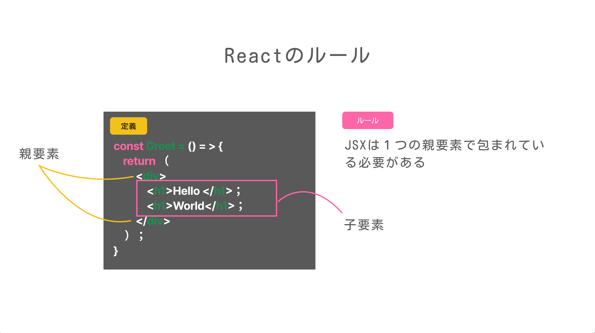
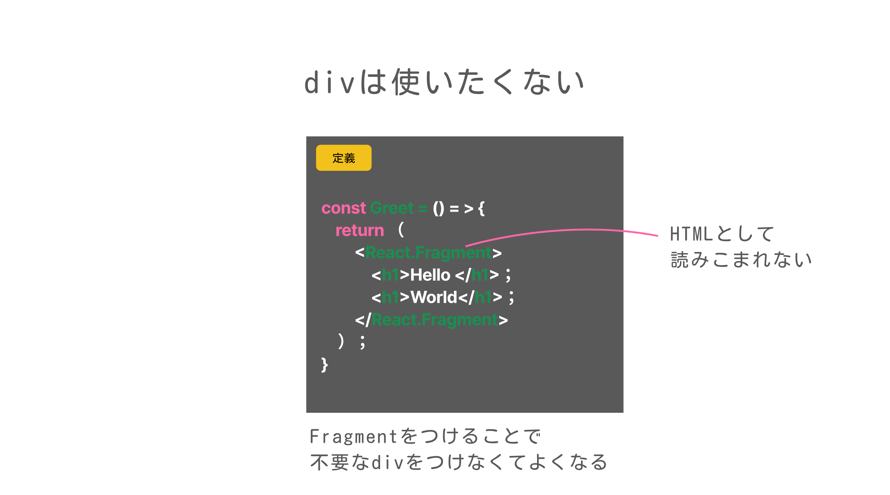
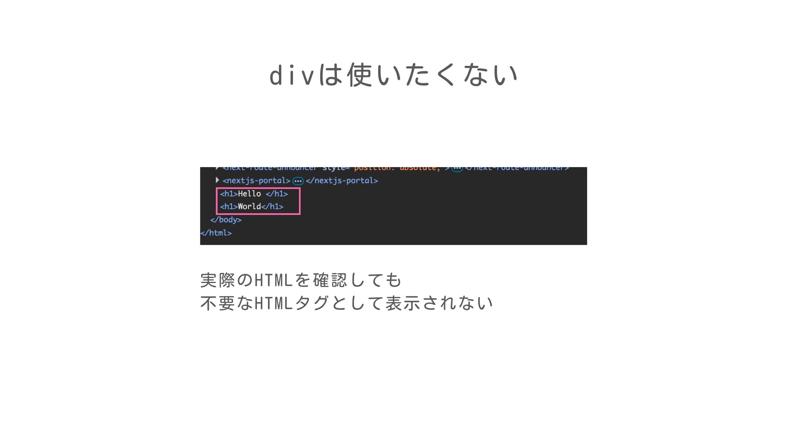

# 学習テーマ
作業日時: 2025-07-01

コンポーネントの分割
## 目的・背景 
Fの社内研修を行うことになったので、Reactの基本に関するドキュメントを作成する。


## 実装内容・学んだ技術  
今回はFragmentについて学習していきます。

## そのdivはなぜ必要？？
JSX（TSX)を書く際に、ふと疑問に思わなかったでしょうか？


結論から言うと、このdivタグはJSX内で必要なものになります。


理由は、JSXではコンポーネントのreturnには単一の親要素が必要とされているためです。そのため、複数の要素を返すにはそれらを1つの親要素で囲む必要があります。


スタイルの関係で、どうしてもdivが使いたくない場面もあるかもしれません。
そのときに使用するのが`Fragment`です。


`Fragment`を使用することで、HTMLの要素を追加せずにJSXの要素を束ねることができます。

## Fragmentの記法①
Reactパッケージのデフォルトエクスポートでインポートをした際には、`React.Fragment`として記述する。
```ts
import React from "react";
import "./Greet.css"

const Greet = ()=> {
  return (
    <React.Fragment>
      <h1>Hello </h1>
      <h1>World</h1>
    </React.Fragment>
  );
}

export default Greet;
```

## Fragmentの記法②
Fragmentを名前付きエクスポートでインポートをした際には、`Fragment`として記述する。
```ts
import {Fragment} from "react";
import "./Greet.css"

const Greet = ()=> {
  return (
    <Fragment>
      <h1>Hello </h1>
      <h1>World</h1>
    </Fragment>
  );
}

export default Greet;
```
## Fragmentの記法③
なにもインポートせずに使用することもできる。こちらの書き方が一般的。
```ts
import "./Greet.css"

const Greet = ()=> {
  return (
    <>
      <h1>Hello </h1>
      <h1>World</h1>
    </>
  );
}

export default Greet;
```

第六回はここまで。
次回はTSX内でTypeScriptのコードを実行する方法について学習していきます！


## 課題・問題点  


## 気づき・改善案  


