# キーボード入力の実装

```c#
void Update(){
    float x = Input.GetAxis("Horizontal");//水平方向
    float y = Input.GetAxis("Vertical");//垂直方向
    Debug.Log(x+","+y);

    bool onSpace = Input.GetKey("space");
    if(onSpace){
        Debug.Log("攻撃");
    }
}
```
horizontal(水平方向)などのパラメータはunity上で確認ができる
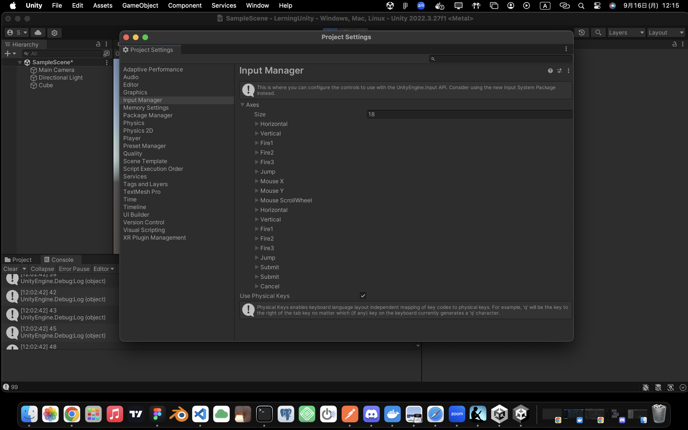

# Playerの動かし方

### 動かし方　その１
```c#
transform.position = new Vector(0.1f, 0, 0);
```

### 動かし方　その２
コンポーネント　RigidBodyを使う
物理演算で使うやつ


useGravityにチェックを入れると重力の影響を受ける

```c#
Rigidbody rigidbody;
void Start(){
    rigidbody = GetComponent<Rigidbody>();
}

void Update(){
    rigidbody.velocity = new Vector3(1f, 0, 0);
}
```
### 動かし方3
力を加える

```c#
Rigidbody rigidbody;
void Start(){
    rigidbody = GetComponent<Rigidbody>();
}

void Update(){
    rigidbody.AddForce(new Vector3(1f, 0, 0));
}
```

これらを合わせることで、入力キーに対して、オブジェクトを動かすことができる

```c#
Rigidbody rigidbody;

void Start(){
    rigidbody = GetComponent<Rigidbody>();
}
void Update(){
    float x = Input.GetAxis("Horizontal");//水平方向
    float y = Input.GetAxis("Vertical");//垂直方向

    rigidbody.velocity = new Vector3(x, y, 0);
}
```

# 当たり判定の実装
CubeにRegidbodyをつける
CubeとPanelにcolliderがついていると当たり判定がつく
どちらかのcolliderを外すと、あたり判定が解除される

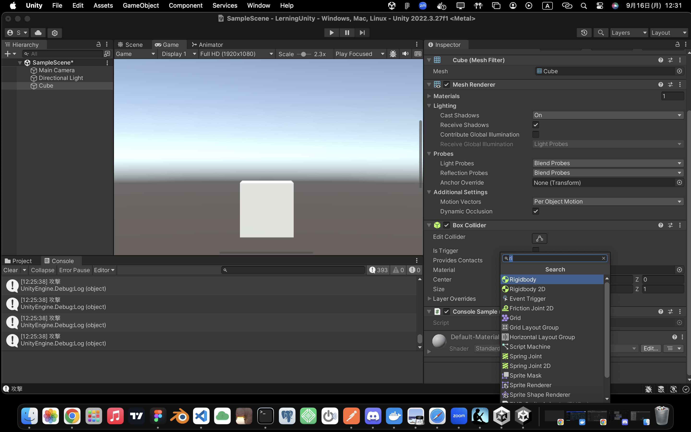
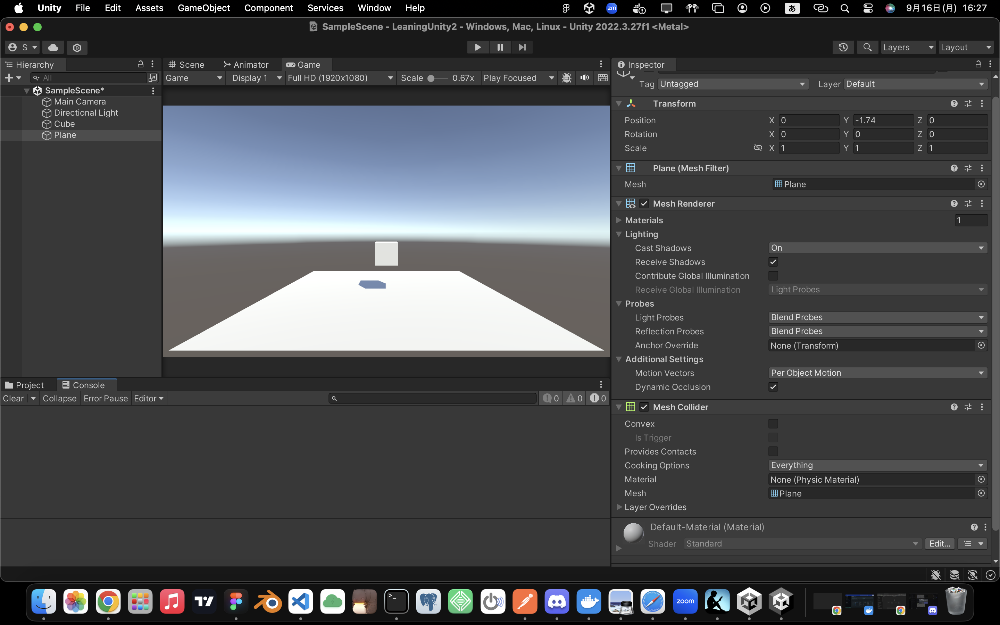


in Triggerのチェックをすると、物理判定はするが、あたり判定はしなくなる.
判定だけ取得指定時は、以下のように記述することで、接触オブジェクトを判定することができる。
```c#
    private void OnTriggerEnter(Collider other)
    {
        Debug.Log(other.name); //Cube
    }
```

活用例
以下のコードを書く
```c#
private void OnTriggerEnter(Collider other){
    if(other.gameObject.tag == "Player"){
        Debug.Log("衝突！！");
    }
}
```
CubeオブジェクトのタグをPlayerにすることで、
Playerが接触した時に判定するみたいなことを実装できる

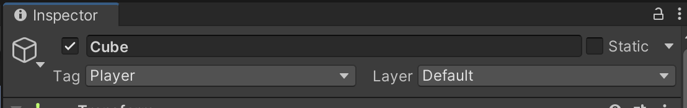

# アニメーションの実装
Asset StoreからダウンロードしてきたAssetsをhierarchyに読み込むだけ

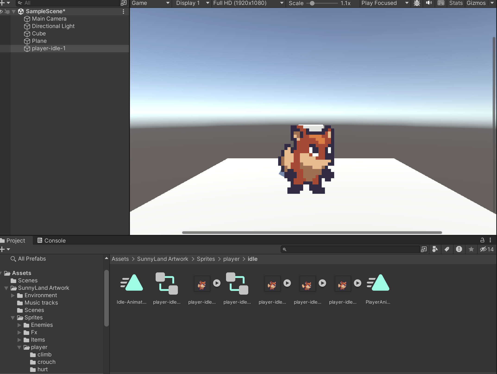

# 入力値によって、アニメーションを変化させる
-  Unity側の操作
パラメータの設定とコンディションの設定を行う
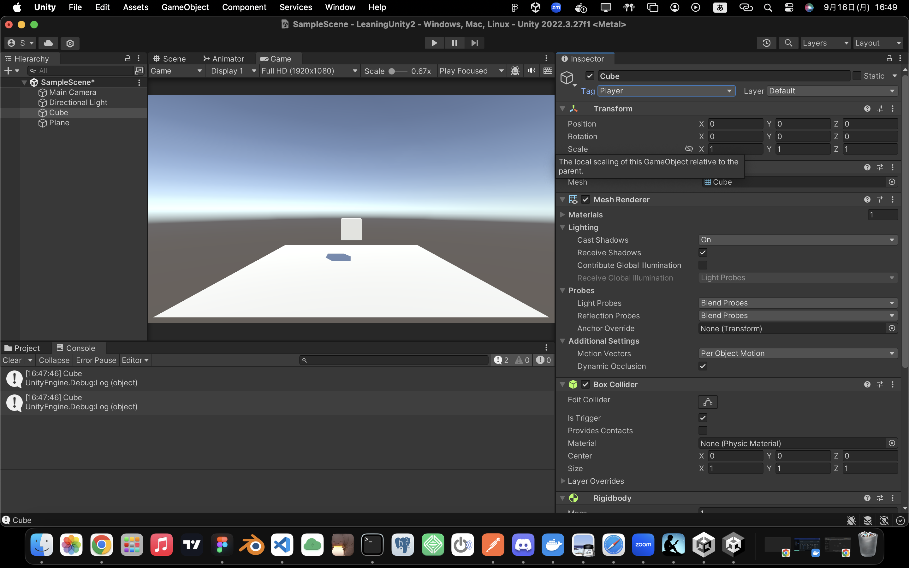
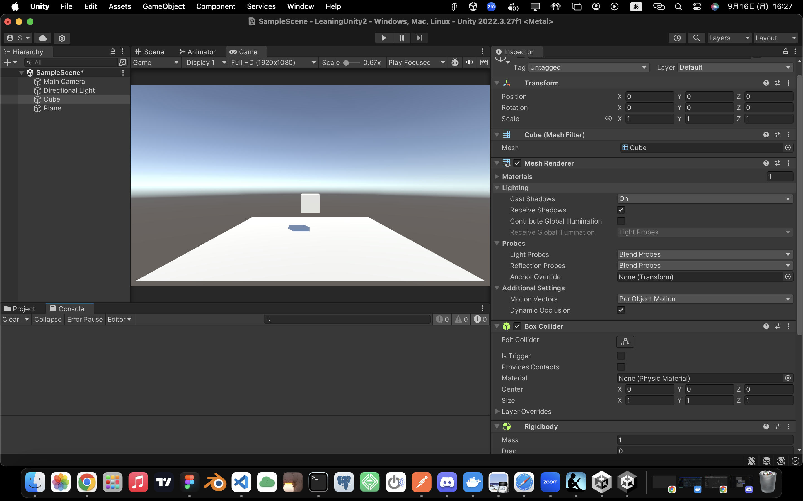

```c#
    void Start()
    {
        animator = GetComponent<Animator>();//コンポーネントの取得
    }
    void Update()
    {
        float x = Input.GetAxis("Horizontal");

        if(x > 0){
            animator.SetFloat("speed",x);
        }else if(x == 0){
            animator.SetFloat("speed",x);
        }
    }
```
# プレファブ化と生成方法
プレファブとは、テンプレートとして保存すること
openprefabを編集することで、すべてのオブジェクトを編集できる

ゲーム再生時にプレファブをインスタンス化方法
```c#
    [SerializeField] GameObject playerPrefab;
    void Start(){
        Instantiate(playerPrefab);
    }
```


# オブジェクトの表示・非表示
unity上では、チェックマークを外すかつけるかで切り替えができる。

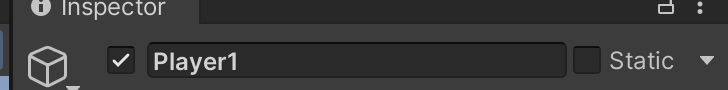

一般的には、GameManagerというスクリプトとemptyobjectを作り、sampleObjに非表示にしたいオブジェクトを指定してあげるとOKらしい
```c#
    [SerializeField] GameObject sampleObj;
    void Start()
    {
        sampleObj.SetActive(false);//非表示
    }
```
表示と破壊
```c#
sampleObj.SetActive(false);//表示
Destroy(sampleObj)//破壊
```

# 別オブジェクトの操作方法

テキストオブジェクトを取得しGameManagerで操作したい

```c#
using UnityEngine.UI;//UIを操作するため
```
`[SerializeField] Text titleText`とすることで外部から呼び出すことができる

```c#
[SerializeField] Text titleText;

void Start(){
    titleText.text = "";
}
```

# シーンの読み込み

import
```c#
using UnityEngine.SceneManagement;
```

```c#
//SceneManager.LoadScene("呼び出したいシーン名");
 SceneManager.LoadScene("MainScene");
```
スクリプトを作ったらビルドセッティングもしておく
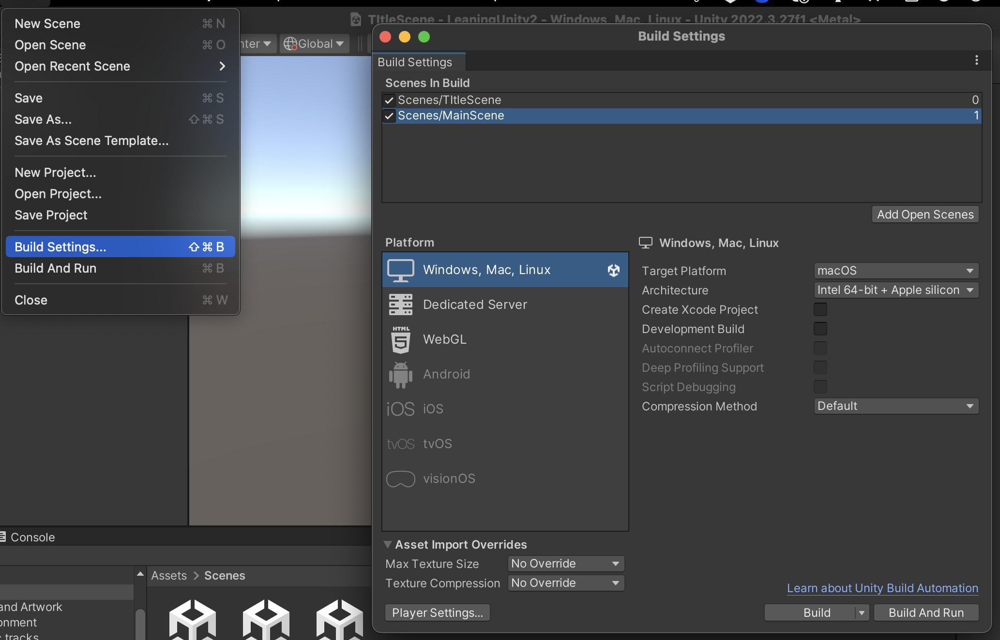

# アイテムの取得の実装

**ItemManager.cs**

GetItemが実行されたら、アイテムを削除する
```c#
using UnityEngine;

public class ItemManager : MonoBehaviour
{
    public void GetItem(){
        Destroy(this.gameObject);
    }
}

```

**PlayerManager.cs**

PlayerMangerから`<ItemManager>`の`GetItem()`を呼び出す

```c#
if(collision.gameObject.tag == "Item"){
    //アイテムの取得
    collision.gameObject.GetComponent <ItemManage().GetItem();
}
```
# 取得したアイテムによって得点を更新する
UIのテキストを追加してscoreTextという名前にしておく

**GameManager.cs**

スコアの更新用関数

```c#
    [SerializeField] Text scoreText;

    /*scoreの更新用関数
    * 9999までは引数valの値をスコアに加算していく
    * 9999を越えれば、強制的に9999にする
    */
    const int MAX_VALUE = 9999;
    int score = 0;
    public void addscore(int val){
        score +=val;
        if(score > MAX_VALUE){
            score = MAX_VALUE;
        }
        scoreText.text = score.ToString(); //intを文字列に変換
    }
```

**ItemManager.cs**

取得するアイテムに更新用関数を割り当てる

```c#
    GameManager gameManager;

    /*Itemへの割り当て
    * ヒエラルキーからGameManagerを探し
    * GetComponet<GameManager>でコンポーネントを取得する
    */
    void Start(){
        gameManager = GameObject.Find("GameManager").GetComponent<GameManager>();
    }

    public void GetItem(){
        gameManager.addscore(100);//コンポーネントを取得しているのでaddscoreが呼び出せる
        Destroy(this.gameObject);
    }

```

- 補足　GetComponent
`GetComponent<コンポーネント名>()`
GetComponentとは、以下の画像のように、オブジェクト内のコンポーネントを取得すること
今回行った処理は、ヒエラルキーの中のGameManagerを取得したのと、GameManegerという名前のコンポーネントを取得している。
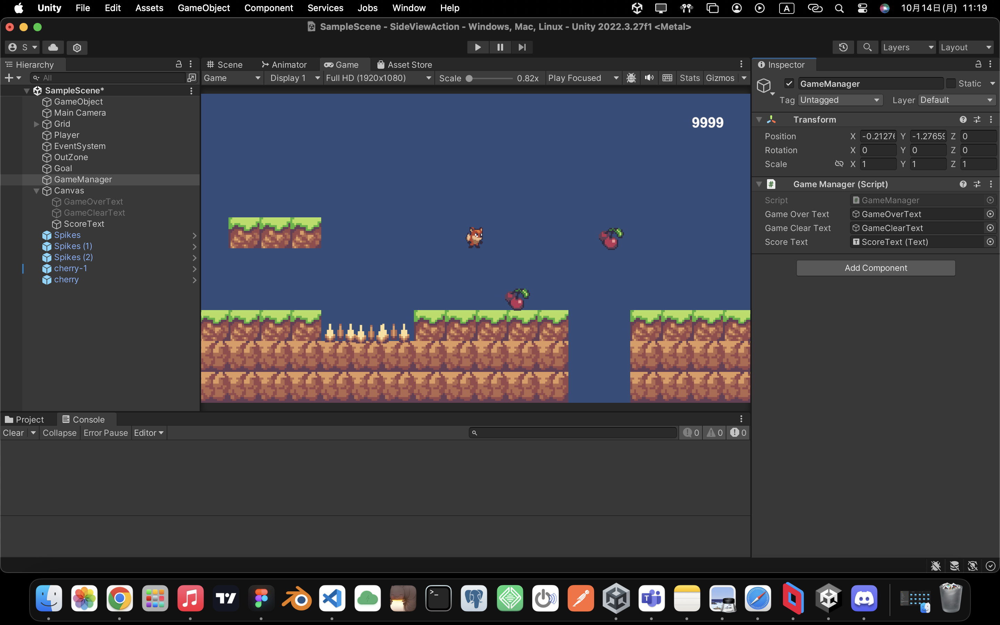


# 敵キャラの実装

- 敵キャラの設定
add componentより、regidBody2dを追加。z軸方向の回転を制御（freeze rotation z）
add componentより、circle collider 2Dを追加

- スクリプトの作成
 ** EnemyManager.cs**

 PlayerManagerを活用する。jumpは実装しないので、削除

```c#
using UnityEngine;
public class EnemyManager : MonoBehaviour
{
    // [SerializeField] GameManager gameManager;
    // [SerializeField] LayerMask blockLayer;
    // 方向は列挙型で定義
    public enum DIRECTION_TYPE {
        STOP,
        RIGHT,
        LEFT
    }
    Rigidbody2D rigidbody2D; // プレイヤーの移動はRigidbodyで管理
    DIRECTION_TYPE direction = DIRECTION_TYPE.STOP;
    float speed = 0;

    private void Start() {
        // Rigidbody2D コンポーネントを取得
        rigidbody2D = GetComponent<Rigidbody2D>();

        // 右方向へ移動
        direction = DIRECTION_TYPE.RIGHT;

    }

    private void Update() {
    }
    
    // FixedUpdateは定期的に呼ばれる。物理計算はここで行う。
    private void FixedUpdate() {
        // 方向に応じて速さを定義する
        switch (direction) {
            case DIRECTION_TYPE.STOP:
                speed = 0;
                break;
            case DIRECTION_TYPE.RIGHT:
                speed = 3;
                transform.localScale = new Vector3(1, 1, 1);//向きを右へ
                break;
            case DIRECTION_TYPE.LEFT:
                speed = -3;
                transform.localScale = new Vector3(-1, 1, 1);//向きを左へ
                break;
        }
        // Rigidbody2Dの速度を更新
        rigidbody2D.velocity = new Vector2(speed, rigidbody2D.velocity.y);
    }
}

```
# 敵キャラクターの攻撃実装

敵キャラクターにTagをつけておく
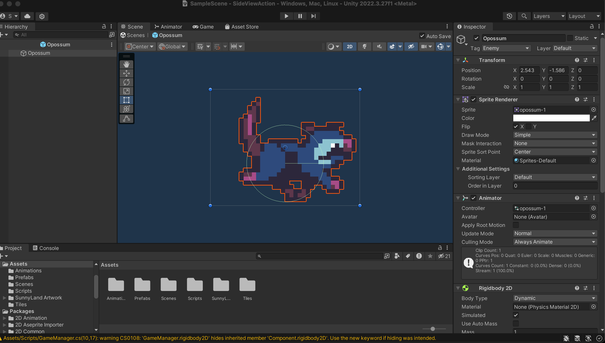

敵キャラクターに当たり判定をつける
boxcolliderをつけ、isTriggerを有効にする


**PlayerManager.cs**

```c#
if(colllision.gameObject.tag == "Enemy"){
    EnemyManager enemy = collision.gameObject.GetComponent<EnemyManager>();

    if(this.transform.position.y + 0.2f> enemy.transform.position.y){
        //上から踏んだら敵を削除
        enemy.DestroyEnemy();
    }else{
        //横からぶつかったらゲームオーバ０
        Destroy(this.gameObject);
        gameManager.GameOver();
    }
}
```
**EnemyManager.cs**

```c#
public void DestroyEnemy(){
    Destroy(this.gameObject);
}
```

ここからさらに、プレイヤーが敵を踏んだら跳ねるモーションを加える
**PlayerManager.cs**

```c#
if(colllision.gameObject.tag == "Enemy"){
    EnemyManager enemy = collision.gameObject.GetComponent<EnemyManager>();

    if(this.transform.position.y + 0.2f> enemy.transform.position.y){
        //上から踏んだら踏む瞬間は速度を０にしてジャンプ
        rigidbody2D.velocity = new Vector2(rigidbody2D.velocity.x, 0);
        Jump();
        //敵を削除
        enemy.DestroyEnemy();
    }else{
        //横からぶつかったらゲームオーバ０
        Destroy(this.gameObject);
        gameManager.GameOver();
    }
}
```