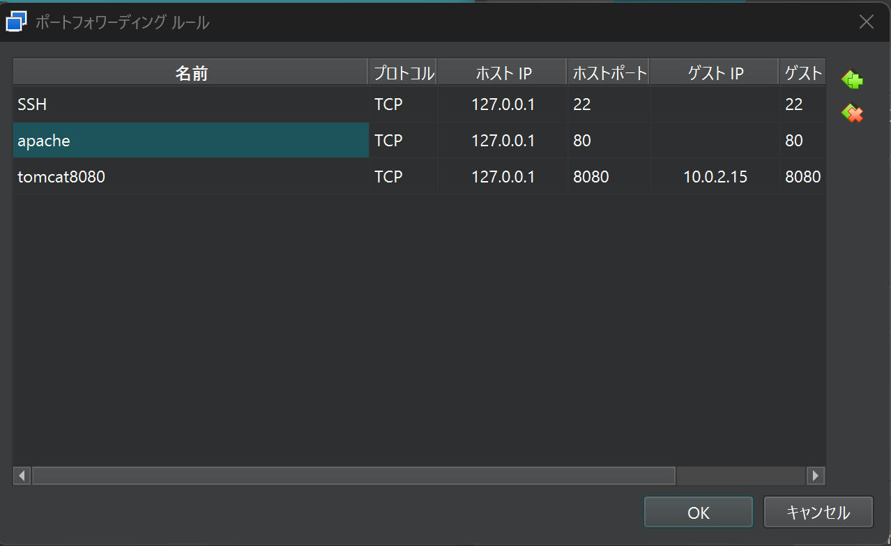

# 学習テーマ
作業日時: 2025-06-14


## 目的・背景 
apacheをインストールしてみる


## 実装内容・学んだ技術  
- apacheのインストール
※`apt`はDebia系のパッケージ管理ツール　Advanced Package Toolの略らしい

```bash
sudo apt update 
sudo apt install apache2
```

- 動作確認
```bash
sudo systemctl status apache2

# 実行結果
● apache2.service - The Apache HTTP Server
     Loaded: loaded (/usr/lib/systemd/system/apache2.service; enabled; preset: >
     Active: active (running) since Fri 2025-06-13 22:45:00 UTC; 19s ago　#Active: activeなので問題なさそう
       Docs: https://httpd.apache.org/docs/2.4/
    Process: 5796 ExecStart=/usr/sbin/apachectl start (code=exited, status=0/SU>
   Main PID: 5801 (apache2)
      Tasks: 55 (limit: 2246)
     Memory: 5.0M (peak: 5.2M)
        CPU: 24ms
     CGroup: /system.slice/apache2.service
             tq5801 /usr/sbin/apache2 -k start
             tq5802 /usr/sbin/apache2 -k start
             mq5803 /usr/sbin/apache2 -k start
```

なぜか起動しない・・・いや正確には起動しているのだが
ブラウザで表示できない・・・

解決方法

ポートフォワードの設定を行う


**ポートフォワード**とは
このポートに届いたデータは、あいつに送ってやるぜ」な設定がされているポートに届いたデータを別のコンピュータに送ってやること


ポートフォワーディング設定
VirtualBoxの設定 → 「ネットワーク」 → 「アダプター1」 → 「詳細」 → 「ポートフォワーディング」を開き、以下を追加：



ブラウザで`http://http://127.0.0.1/で動作確認

- apache（ポート80）で受け取ったリクエストをtomcat(ポート8080)へ転送する

Apache の mod_proxy と mod_proxy_ajp / mod_proxy_http モジュールを使って、Tomcat にリクエストを転送

**Apache → Tomcat（ポート8080）へのプロキシ設定**
```bash
# /etc/apache2/sites-available/000-default.conf などに追記

<VirtualHost *:80>
    ServerName localhost #ブラウザから http://localhost でアクセスされたときに、この設定を使用
    ProxyRequests Off # フォワードプロキシの動作を無効
    ProxyPreserveHost On　# Tomcatへリクエストを引き継ぐか
    ProxyPass / http://localhost:8080/ # TomcatのIPにリクエストを転送
    ProxyPassReverse / http://localhost:8080/ # リダイレクトのurlをapacheで置換　ex)http://localhost/login
</VirtualHost>

```

その後実行
```bash
sudo a2enmod proxy
sudo a2enmod proxy_http
sudo systemctl restart apache2
```
✅ sudo a2enmod proxy
Apache の mod_proxy モジュール（プロキシ機能の基盤）を有効。
✅ sudo a2enmod proxy_http
HTTP プロトコルでのプロキシ（Tomcat のようなHTTPアプリ）を使うための mod_proxy_http モジュールを有効。
✅ sudo systemctl restart apache2
設定変更を反映するために Apache を再起動。

- 動作確認

tomcatが起動しているか
```bash
http://localhost:8080/
```

apache経由でtomcatにアクセスできるか
```bash
http://localhost/
```

## 課題・問題点  
- apacheとtomcat同時に起動するのめんどくさすぎる
→　シェルスクリプトでまとめて実行・停止をできるようにする

`/opt/start_service.sh`
```bash
#!/bin/bash

echo "Starting Apache..."
sudo systemctl start apache2

echo "Starting Tomcat..."
/opt/apache-tomcat-10.1.24/bin/startup.sh

```

`/opt/stop_service.sh`
```bash
#!/bin/bash

echo "Stopping Tomcat..."
/opt/apache-tomcat-10.1.24/bin/shutdown.sh

echo "Stopping Apache..."
sudo systemctl stop apache2
```

実行権限の付与
```bash
chmod +x start_web.sh stop_web.sh
```

## 気づき・改善案  

- Tomcatの起動確認スクリプトの強化（改善案）
start_service.sh では Tomcat が既に起動しているかを確認してから起動するようにすると、より安全


